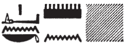

# South Anta (49-54) {-}  
  
## Esna 49 {-}  
  
  
  
- Location: South Anta, Top Panel  
- Date: Claudius  
- [Hieroglyphic Text](https://www.ifao.egnet.net/uploads/publications/enligne/Temples-Esna002.pdf#page=339){target="_blank"}  
- Bibliography: None  
  
#### Title {-}  
  

  
  
^1^ *wpš [b]zn m [ḥw.t-nṯr?]   *  
*swȝb nỉw.t   *  
  *n nb ʿbw  *  
  
^1^ Sprinkling plaster [^fn-49-1] on [the temple],[^fn-49-2]  
purifying the city [^fn-49-3]  
 of the Lord of Purity.  
  
[^fn-49-1]: The exact translation of *bzn* is debated. Cf. recently @laroche-2020, pp. 91-92.  
[^fn-49-2]: Parallel texts specify this action is performed "in [the temple]" (*Edfou* II, 32, 17; *Edfou* III, 109, 7-8, 9), but one might restore here "around (*m-pẖr*) the temple" (*Edfou* II, 62, 2).  
[^fn-49-3]: {width=8%}{width=20%} - In a related offering scene, the king "purifies the city of Edfu (*<s>wab wTz.t*)" for Horus (*Edfou* III, 109, 8), which makes more sense here than purifying Khnum's "things (*ỉḫt*)."  
  

  
  
#### The King {-}  
  

  
  
^2^ *nsw.t-bỉty   *  
*nb tȝ.wy  *  
*(tbrys gr[ds] ksrs nty-ḫwỉ) *  
^3^ *zȝ Rʿ nb ḫʿ.w  *  
*(krmnyqs ȝwdgrtwr) *  
    
^4^ *ỉwʿʿ n Gbb  *  
*s[wʿb] pr n ỉt=f  *  
   
^2^ The King of Upper and Lower Egypt,  
Lord of the Two Lands,  
(Tiberius Clau[dius] Caesar Augustus)  
^2^ Son of Re, Lord of Appearances,  
(Germanicus Autokrator)  
  
^4^ Heir of Geb,[^fn-49-4]:  
who p[urifies] the temple for his father.  
  

  
  
[^fn-49-4]: The king is often the "heir of Geb" in this particular ritual (*Edfou* III, 109,10; *Edfou* II, 62, 4), since he handles minerals from the earth.  
  
#### Khnum-Re Lord of Esna {-}  
  

  
  
^5^ *ḏd-mdw ỉn   *  
  *ẖnmw-Rʿ nb tȝ-sn.t  *  
*nb ʿbw   *  
*mr.n=f* ^6^ *twr  *  
  *šȝʿ.tw* ^7^ *wʿb n kȝ=f  *  
    
^8^ *dỉ=ỉ n=k ndm  *  
  *twr.tw n kȝ=k  *  
      
^9^ *dỉ=ỉ n=k pr=k  *  
  *mn.tw ẖr ʿbw  *  
  *mḥ(.w) m ỉḫt nb nfr  *  
  
^5^ Words spoken by  
  Khnum-Re Lord of Esna,  
Lord of purification,  
who loved ^6^ cleanliness,  
  purity ^7^ was first created for his Ka.  
  
^8^ I give to you the throne,  
  made clean for your Ka.  
  
^9^ I give to you your house,  
  enduring in purity,  
  and filled with all good things.  
  

  
  
  
#### Menhyt {-}  
  

  
  
^10^ *ḏd-mdw ỉn   *  
  *Mnḥy.t wr.t nb.t ḫnt-tȝ  *  
*sḫm.t* ^11^ *ʿȝ.t   *  
*mr.t Ptḥ  *  
*mḥ(.t) ʿḥ [m nfrw=s]  *  
^12^ *mỉ p.t ẖr ỉtn.wy  *  
    
^13^ *dỉ=ỉ n=k mn[qb?]    *  
  *[s]wʿb(.w) n kȝ=k  *  
  *ʿrq(.w) m kȝ.t nb(.t)  *  
   
^10^ Words spoken by  
Menhyt the great, Lady of Khent-ta,  
Sekhmet ^11^ the great,  
  beloved of Ptah,  
who fills the palace [with her beauty][^fn-49-5],  
^12^ just like the sky with the two disks.  
  
^13^ I give to you the pal[ace?][^fn-49-6]  
  purified for your Ka,  
  completed in all works.  
    

  
  
[^fn-49-5]: There is just enough space in the lacuna for this frequent epithet of Menhyt and Nebtu: *LGG* III, 367a-b.  
  
[^fn-49-6]: {width=22%} - This term occurs in other examples of this particular building ritual (*Edfou* II, 33, 4; *Edfou* VII, 50, 16), and would be parallel to Khnum promising to purify the king's "domain" (*pr*) in the present text (supra, 9). Nonetheless, in the symmetric scene from Esna, Menhyt promises to make the king's "monument (*mnw*)" endure ([Esna 113],16), so that restoration cannot be ruled out here.  