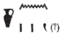

## Esna 51 {-}  
  
  
  
- Location: South Anta, Middle   
- Date: Claudius  
- [Hieroglyphic Text](https://www.ifao.egnet.net/uploads/publications/enligne/Temples-Esna002.pdf#page=179){target="_blank"}  
- Bibliography: None  
- Parallels: Similar scene with some identical phrases in *Esna* VI, 496.
- [Photograph](http://www.temples-egypte.net/sud/esna/devant/montantSud.html#B1){target="_blank"}
  
#### The King {-}  
  

  
  
^1^ *nsw.t bỉty  *  
*nb tȝ.wy  *  
*(tbrys grwtys nty-ḫwỉ)|  *  
^2^ *zȝ-Rʿ nb ḫʿ.w  *  
*(krmnyqs ȝwdgrtwr)|  *  
  
^3^ *snn n Rʿ  *  
*mswt n Itm  *  

^4^ *šzp.n(=ỉ) n(=ỉ)  *  
*ʿḥʿ m-ʿ wp-tr.w  *  
*rnp.wt m-ʿ ỉr-ȝbd  *  

*sd=ỉ ḥb.w-sd.w  *  
*ẖnm.n=ỉ Rʿ(?)  *  
*m ỉrw=f n ḏ.t  *  
*ȝbḫ.n=ỉ ỉm=f  *  
   
*wȝḏ.n=ỉ ʿnḫ=ỉ  *  
*snb ḥȝw=ỉ   *  
*ỉwf=ỉ tm(.w) m ʿnḫ  *  
*ỉw=ỉ m ỉwʿʿ=k  *  
*ḥr ns.t=f  *  
*ḥr ỉr(.t) mr=k  *  
  
^1^ The King of Upper and Lower Egypt,  
Lord of the Two Lands,  
(Tiberius Claudius Augustus)|  
^2^ Son of Re, Lord of Appearances,  
(Germanicus Autokrator)|  
  
^3^ Likeness of Re,  
Image of Atum.   

^4^ I have received   
a lifetime from He who divides seasons,  
and years from He who determines the month.  
  
I celebrate Sed-festivals,  
having united with (Re)?,[^fn-51-1]  
in his form of linear eternity,  
and I mixed with him.  
  
I have flourished, I live,  
my body is healthy,  
my flesh complete in life.  
I am your heir,  
upon your throne,  
doing what you prefer.  

[^fn-51-1]: {width=10%} - Restoration uncertain. Assuming the first vertical stroke writes the first person suffix pronoun, and the second two are a mistake for the sundisk with the tail of a uraeus serpent.

#### Khnum-Re upon his Great Throne {-}

^5^ *ḏd-mdw ỉn ẖnmw-Rʿ  *  
*ḥry s.t=f wr.t  ḥr-ỉb Iwny.t  *  
  
*ḥry nḥp m* ^6^ *šȝʿ  *  
*ỉt nṯr.w nb   *  
*ʿnḫ [...] ṯnỉ ỉwʿʿ=f  *  
*ḥr-tp* ^7^ *msḫn.t=f  *  
*swḏȝ zȝ qmȝ.n=f  *  
  
^8^ *ḏỉ=ỉ n=k rnp.wt n Rʿ  *  
*ȝbd.w n ỉʿḥ  *  
*nỉ ỉw.n rnp.wt=f  *  
*nỉ ʿq.n* ^9^ *ȝbd.w=k  *  
*hrw.w[=k] wḥm=sn šn  *  
  
*šzp=k ḥḥ.w n ḥb.w-sd  *  
*m-ʿ=ỉ  *  
*grb n tȝ* ^10^ *[...]  *  
*p.t tȝ mw.w ḏw.w  *  
*bw nb wbn Rʿ ḥr=sn  *  
*ḥp.ty šzp(?)=sn*  
^11^ *[...]=k  *  

*^12^ nḫb=ỉ n=k ḥb.w-sd.w  *  
*ʿšȝ.w wr.w  *  
*spẖr=ỉ nswy.t ḥr rn=k  *  
  
^5^ Words spoken by Khnum-Re  
upon his Great Throne within Iunyt.  
  
Chief of the potter's wheel ^6^ in the start,  
father of all the gods,  
Life [...] who distinguishes his heir  
upon ^7^ his birth-brick,  
who makes prosper the son he created.  
  
^8^ I give to you the years of Re,  
the months of the moon,  
your years shall not come,  
your months ^9^ shall not run out,  
and [your] days will repeat their cycles.  
  
May you receive millions of Sed-festivals  
from me,  
the inheritance of the earth ^10^ [...]  
heaven, earth, waters, mountains:  
all places over which Re shines,  
the limits, they receive(?)   
^11^ [...] you.

^12^ I decree for you Sed-festivals,  
being greatly numerous,  
I inscribe kingships in your name.  

#### Heka the Child {-}

^13^ *ḏd-mdw ỉn ḥkȝ pȝ ẖrd  *  
*ʿȝ wr tpy n ẖnmw  *  
*ḥwnw* ^14^ *nfr bnr-mrw.t  *  
*wḥm ms.w m tr r tr  *  
   
^15^ *ḏỉ=ỉ n=k nswy.t ʿȝ.t ẖr ršw  *  
*ḥwnw=ỉ ḏ.t=k m tp-rnp.t  *  
    
^16^ *ḏỉ=ỉ n=k ḥḥ.w m ʿnḫ-ḏd-wȝs  *  
*nsw=k tȝ.wy   *  
*mỉ Rʿ ḏ.t nḥḥ *  
  
^13^ Words spoken by Heka the Child,  
the very great, first-born of Khnum,  
the good ^14^ youth, sweet of love,  
who repeats births from season to season.  
  
^15^ I give you a great kingship filled with joy,[^fn-51-2]  
I rejuvenate your body every year.  
  
^16^ I give you millions of *ʿnḫ-ḏd-wȝs*  
so you might rule the two lands  
like Re, for all eternity.  

[^fn-51-2]: In a parallel version of this scene, the Emperor Caracalla repeats these exact words of Heka: *Esna* VI, 496, 8.

#### Behind the Gods  {-}

^17^ *mn n=k [ḥb-sd]  *  
*nswy.t n Rʿ  *  
*ỉȝw.t n Itm  *  
*ḥqȝ n šw  *  
*ỉmỉ.t-pr n (Wn-nfr mȝʿ-ḫrw)|  *  
*wȝḏ.ty n ḥr-zȝ-Is.t  *  
  
*hȝw=k hȝw n p.t  *  
*ḥr zḫn.w=s    *  
*rnp[.wt?...]    *  
  
^17^ Receive the [Sed-festival],[^fn-51-3]
the kingship of Re,  
the office of Atum,  
the rulership of Shu,  
the inheritance of (Wennefer, justified)|,  
the two uraei of Harsiese.  
  
Your epoch is the epoch of heaven  
upon its supports,  
the year[s? ...]  

[^fn-51-3]: Restored after *Esna* VI, 496, 21. In the offering scene, Khnum hands over a single Sed-festival sign to the king. 