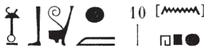
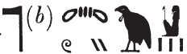
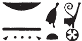

## Esna 52 {-}  
  
  
  
- Location: South Anta, Bottom  
- Date: Probably Vespasian  
- [Hieroglyphic Text](https://www.ifao.egnet.net/uploads/publications/enligne/Temples-Esna002.pdf#page=182){target="_blank"}  
- Bibliography: None  
- [Photograph](http://www.temples-egypte.net/sud/esna/devant/montantSud.html#B2){target="_blank"}
  
#### The King {-}  
  

  
  
  
  
  
^1^ *nsw.t bỉty  *  
*nb tȝ.wy  *  
*([... nty]-ḫwỉ)|  *  
^2^ *zȝ-Rʿ nb ḫʿ.w  *  
*([...]]rtwr)|  *  
  
^3^ *[ḫʿỉ] m ḥȝy.t=f   *  
*nt ʿnḫ-wḏȝ-snb  *  
*spr r ỉwny.t   *  
*r mȝȝ ỉt=f  *  
*ỉt-m-šȝʿ  *  

^1^ The King of Upper and Lower Egypt,  
Lord of the Two Lands,  
([... Augus]tus)|  
^2^ Son of Re, Lord of Appearances,  
([... Autokra]tor)|  
  
^3^ [Appearing] from his palace  
of life, prosperity, health,  
reaching Iunyt,  
to see his father,  
the Father in the Beginning.  

#### In front of the King {-}

^4^ *nṯr nfr   *  
*snn n ẖnmw  *  
*šzp-ʿnḫ *   
*n sḫt-šzp=f  *  
*wbn n ^5^ nḥḥ  *  
*psḏ m ḏ.t=f  *  
*wȝḥ-qd=f m wḫȝ  *  
*wdỉ ^6^ st.wt  *  
*wbn m hrw  *  
   
*ʿšȝ mȝwy mỉ ȝḫty  *  
*ḫʿỉ* ^6^ *ḥr tȝ mỉ Rʿ  *  
*wbn m p.t  *  
*sḥḏ tȝ m wḏȝ.ty=f  *  
*pʿy.t ḥr dwȝ=f  *  
^8^ *rḫy.t ḥr swȝš=f  *  
*ʿnḫ=sn n mȝȝ[=f]  *  
    
*wbn m ʿḥ=f   *  
^9^ *nt ʿnḫ-ḏd-wȝs  *  
*ʿq ḥw.t-nṯr   *  
*nt ḫntỉ-nb-ʿnḫ  *  
   
*sw mỉ ỉtn  *  
*wbn m* ^10^ *nhp  *  
*ỉwn-ḥʿʿ dỉ=f s(w)   *  
*m [...]  *  
  
The good god,  
replica of Khnum,  
living image   
of He who Weaves his Light,  
who rises for ^5^ eternity,  
who shines in the morning,  
who increases his form at night,[^fn-52-1]  
who shoots out ^6^ rays,  
who shines in the day.  
  
Plentiful of light like Akhty,  
who appears ^7^ on earth like Re,  
who shines in the sky,  
who illumines the earth with his eyes.  
The *pʿ.t*-people praise him,  
the *rekhyt* worship him,  
they all live from seeing [him],  
  
He who shines from his palace,  
of life, stability, and dominion,  
and enters the temple  
of Foremost of Neb-ankh.  
  
He is like the sundisk,  
who shines at ^10^ dawn;[^fn-52-2]  
(like) the moon, who appears  
in [...]  

[^fn-52-1]: Standard lunar epithet denoting the waxing moon.
[^fn-52-2]: {width=25%} - The spelling of this phrase evokes the roughly homophonous epithet *wbȝ nḥp*, "to open the potter's wheel" (i.e. start creation at dawn).

*bqnqn.w* ^11^ *ḥr ḏsr n=f wȝ.wt  *  
*šzp=f tp-wȝ.t nfr.t  *  
*r ḥw.t-ṯȝ.wy  *  
*[...] ẖnw n* ^12^ *n nb=s  *  
*nb nṯr.w rmṯ  *  
*ḥʿʿ.wy n mȝȝ=f  *  
   
*ḏd n=f ỉt=f šps  *  
*ỉỉ.tw r s.t-wr.t  *  
^13^ *qdỉ.n=f pr=i  *  
*swʿb.n=k ḥw.t-nṯr(=i)  *  
*wʿb.tw nn sȝ.t  *  
  
The protector gods ^11^ clear the roads for him,  
as he makes a good start  
towards the Temple of the Chicks,  
[...] the Residence of ^12^ its lord,  
Lord of gods and people:  
How joyful to see him!  
  
His august father says to him:  
'Welcome to the great place!  
^13^ As you built my domain,  
so you purified (my) temple,  
being cleansed, without impurity.

#### Above the Palace {-}

^13a^ *mnqb*  
  
^13a^ The palace.

#### Iunmutef {-}

^14^ *ỉwn-mw.t=f   *  
*ʿbw pr-wr  *  
^15^ *ỉr ʿbw nsw.t  *  
*m ẖms.w šmʿ  *  
*nṯrỉ ḥm=f m mnwr  *  
^16^ *ỉr snṯr *  
*ẖr-ḥȝ.t nsw.t  *  
  
^14^ Iunmutef,  
who purifies the Per-wer,  
^15^ who purifies the king  
with Upper Egyptian grains,  
who divinizes his majesty  
with *mnwr*-incense,  
^16^ who performs incense  
before the king.  

#### Gods on the Standards {-}

 

^17^ *bqnqn.w dmḏ.w  *  
*m nh.t ḥȝ=f  *  
*bqnqn.w ḥr mȝʿ n=f mṯn=f  *  
*tpy.w-ỉȝ.t=sn *  
*ḥr ỉr nh.t=f  *  
*qmȝty.w(?) ḥr ỉr(.t) mk.t=f  *  
  
^18^ *dy dy   *  
*m ʿr r mṯn=f  *  
*ḥȝ=tn r=tn  *  
*ḏȝ.t nb  *  
^19^ *m ḏȝ wȝ.t r (pr-ʿȝ)|  *  

^17^ The protector gods are united  
in protection around him,  
the protector gods show him his path,  
those upon their standards  
are performing his protection,  
the divine statues(?)[^fn-52-3] guard over him.  
  
'(Stay) here, here!  
Do not approach his path!  
Turn back, the lot of you,  
all evil-doers!  
Do not block the path from Pharaoh!'

[^fn-52-3]: {width=20%} - Sauneron noted the first sign (*nṯr*) could be something tall and bent, so I tentatively suggest emending to the *qmȝ* throw-stick. While this word is attested, I can find no example where it applies to the gods upon the standards.

#### Wepwaet of Upper Egypt {-}

^20^ *Wp-wȝ.wt šmʿ  *  
*ḥr wp n=f wȝ.wt  *  
*sḫm tȝ.wy  *  
*ḥr wbȝ n=f [...]  *  
*[...]  *  
*r ẖnm.n=f nb tȝ-sn.t  *  
  
^20^ Wepwawet of Upper Egypt  
is opening the ways for him,  
the Power of the Two Lands,  
is opening for him [...]  
[...]  
so he might see the Lord of Esna.[^fn-52-4]  

 

[^fn-52-4]: {width=10%} - The red crown writes *n.t*, a standard value. One could possibly understand the white crown as *s* < *sḥḏ* (acrophony, frquent use of white crown in the verb *sḥḏ*, "to illumine"); *s* < *sḥn*, "double crown" (acrophony); *s* < *š* < *šmʿ*, "white crown" (acrophony, phonetic change); or *s* < *sw* < *nsw.t* (white crown writes *nsw.t*, alternates with *sw*-plant).  Alternatively, since the two crowns form a conceptual pair, one might just read "two crowns" = "the two (sisters)" = *sn.t*. Same spelling in *Esna* III, 225, 3; 241, 13 (89); 249, 2 (16); 292, 22; 385 A; *Esna* VII, 587, 31.

#### Double Plume Crown {-}

^21^ *wr-sḫm.w ḥr ḏsr [...]  *  
*[...] sšš.t=f   *  
*r mȝȝ=f nb-nḥp  *  
  
^21^ Great of Images is sanctifying [...]  
[...] his path,  
so he can see the Lord of the Potter's Wheel.  

#### The Divine Falcon  {-}

^22^ *sỉȝ nṯry ḥr ḫw.t=f  *  
*zȝb-šw.ty ḥr ỉr(.t) zȝ=f  *  
*r wṯz-nfrw n ẖnmw  *  
*m-ẖnw pr=f  *  
  
The Divine Falcon guards him,  
Dapple of Plumages performs his protection,  
to carry the perfection of Khnum  
within his domain.  

#### Khonsu Emblem  {-}

^23^ *[ty.t] štȝ.t ḥr ỉr(.t) mk.t=f  *  
*ḥwn.t wr.t ḥr ỉr(.t) zȝ=f  *  
*r snỉ-tȝ n nb-nṯr.w  *  
  
^23^ The Mysterious [Image][^fn-52-23] guards him,  
the great young woman makes his protection,  
to kiss the earth for the Lord of Gods.  

[^fn-52-23]: For the restoration, see [Esna 74], 37 (also partially damaged); *KO* 73 and 198. In other temples, this effigy is just called "Khonsu."

#### The Ibis {-}

^24^ *tḫn šps ḥr ḫw(.t) ḏ.t=f  *  
*ỉb-n-Rʿ ỉnḥ m-dbn=f  *  
*r mȝȝ=f [ỉt]=f *  
*(m) pr=f  *  
  
^24^ The August Ibis[^fn-52-24] guards his body,  
the Heart of Re encircles him,  
so he might see his [father]  
(in) his domain.

[^fn-52-24]: For the transliteration, see [Esna 74], 38.

#### The Bow {-}

^25^ *ỉwn.t wr.t ḥr dr ḫfty.w=f  *  
*pḏ.t n Rʿ ḥr bḥn sbỉ.w=f  *  
*r ḫf=f ỉt(?)=f  *  
  
The great bow is repelling his enemies,  
the bow of Re cuts down his rebels,  
so he might behold his father(?).  

#### The Ram {-}

^26^ *bȝ n šw ḥr swḏȝ ḥʿw=f  *  
*ḥr ỉr(.t) zȝ=f rʿ-nb  *  
*r mȝȝ=f ḫnty-nb-ʿnḫ  *  
   
^26^ The Ba of Shu[^fn-52-26] preserves his body,  
carrying out his protection daily,  
so he might see Foremost of Neb-ankh.  

[^fn-52-26]: In the symmetric scene ([Esna 74], 34), the ram is called Khnum the Good Protector, and "the excellent wind," both of which can be identified with Shu.