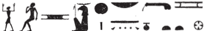

## Esna 54 {-}  
  
  
  
  
- Location: South Anta, Soubassement  
- Date: Uncertain, Vespasian  
- [Hieroglyphic Text](https://www.ifao.egnet.net/uploads/publications/enligne/Temples-Esna002.pdf#page=185){target="_blank"}  
- Bibliography: @tattko-2014, pp. 414-415 (description only). 
- [Photograph](http://www.temples-egypte.net/sud/esna/devant/montantSud.html#B3){target="_blank"}
  
#### The King {-}

  
  
^1^ *nsw.t-bỉty  *  
*(ỉwtwgrtwr tỉtỉs ksrs)|  *  
^2^ *zȝ-Rʿ   *  
*(wsp(s)ỉnỉs ḫwỉ)|  *  
    
^3^ [...]  *  
*[...(ỉwtwg]rtwr tỉtỉs gysrs)|  *  
*ỉỉ.n=ỉ ḫr=k  *  
*ẖnmw-Rʿ nb tȝ-sn.t  *  
  
*ỉn=ỉ n=k ỉḫt nb   *  
*pr m ḥʿpỉ  *  
*wȝḏwȝḏ* ^4^ *sm.w  *  
  
*zbỉ(=ỉ)-sš *  
*m sḫ.t nfr.t  *  
*ȝpd.w qn.w  *  
*sr.w ʿšȝ.w šbn(.w)  *  
  
*thm=ỉ nfr.w*  
*m qbḥw  *  
    
*ntk nb nṯr.w rmṯ  *  
*sḫpr wnn.t  *  
*nb ḥḥ.w ʿšȝ ḥfn.w  *  
  
^1^ The King of Upper and Lower Egypt  
(Autokrator Titus Caesar)|  
^2^ Son of Re  
(Vespa(s)ian Augustus)|  
  
^3^ [...]  
[...(Autok]rator Titus Caesar)|  
I have come before you,  
Khnum-Re Lord of Esna.[^fn-54-1]  
  
I bring to you all good things  
which come forth from Hapi,  
verdure, ^4^ plants.  
  
I tour the marshes  
in the Good Field:[^fn-54-2]  
many birds,  
numerous mixed geese.  
  
I round up[^fn-54-3] the goodness  
of the First Cataract region (Qebehu).  
  
You are the lord of gods and people,  
who created what exists,  
lord of millions, numerous of myriads.  

[^fn-54-1]: {width=15%} - This spelling recalls the etymology narrated in [Esna 81], 1-2.
[^fn-54-2]: "Touring the marshes" has various connotations, but here it refers to the Egyptian pasttime of enjoying flowers and natural life. The healthy, "Good Field" is produced when Nebtu-Isis returns to North Esna: cf. @sauneron-5, pp. 59-60.
[^fn-54-3]: *Wb* V, 321, 10. Several of the rare phrases from this scene, including this verb, occur in the offering scene *Esna* III, 218.

#### First Hapi {-}

^5^ *ḥʿpỉ šmʿ  *  
^6^ *bʿḥ.tw ẖr nfrw=f  *  
  
^7^ *ḏd-mdw  *  
*ỉỉ.n zȝ-Rʿ  *  
*(wsp(s)ỉnỉs nty-ḫwỉ)|  *  
*ḫr=k  *  
*ẖnmw-Rʿ nb tȝ-sn.t  *  
     
*ỉn=f n=k ḥʿpỉ rnp  *  
*pr m qrr.ty  *  
*m wdn(?) [...] *  
^8^ *Nwn wr nn=f r tr=f  *  
*ȝm tȝ.wy nb  *  
*m rḏw=f  *  
  
*ntk ʿḥʿ ḥr rd.wy=f  *  
*nb nmt.t n tȝ-sṯỉ  *  
*ḥr sṯỉ Nwn  *  
*r [wḥ]m ẖr.t  *  
*n tȝ-r-ḏr=f  *  
  
^5^ Hapi of Upper Egypt,  
^6^ flooded bearing his goodness.  
  
^7^ Recitation:  
The Son of Re,  
(Vespa(s)ian Augustus)|  
has come before you,  
Khnum-Re Lord of Esna.[^fn-54-4]  
  
He brings to you a rejuvenated Hapi,  
who comes forth from the caverns  
as a heavy(?) [...]  
^8^ Great Nun who settles at his time,  
who swallows the two lands  
with his efflux.  
  
You are He who stands on his legs,  
Lord of steps in Ta-Seti,  
spitting out Nun  
in order to [re]new food shares  
for the entire land.

[^fn-54-4]: {width=25%} - The spelling of Khnum evokes the rising (*ḫy*) of Nun (child + canal). The first two signs of Esna (land + phallus = *s* < *sṯỉ*) by themselves could write Ta-Seti, anticipating the reference to Khnum in Ta-Seti (column 8), spitting out or ejaculating (both *sṯỉ*) Nun from the South.

#### Second Hapi {-}

^9^ *mw n rnp  *  
^10^ *mḥ.n=f ȝḫ.wt  *  
  
^11^ *ḏd-mdw  *  
*ỉỉ[.n] nsw.t-bỉty  *  
*([ỉwt]wgrtwr tỉtỉs ksrs)|  *  
*ḫr=k   *  
*ẖnmw-Rʿ nb tȝ-sn.t  *  
     
*ỉn=f n=k mw n rnp  *  
*pr m Qbḥw  *  
*ỉỉ r nw[=f]  *  
^12^ *ḥtp.w ḏfȝ.w   *  
*r-ḫt=f  *  
*ḥr mzỉ=w n kȝ=k rʿ-nb  *  
     
*ntk bȝ msw.t n Itm  *  
*nb nty  *  
*sʿnḫ wnn.t  *  
  
^9^ Rejuvenated Water,  
^10^ it filled the fields.  
  
^11^ Words spoken:  
The King of Upper and Lower Egypt  
([Auto]krator Titus Caesar)|  
[has] come before you,  
Khnum-Re Lord of Esna.  
  
He brings to you the rejuvenated water,  
which comes forth from the First Cataract,  
which arrives at [its] time,  
^12^ offerings and provisions  
follow after him,  
presenting them to your Ka, daily.  
  
You are the Ba, image of Atum,[^fn-54-5]  
lord of what is,  
who enlivens what exists.

[^fn-54-5]: {width=20%} - The same spelling of Atum occurs in [Esna 67], 12; [Esna 163], 13; *Esna* III, 218, 9.

#### Third Hapi {-}

^13^ *pȝ ʿḏ   *  
*ʿpr.n=f* ^14^ *ỉp.wt=k  *  
*sḥb=f wḏḥ(=k)  *  
    
^15^ *^ḏd-mdw   *  
*ỉỉ.n zȝ-Rʿ  *  
*(wspsỉnỉs nty-ḫwỉ)|  *  
*ḫr=k   *  
*ẖnmw-Rʿ nb tȝ[-sn.t]  *  
     
*ỉn=f n=k pȝ ʿḏ n tȝ-sn.t  *  
*gs-pḫȝ* ^16^ *m ỉry=f  *  
*spt.y=f nb   *  
*m ḫt-n-ʿnḫ  *  
*ṯḥn.tw m šȝ.w nb  *  
     
*ntk ẖnmw [nb] ww  *  
*ṯȝw n ʿnḫ n nṯr.w rmṯ  *  
*nfrw=k snfr tpy.w-tȝ  *   
  
The *ʿḏ*-region,  
he equipped your *ỉp.t*-fields,  
so he might decorate (your) altar.[^fn-54-6]  
  
^15^ Words spoken:  
The Son of Re  
(Vespasian Augustus)|  
has come before you,  
Khnum-Re Lord of E[sna].  
  
He brings to you the *ʿḏ*-region of Esna,  
breads ^16^ are in front of him,  
all his lips(?)   
are 'wood-of-life',  
sparkling from all the marshes.  
  
You are Khnum, [Lord] of the Field (*ww*),  
breath of life for gods and people,  
your goodness improves those on earth.

[^fn-54-6]: {width=8%} - Sauneron arranged the signs differently in the text edition, but I read the two tall signs as *wȝḏ* + *ḥ* = *wḏḥW*, followed by the elaborate determinative. It's unclear whether the two small signs were meant to signify the expected suffix pronoun (*=k*).

