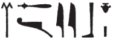
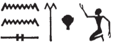
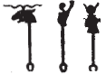
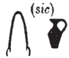
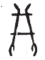
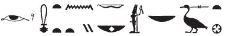

# Calendar I (55) {-}

## Esna 55 {-}  
  
  
  
- Location: South-East Door, right   
- Date: Probably Domitian  
- [Hieroglyphic Text](https://www.ifao.egnet.net/uploads/publications/enligne/Temples-Esna002.pdf#page=190){target="_blank"}  
- Bibliography: @sauneron-5, pp. 7, 11-19 (complete); @grimm

#### Title {-}

^1^ *rḫ(.t) ḥb.w nw Iwny.t  *  
  *ḥw.t-bȝ.w ḥw.t-ṯȝ.wy  *  
*nty ḥr ʿr.w nw nṯr.w  *  
*ḥnʿ ḏ(d) n tpy.w-ʿ  *  

^1^ List of the festivals of Iunyt,  
Temple of the Bas, Temple of the Chicks,  
which are on the papyri of the gods,  
and the oral tradition of the ancestors.  

### Thoth (Akhet I) {-}

#### Thoth 1 {-}

  

*ḥb wp.t-rnpt nfr nfr  *  
*ḥb Nḥb-kȝ.w  *  
*ẖnmw ḥnʿ psḏ.t=f  *  
   
*gm šw ỉr.t=ḥr  *  
*m-ʿ Swt(ḫ)  *  
*nḥm=f sw m [...]  *  
  
*nỉs pȝ ʿn *  
*n šzp rnp.t-nfr.t  *  
*ỉr(.t) ỉrw nb  *  
*mỉ nty r nt-ʿ  *  
    
*sḫʿ n ẖnmw-Rʿ nb tȝ-sn.t  *  
*ḥnʿ psḏ.t=f  *  
*pr-ẖnmw pr-sȝḥw-Rʿ   *  
*ẖnm-ỉtn ḥtp  *   
  
New Year festival: twice good!  
Festival of Nehebkau,  
Khnum with his Ennead.  
  
Shu finds the eye of Horus  
in the hand of Seth,[^fn-55-1]  
he takes it as [...]  
  
Reading the tablet   
of receiving the Good Year.[^fn-55-1a]  
Perform all rites  
like what is on the festival papyrus.  
  
Procession of Khnum-Re Lord of Esna,  
along with his Ennead:  
(to) Per-Khnum (and) Per-Sahure.  
Union with the disk. Return.  

[^fn-55-1]: {width=12%} - Note the spelling of *m-ʿ*. 
[^fn-55-1a]: For this ritual, see @germond-nouvelan.

#### Thoth 4 {-}

  

*m ʿȝ-ỉb  *  
*ḥb ḏḥwty  *  
  
Do not be haughty![^fn-55-2]  
Festival of Thoth.  

[^fn-55-2]: {width=15%} - @sauneron-5, p. 12, n. f, refrained from translating this group. Like other warnings from the Calendars of Lucky and Unlucky Days, this appears to be an injunction against boastful activity on this particular day. For this phrase, compare *Ptahhotep* 2, 1; 5, 8 (*m ʿȝ-ỉb=k*). @grimm, pp. 25,  240, L2, n. a, suggested "rein an Herz (?) (*m ʿbw jb*)", but that does not appear to fit the existing hieroglyphs.

#### Thoth 9 {-}

 

*ḥb Imn ḥb Rw  *  
*m wp.t-rnp.t   *  
*ḏ(d) tpy.w-ʿ  *  
  
*ỉr(.t) mnḫ.t n ẖnmw  *  
*ḥnʿ psḏ.t=f  *  
*n Pr-ẖnmw n sḫ.t  *  
*nn s(w) m ḥr(.w)  *  
  
Festival of Amun, Festival of Re,  
being the New Year,  
as the ancestors would say.  
  
Giving linens to Khnum  
along with his Ennead  
of Per-Khnum of the Field,  
but not in public.[^fn-55-3]  

[^fn-55-3]: {width=15%} - @sauneron-5, pp. 11-12, n. g, emended this to "Priere (?) devant son visage (*sns m ḥr=f*)," while @grimm, pp 25, 241, L3, n. g, read "Rufen vor dem Gesicht(?) (*njs m ḥr(?)*)." The present translation requires no correction, understanding a set phrase: *Wb* III, 128, 1.  

#### Thoth 10 {-}

 
*ʿḥȝ nfr  *  
*ḥb tfn.t m Iwny.t  *  
^2^ *ỉn Rʿ ỉr n=s  *  
*šȝʿ ỉr(.t) kȝ.t   *  
*n ms.w Srq.t  *  
   
*sḫʿ n Nb.t-ww Nb.t tȝ-sn.t  *  
*ḏbȝ=s m ḥbs n ins  *  
*ḫʿỉ r s.t-ḥry [...]  *  
*[...]  *  
*[...] ms.w Rʿ   *  

*ḥtp  *  
*šzp jns   *  
*jr(.t) ʿȝb.t ʿȝ.t  *  
   
*sḫʿ n Is.t m pr-nṯr  *  
*r wȝḥ ỉ[ḫ]t   *  
*n sn=s Wsỉr ḥnʿ [...]  *  
*[...]  *  
    
*sḫʿ nṯr.t tn   *  
*m tr n rwhȝ  *  

*ḥtp n pr-ẖnmw  *  
  
Bad and good.  
Festival of Tefnut in Iunyt:  
^2^ it is Re who acts for her.  
Beginning doing work  
for the children of Serqet.[^fn-55-4]  
  
Procession of Nebtu, Lady of Esna;  
covering her in red cloth;  
going to the Higher Place [...],  
[...]  
[...] of the children of Re.  
  
Return.  
Receiving red cloth.  
performing a great offering.  
  
Procession of Isis in Per-netjer,  
in order to lay down offerings  
for her brother Osiris, along with [...]  
[...]  
  
Procession of this goddess  
at the time of evening.  
  
Return to the temple of Khnum.    
  

[^fn-55-4]: According to *LGG* III, 427c, these beings are a group of snakes, occasionally mentioned in magical texts.

#### Thoth 1[2] {-}

 
*[s]ḫʿỉ n nṯr.t tn   *  
*r pr-sȝḥw-Rʿ  *  
*ḥtp m tȝ-sn.t  *  
*m tr n rwhȝ  *  
  
[Pro]cession of this goddess  
to Per-sahure,  
returning to Esna  
at the time of evening.  

#### Thoth 14 {-}

 

*ḥb twtw zȝ N.t  *  
*ṯz ỉḫt (ḥr) ḫȝw.t  *
  
Festival of Tutu, son of Neith:  
binding offerings (on) the altar.  

#### Thoth 19 {-}

 

*ḥb ḏḥwty ʿȝ wr  *  
*m tȝ-r-ḏr=f  *  
*ḥb ḥr  *  
   
*ʿq šw zȝ Rʿ  *  
*r ḏȝ-rȝ n ỉt=f  *  
*m hrw pn  *  
*ỉr.t ỉrw nb  *  
  
Festival of Thoth, the very great  
in the entire land.  
Festival of Horus.  
  
Shu, the son of Re, enters  
to feed his father  
on this day.  
Performing every ritual.  
   

#### Thoth 21 {-}

*ỉr.t mȝʿ-ḫrw   *  
*n ḏḥwty m-bȝḥ Rʿ  *  
  
Performing justification  
for Thoth before Re.  

### Paophi (Akhet II) {-}

#### Paophi [1?] {-}

*[...] [n]ḏ.t ỉr.t-ḥr  *  
*hrw pfy  *  
  
*^3^ pr ỉn šw  *  
*ḥnʿ tfn.t  *  
*r wḏʿ ỉmy.w-ẖ.t *   
  *ḥm=f  *  
    
*sḫʿỉ n ḥkȝ ḫnsw ḏḥwty  *  
*ẖnm-ỉtn ḥtp  *  
  
[...] protecting the Eye of Horus  
on this day.  
  
^3^ Shu comes forth  
together with Tefnut  
to cut off [^fn-55-5] the intestines(?)   
  of his Majesty.  
  
Procession of Heka, Khonsu-Thoth.  
Union with the disk, return.  

[^fn-55-5]: Apparently an allusion to Apophis and other enemies of Re who emerged from Atum's. If they are indeed serpents, they appear to be identified here with intestines (also *ỉmy.w-ẖ.t*). For the signifiance of this verb (*wḏʿ*), see Corteggiani, BIFAO 95; for the Heliopolitan mythology here, see @meeks-delta.
<!--Note the original reading by Junker, Auszug, p. 71, appears to make more sense: "um die Eingeweide abzuschneiden(?)" (Cited by Grimm, p. 243, L10, n. e) -->

#### Paophi 4 {-}

*ḥb Gm-bȝ.w=s  *  
*gm.n.tw ỉr.t-ḥr  *  
*m bȝ=s m bȝẖ  *  
   
*nṯr.t m hrw pn Nb.t-ww  *  
*bwt=s ḥqr ỉbw  *  
    
*sḫʿỉ n nṯr.t tn ḥnʿ [...]  *  
*m-bȝḥ=s  *  
*sḏr m pr=s*  
*n tr n rwhȝ  *  
  
Festival of *Gm-bȝ.w=s*:  
the Eye of Horus was found  
in her (appeased) Ba-form[^fn-55-999] in Bakhu.  
  
The goddess in this day is Nebtu,  
her taboos are hunger and thirst.  
  
Procession of this goddess with [...]  
in her presence,  
spending the night in her temple  
at the time of evening.  

[^fn-55-999]: Cf. [Esna 163], 23, where the verb *bȝ* refers to the pacified Bastet, in contrast to *sḫm* for Sakhmet.

#### Paophi 6 {-}

*ḥb Mnḥy.t  *  
*nhm.tw n=s ỉn ḥmw.wt  *  
  
*ḥb Is.t  *  
*šȝʿ ỉr(.t) ḥb  *  
*ḫ(r).tw r=f  *  
  
Festival of Menhyt:  
rejoicing for her by women.  
  
Festival of Isis.  
Also called:  
Festival of Beginning to Act(?)  

#### Paophi 14 {-}

*ʿq m hrw pn  *  
*sḫʿ ẖnmw-Rʿ   *  
*nb sḫ.t  *  
*ḥnʿ psḏ.t=f  *  
*ẖnm-ỉtn ḥtp  *  
*ỉḫt (ḥr) ḫȝw.t  *  
  
Festival on this day.  
Procession of Khnum-Re,   
Lord of the Field,  
along with his Ennead:  
Union with the disk, return,  
food (upon) the altar.  

#### Paophi 16 {-}

*ḥb N.t  *  
*ḥb ỉr.t-Rʿ  *  
*ỉn sy šw  *  
  
Festival of Neith,  
Festival of the Eye of Re,  
Shu brings her back.  

#### Paophi 19 {-}

*ḥb Imn m ỉp.t=f    *
  
Festival of Amun in his Opet.  

#### Paophi 25 {-}

*ḥb Ptḥ nb ʿnḫ-tȝ.wy  *  
*ḥb ḥkȝ    *
  
Festival of Ptah, Lord of Ankh-tawy.  
Festival of Heka.  

#### Paophi 28 {-}

*ḥb Mnḥy.t-Nb.t-ww  *  
^4^ *sḫʿ nṯr.t tn  *  
*r swḏȝ sḫ.t  *  
    
*ỉr(.t) ỉrw nb n ḥtp  *  
*m wsḫ.t-ḫʿ  *  
  
Festival of Menhyt-Nebtu,  
^4^ procession of this goddess  
to make the field thrive.  
  
Performing every ritual of resting  
in the Court of Appearances.  

### Hathor (Akhet III) {-}

#### Hathor 1 {-}

*ḥb sḫm.t  *  
    
*sḫʿ n mdw.w  *  
*n nṯr.w ʿȝ.w  *  
*ḥtp n p(ȝ) wbȝ  *  
*n ḫft-ḥr  *  
*ỉr(.t) ỉrw=sn  *
  
Festival of Sekhmet.  
  
Procession of the standards[^fn-55-6]  
of the great gods.  
Stop at the entrance hall  
near the processional way.  
Perform their rites.  

<!--also add: Wallet-Lebrun, Christiane 1985. A propos d'wbA: note lexicographique. Göttinger Miszellen 85, 67-88.; and Rondot, Hypostyle Karnak --; Ptolemaic Lexikon
Sauneron, p. 15, n. a, said this was bizarre, and translated (p. 14): "la cour axiale"--> 

 

[^fn-55-6]: {width=15%} - The divine standards of Khnum, Neith, and Nebtu.

#### Hathor 10 {-}

*ʿḥȝ nfr  *  
*ḥb N.t ḥnʿ zȝ=s   *  
*twtw  *  
  
Bad and good.  
Festival of Neith with her son,  
Tutu.  

#### Hathor 19 {-}

*tȝ ỉns [...]  *  
  
The red cloth [...] 

#### Hathor 2[2?] {-}

*ḥȝ.t n wp ḥkȝ  *  
*r pr ẖnmw  *  
  
Start of the festival of Heka,  
at/towards Per-Khnum.[^fn-55-6a]  

[^fn-55-6a]: For further details on this festival, which featured the enthronement of Heka the Child at Per-netjer, see *Esna* III, 339-341; @sauneron-5, pp. 29-35.

#### Hathor 23 {-}

*Nb.t-ww ẖnmw pȝ nḫy nfr  *  
*r tȝ s.t-ʿȝ.t  *  
    
*ỉr.t qbḥw snṯr  *  
*ḥtp n pr-ẖnmw  *  
  
Nebtu, Khnum the Good Champion,  
towards the Great Place.[^fn-55-6b]  
  
Doing cool water and incense,  
return to Per-Khnum.  

[^fn-55-6b]: A few more details for this festival can be found in *Esna* III, 342; @sauneron-5, pp. 37-38.

#### Hathor 25 {-}

*šw [zȝ Rʿ]  *  
*[...ẖnmw] nb sḫ.t  *  
  
Shu [son of Re]  
[...Khnum] Lord of the Field.[^fn-55-6c]  

[^fn-55-6c]: A few more details for this festival can be found in *Esna* III, 343; @sauneron-5, pp. 39-40.

#### Hathor 29 {-}

*ỉʿb ỉḫt  *  
*ḫr.tw r=f  *  
  
*sḫʿ n Nb.t-ww  *  
*m ḥb=s nfr  *  
  
*ḥtp n tȝ wsḫ.t n bnr  *  
*ỉr ʿȝb.t m bȝḥ=s  *  
*mỉ nty r pȝ ʿḥʿ  *  
*n (mn-ḫpr-Rʿ)|  *  
  
*ḫʿ r t(ȝ) s.t-ʿȝ.t nfr.t  *  
*ḥr sȝ ḥn rwhȝ  *  
*ḥtp n pr-nṯr  *  
  
Assembling offerings:  
so this (festival) is called.  
  
Procession of Nebtu  
in her good festival.[^fn-55-6d]  
  
Stopping in the outter courtyard,  
doing a mixed offering before her,  
like what is on the stela  
of (Menkheperre)| (i.e. Thutmosis III).  
  
Going out to the Great, good Place
after the evening service,  
return to Per-netjer.  
  

[^fn-55-6d]: This interesting festival of Renenutet-Nebtu is described in greater detail in  few more details for this festival can be found in *Esna* III, 344; @sauneron-5, pp. 41-43.

#### Hathor 30 {-}

^5^ *sḫʿ n ḥkȝ pȝ-ẖrd  *  
*r s.t-ʿȝ.t  *  
    
*ỉr(.t) ỉrw nb   *  
*n hrw ẖn.t  *  
  
^5^ Procession of Heka the Child  
to the Great Place.  

Perform every rite  
of the day of the boat procession.[^fn-55-6e]  
  

[^fn-55-6e]: Similar proceedings are recorded in *Esna* III, 345. Since this day is also a multiple of ten, the same text describes decade rituals performed by Isis "lady of Elephantine." Cf. @sauneron-5, pp. 45-46.

### Khoiak (Akhet IV) {-}

#### Khoiak 1 {-}

*ḥb kȝ-ḥr-kȝ  *  
*sḫʿ.n ẖnmw-Rʿ   *  
*ḥry s.t-f wr.t m Iwny.t  *  
*ḥ(nʿ) psḏ.t=f  *  
*ẖnm-ỉtn ḥtp  *  
   
*sḫʿ.n Nb.t-ww   *  
*ḥnʿ ỉmy.w-(ḫ.t)=s  *  
*r tȝ s.t-ʿȝ.t  *  
*ỉr(.t) snṯr qbḥw  *  
*ḥtp m pr-ẖnmw  *  
*ỉḫt (ḥr) ḫȝw.t  *  
   
Khoiak Festival.[^fn-55-6f]  
Procession of Khnum-Re  
upon his great throne in Iunyt,  
along with his Ennead.  
Union with the sundisk. Return.  
  
Procession of Nebtu,  
together with her retinue,  
to the Great Place.  
Giving incense and cool water,  
returning to Per-Khnum,  
offering (upon) the altar.  

[^fn-55-6f]: Many events occur at Esna and North Esna during the first days of Khoiak: @sauneron-5, pp. 47-67. 

#### Khoiak 2 {-}

*ḥb ẖnmw*  
  
Festival of Khnum

#### Khoiak 1-6 {-}

*ỉỉ ḫr nṯr.w m spȝ.t=sn  *  
*r mȝȝ nṯr šps  *  
*m rn=sn  *  
    
*ḥr Nḫn  *  
*šw zȝ-Rʿ  *  
*ḥw.t-ḥr wr.t nb.t ʿgny  *  
*Nb.t-ḥw.t n Pr-mr  *  
*Mnḥwy ʿšȝ-dm   *  
*m ḥw.t-ḥtp  *  
*ḥr ỉȝbty n ḥfȝ.t  *  
*Sbk nb Swmnw  *  
*ḥr nb Swmnw  *  
*zȝ Gbb pw  *  
*ḥmn m sḫ.t-ỉwr.t  *  
*Imn m P   *  
*nty ḥr ỉȝbt.t n tȝ-sn.t  *  
     
*ḫpr nn nṯr.w   *  
*m pr ẖnmw n sḫ.t  *  
*šȝʿ (m)* ^6^ *ȝbd 4 ȝḫ.t hrw 1  *  
*nfry.t r hrw 6  *  
*ḥr ỉr(.t) qbḥw   *  
*n ỉmy.w ỉmḥ.t  *  

*ỉw mšʿ n=s  *  
*(ḥr) ỉr(.t) hrw nfr  *  
*m-dbn ḥw.t-nṯr tn  *  
   
*ỉr.t ỉrw nb n ḫʿỉ  *  
*n nṯr pn šps  *  
*m tr n rwh  *  
*mỉ nty r ȝbd 3 šmw 20  *  
  
Then gods come from their districts  
to see the august god,  
in their names:[^fn-55-9]  
  
Horus of Nekhen (Hierakonpolis),  
Shu son of Re;  
Hathor the great, Lady of Agny;  
Nephthys in Per-mer (Komir);  
Menehwy, numerous of knives  
in Hut-hetep;  
Horus the Eastern in Hefat (Mo'alla);  
Sobek Lord of Sumenu (el-Rizeiqat);  
Horus Lord of Sumenu  
(that means the son of Geb);  
Hemen in Sekhet-Iuret;  
Amenemope  
who is to the East of Esna.  
  
These gods are   
in the temple of Khnum of the Field,  
from ^6^ IV Akhet day 1  
until day 6,  
performing cool water offerings,  
to those within the crypt.  
  
A multitude attends it,  
performing *hrw-nfr*  
all around this temple.  
  
Perform all rites of procession  
for this august god,  
at the time of evening,  
just like on [Epiphi 20].[^fn-55-10]

[^fn-55-9]: These are all divinities from temples in the area who visit North Esna during the month of Khoiak to pay tribute to the ancestor deities. See @sauneron-5, pp. 48-57. Several of these divinities appear in offering scenes at Esna, as well as various scenes in other temples: cf. @recklinghausen-2014.
[^fn-55-10]: This is the great festival where Khnum of the Field receives his shepherd's crook: @sauneron-5, 355-378.

#### Khoiak 3 {-}

*sḫʿ.n ẖnmw-Rʿ nb sḫ.t  *  
*ẖnm-ỉtn ḥtp  *  
  
*pẖr pȝ ḏȝḏȝ m wn.t  *  
*ỉn ḥkȝ pȝ ẖrd  *  
*qdỉ m-dbn tȝ wʿb.t  *  
  
Procession of Khnum-Re Lord of the Field.  
Uniting the sundisk, return.  
  
Going quickly around the tribune,  
by Heka the Child,  
encircling the Wabet.   

#### Khoiak 4 {-}

*sḫʿ.n Nb.t-ww  *  
*ḥnʿ ỉmỉ.w(-ḫt)=s  *  
*r tȝ s.t-ʿȝ.t  *  
    
*ỉr.t ḥb m bȝḥ=s  *  
*ḥtp n pr-ẖnmw  *  
*m tr n rwh  *  
  
Procession of Nebtu,  
with her retinue  
to the Great Place.  
  
Making festival before her.  
Return to Per-Khnum  
at the time of evening.  

#### Khoiak 5 {-}

*pȝ ẖrd r tȝ s.t-ʿȝ.t  *  
  
The child to the Great Place.

#### Khoiak 6 {-}

*sḫʿ n ẖnmw-Rʿ nb sḫ.t  *  
*ʿḥʿ[.ỉ]n nṯr.w   *  
*ỉỉ(.w) m spȝ.t=sn  *  
*m ḫft-ḥr n nṯr pn  *  
   
*ḏ(d) ỉn pȝ sš-nṯr  *  
*ỉ nṯr.w nṯry.t nb  *  
*ỉw(.w) r mȝȝ ẖnmw m wpy=f  *  
*spr=tn r spȝ.t=tn  *  
*m ȝw.t-ỉb  *  
    
^7^ *sḫʿ.n nṯr.w r spȝ.t=sn  *  
*ỉn wʿb n=sn ỉmy  *  
    
*Nb.t-ww ḥkȝ pȝ ẖrd  *  
*r pr-Sȝḥw-Rʿ  *  
*ḥtp m tȝ-sn.t  *  
*m tr n rwhȝ  *  
  
Procession of Khnum-Re Lord of the Field.  
The gods who arrived from their district  
make a processional stop  
in the forecort of this god.  
  
The the scribe of god says:  
'O all gods and goddesses  
who came to see Khnum in his wpy-festival,  
may you reach your districts  
in happiness!'  
  
^7^ Procession of the gods to their district  
by each of their respective *wʿb*-priests.   
  
Nebtu, Heka the Child  
towards Per-Sahure.  
Return to Esna  
at the time of evening.  

#### Khoiak 11 {-}

*ẖnmw pȝ-nḫy-nfr  *  
*r pr-Sȝḥw-Rʿ  *  
*ḥtp m Iwny.t m hrw pn  *  
  
Khnum the Good Protector  
towards Per-Sahure,  
return to Iunyt on this day.  

#### Khoiak 25 {-}

*wn ʿ.wy m r-pr.w  *  
*ỉḫt (ḥr) ḫȝw.t  *  
   
Open the doors of the temples.  
Offerings (upon) the altar.  

#### Khoiak 26 {-}

*ḥb-skr  *  
*ḥtp nṯr m pr-sȝḥw-Rʿ  *  
*ỉr(.t) ỉrw nb  *  
      
*ỉr ḥr-sȝ *   
*sḫʿ n ẖnmw (pȝ)-nḫy-nfr  *  
*ḥr sḥr ḏȝ.t m pr pn  *  
   
Festival of Sokar:  
this god rests in Per-Sahure,  
perform all rites.  
  
Afterwards,  
procession of Khnum the Good Protector,  
repelling all enemies from this temple.  

#### Khoiak 27 {-}

*ḥb N.t  *  
*wn ʿ.wy m s.wt   *  
*wrḥ nṯr.w  *  
  
*sḫʿ.n nṯr.t  *  
*ḥnʿ psḏ.t=s  *  
*ẖnm-ỉtn ḥtp  *  
  
Festival of Neith:  
Open doors in the places,  
anoint the gods.[^fn-55-163-2]  
  
Procession of the goddess  
together with her Ennead,  
Union with the sun disk, return.  

[^fn-55-163-2]: More details of this festival in the hymn to Neith, [Esna 163], 21-22.

#### Khoiak 30 {-} 

*ḥb sʿḥʿ ḏd   *  
*n Wsỉr m pr-nṯr  *  
  
Festival of raising the Djed-pillar  
for Osiris in Per-netjer.  

### Tybi (Peret I) {-}

#### Tybi 1 {-}

*ḥb Tfn.t  *  
*sḫʿ.n Mnḥy.t Nb.t-ww ḥkȝ  *  
  
Festival of Tefnut.  
Procession of Menhyt, Nebtu, Heka.  

#### Tybi 4 {-}

 

*pr(.t) r-ḥȝ ỉn šmʿ-nfr  *  
*dỉ(.t) n=f ʿnḫ.w  *  
*m-bȝḥ* ^8^ *ỉt=f mw.t=f   *  
*ỉḫt ḥr ḫȝw.t  *  
  
Going out by Shemanefer.[^fn-55-11a]  
Giving him flowers  
before ^8^ his father and mother.[^fn-55-11]  
Offering upon the altar.  

[^fn-55-11a]: 
[^fn-55-11]: {width=15%} - Most texts specify that Shemanefer is the son of Neith, and do not mention who his father is. This passage suggests he might be Khnum. Similar determinatives to it.w, "parents" in [Esna 58], 3 and 6.

#### Tybi 17 {-}

 

*ẖn.t pw n Mnḥy.t  *  
  
It is the boat procession of Menhyt.

#### Tybi 18 {-}

 

*ḥb N.t   *  
*ḥb wr-ḥkȝw  *  
*ḥb ẖrd m zȝw  *  
      
*sḫʿ.n nṯr.t tn   *  
*ỉr.t ỉrw nb n ẖn.t  *  
*m pȝ ỉšrw  *  
*nfry.t r hrw 21  *  
  
Festival of Neith.  
Festival of Eldest of Magic (Heka).  
Festival of the Child in Sais.  
  
Procession of this goddess.  
Perform all rites of a boat procession  
in the Isheru,  
until the 21st.  

#### Tybi 19 {-}

 

*ḏbȝ ẖnm-ỉtn   *  
*n Nb.t-ww  *  
  
Clothing,[^fn-55-12] Union with the sun disk
for Nebtu.

[^fn-55-12]: {width=10%} - @sauneron-5, pp. 17-18, with n. c, thought the first sign was a mistake for the di-bread loaf: "Assurer (*ḏỉ.t*) l'union au disque"; @grimm, pp. 73, 250, L41, preferred *zḫn*, "Sichereignen des Sichvereinigens." However, neither expressions occur elsewhere in the Esna calendar. Rather, this resembles similar spellings of the triangular *ḏbȝ* sign at Esna, where it very closely resembles negative arms. For example, above in a similar calendar entry for [Thoth 10]: {width=8%}; or in the word *ḏbȝ.t*, "coffin": [Esna 129], 4: {width=10%}; cf. @sauneron-2, p. xxviii. For other references to "clothing (*ḏbȝ*)" in the festival calendars, see @grimm, pp. 318-319.

#### Tybi 28 {-}

 

*ẖn.t pw   *  
*nfry.t r hrw 4   *   
  
It is the boat procession,  
until the fourth day ([Mechir 1]).

#### Tybi 29 {-}

 

*ḥb ʿq r nỉw.t=f  *  
*sḫʿ.n ẖnmw-Rʿ nb tȝ-sn.t   *  
*[...]  *  
  
Festival of Entering his City.  
Procession of Khnum-Re Lord of Esna  
[...]  

#### Tybi 30(?) {-}

 

*ḥb ḥw.t-ḥr nb.t ʿgny  *  
  
Festival of Hathor, Lady of Agny.[^fn-55-13]

[^fn-55-13]: The precise date is uncertain. A hymn to Hathor of Agny was recited during a festival of Nebtu on [Hathor 29]: *Esna* III, 344, 12; @sauneron-5, p. 42. She also had another festival at Esna on [Payni 14].

### Meshir (Peret II) {-}

#### Meshir 1 {-}

*ḥb nṯr.w nṯry.t  *  
*ỉr.t ỉrw nb   *  
*n ẖn.t  *  
*ḥtp ḥr s.t=sn  *  
*ỉr.t hrw nfr ỉn z nb  *  
   
Festival of gods and goddesses.  
Perform all rites   
of boat processions,  
return to their seats.  
Everybody celebrates *hrw-nfr*.  

#### Meshir 6 {-}

*ʿḥȝ-nfr  *  
*ḥb šw  *  
*ḥb ỉrt-ḥr  *  
*sḫm.t pw  *  
*ḥb Mnḥy.t  *  
*nṯr.t m hrw pn   *  
*wr.t-mrw.t  *  
  
Bad-Good.  
Festival of Shu.  
Festival of the Eye of Horus  
(that means Sakhmet).  
Festival of Menhyt.  
The goddess in this day   
is Great of Love.  

#### Meshir 8 {-}

 

*ḥb N.t   *  
*^9^ wn ʿ.wy   *  
*m ḥw.t-N.t  *  
*[r]ḏỉ ḥtp.w n psḏ.t=s  *  
*nṯr.t tn ḥnʿ psḏ.t=s [...]  *  
*[...] N.t  *  
*ḥr-sȝ ỉr.t ḥn n rwhȝ  *  
*ẖnm-ỉtn ḥtp  *  
  
Festival of Neith.[^fn-55-14]  
^9^ Open the doors   
in the Temple of Neith,  
give offerings to her Ennead,  
this go with her Ennead [...]  
[...Neith]  
Afterwards, do the evening service.  
Unite with the sundisk, return.

[^fn-55-14]: This festival is mentioned in the long hymn to Neith, [Esna 163], 21 (noted by @sauneron-2, p. 129, n. b). 

#### Meshir 17 {-}

 

*ḥb N.t nb.t tȝ-mḥw  *  
*ỉr(.t) mỉt.t ḥb tȝ-nt-šmr.t   *  
*n nb.t zȝw  *  
  
Festival of Neith, Lady of Lower Egypt.  
Do like in the festival of She of the Bow(?)  
for the lady of Sais.[^fn-55-15]  

[^fn-55-15]: {width=35%} - The reading is uncertain; cf. @sauneron-5, pp. 19, n. e, Corrigenda, A. Rather than introduce a festival of an otherwise unknown "Min Lord of Sais", I propose to read the Min figure as a preposition (*n/m* < *Mnw*), since he represents *m* elsewhere at Esna. A similar festival procession of Neith, where she appears with her bow, is described in [Esna 63], 1-2, apparently associated with Meshir 16.

#### Meshir 21 {-}

 

*ḥb qn  *  
*sḫʿ.n ḥkȝ   *  
*r wsḫ.t-ḫʿ  *  
*ỉr.t ỉrw nb n ḥb qn  *  
*m pȝ wbȝ n nṯr pn  *  
  
^10^ [...]   
*m ḫft-ḥr n nṯr pn  *  
  
Festival of Victory.  
Procession of Heka  
to the court of appearances.  
Perform all rites  
for the Festival of Victory  
in the forecourt of this god.  
  
^10^ [...]  
on the dromos of this god.  

