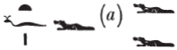
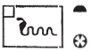
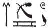

# Esna 56 {-}

- Location: Next to the South Pillar
- Date: Probably Domitian
- [Hieroglyphic Text](https://www.ifao.egnet.net/uploads/publications/enligne/Temples-Esna002.pdf#page=197){target="_blank"}
- Bibliography: None

| *ʿnḫ [nṯr nfr]  *
| *ṯnỉ [...]   *
| *ỉm=s  *
| *ẖkr.tw [m] ḫkr.w n ẖnmw   *
|   *tȝ-ṯnn nfr-ḥr   *
|     *nb šw.ty-wr  *
|   
| Live the good god,
| distinguished [...]
| in it,
| equipped [with] the regalia of Khnum ({width=10%}):
|   Tatenen, beautiful of face,
|   lord of the great double-plumes;[^fn-56-1]

| *ḫʿỉ m ʿḥ m nḏm-ỉb  *
|   *r mȝȝ ỉt-ỉt.w  *
|     *ḥnʿ psḏ.t=f  *
|       
| He who appears from the palace in joy,
|   to see the father of fathers [^fn-56-2],
|     along with his Ennead.

| *swʿb s(w) nb.wy  *
| *msỉ s(w) nb.ty  *
| *spr=f ḥw.t-ỉt  *
|   *m ʿb wr  *
| *(r) snỉ-tȝ    *
|   *n nṯr ʿȝ m kȝr=f  *
| 
| The two lords [^fn-56-3] purify him,
| the two ladies guide him, [^fn-56-4]
| he reaches the Temple [^fn-56-5]
|   in great purity [^fn-56-6],
| (to) kiss the ground 
|   for the great god [^fn-56-7] in his shrine.

| *pr-wr m wnf  *
| *pr-nw m tf[n]  *
| *sḥ.w ỉpn m ršw [...]  *
|   *ḏr ʿq s(n) nb=s[n]  *
|   
| The Per-wer is delighted,
| the Per-nu is ecastat[ic],
| these chapels are in joy [...]
|   since their lord enters them.

| *[...ỉt=]f nḥp  *
| *dỉ=f n=f nswy.t   *
|   *m ḥqȝ m tȝ   *
|     *ḫnty ʿnḫ.w ḏ.t  *
| 
| [...] his [father], the Potter,
| he gives to him kingship,
|   as ruler of the earth,
|     foremost of the living, eternally.

[^fn-56-1]: This is all an allusion to the parallel scenes [Esna 52] and [Esna 74], in which the king "leaves the palace", wearing the double-plumed crown characteristic of Khnum-Tatenen.

[^fn-56-2]: {width=15%} - This might alternatively write "(his) father, Nun."

[^fn-56-3]: For this epithet, Sauneron cites [Esna 74], 12. This refers to Horus and Thoth, who purify the king before he meets Khnum and Menhyt in [Esna 67].

[^fn-56-4]: Wadjyt and Nekhbet, as depicted accompanying the king in [Esna 70].

[^fn-56-5]: {width=10%} - This reading is confirmed by [Esna 157 B], which is paralleled by a regular spelling in *Esna* III, 242, 23 (58); another example occurs in *Esna* III, 243, 9, where Khnum is identified as the serpentine Kematef.

[^fn-56-6]: {width=10%} - @kurth-1, p. 312, n. 138, cites this example as a unique spelling of the lotus bud for *r*.

[^fn-56-7]: {width=8%} - Note the spelling, appropriate for the statue of Khnum within his shrine, and reveals the contemporary pronunciation (cf. Coptic ⲛⲟⲩⲧⲉ).