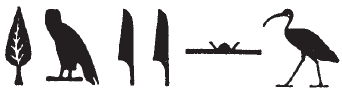

## Esna 58 {-}  
  
- Location: South-east door, Lintel   
- Date: Domitian  
- [Hieroglyphic Text](https://www.ifao.egnet.net/uploads/publications/enligne/Temples-Esna002.pdf#page=201){target="_blank"}  
- Bibliography: [See entries in Tempeltexte 2.0](http://www.tempeltexte.uni-tuebingen.de/portal/#/text-detail/482){target="_blank"}  
- Parallels: The first section is paralleled exactly in *Esna* VI, 474.
  
  
  
  

  
  
^1^ *ỉȝ.t ṯȝ.wy  *  
*s.t-ʿn.t n ỉrỉ-tȝ  *  
*r'-ḥn.t*  
*n tmȝ.t ḥnʿ ḏt  *  
*rhn=sn ỉs m-ḫnt=s  *  
  
*ẖnm=f sy m ršw  *  
*m rn=f n ẖnmw  *  
   
*mn=s ḥȝ=f   *  
*m rn=s n Mnḥy.t  *  
   
*wpš.n=s m wp.t=f  *  
*m rn=s n Nb.t-ww  *  
   
^1^ The Mound of the Chicks,[^fn-58-1]  
it is the stronghold [^fn-58-2] of Irita,  
the Mouth of the Canal (*r'-ḥn.t*)[^fn-58-3]  
of the mother together with the *ḏ*-serpent,[^fn-58-4]  
they rested (*rhn*)[^fn-58-4a] themselves within it.  
  
He unites (*ẖnm*) with her in delight,  
in his name of Khnum (*ẖnmw*).  
  
She stays (*mn*) behind (*ḥȝ*) him,  
in her name of Menhyt (*Mnḥy.t*).  
  
She shone (***w****pš*) upon his brow (***w****p.t*),  
in her name of Nebtu (*Nb.t-****ww***).[^fn-58-5]

[^fn-58-1]: {width=10%} - Similar spellings occur in [Esna 74], 34; *Esna* II, 16, 1; *Esna* III, 243, 10; *Esna* IV, 433, 1; 436; *Esna* VII, 586; 602, 11. @sternberg, p. 62, n. a, transcribed this example as *bȝ.wỉt*. However, the simple ram elsewhere writes *ṯȝ* (< *ṯȝy*, "male") in *ṯȝw*, "wind; breath": *Esna* III, 378, 17 and 21; probably also in @leitz-rams, p. 260, Nos. 20-21.
[^fn-58-2]: For this term, see @klotz-caesar, p. 162, n. 1031.
[^fn-58-3]: {width=10%} - Reading doubtful, the parallel in *Esna* VI, 474 is spelled similarly: {width=10%}. Given the context, it might also be relevant to compare a term that shows up in connection with a goddess in [Esna 75]: {width=8%}. The lotus bud usually writes *n* at Esna, but at least once it spells *r*, in the nearby inscription [Esna 56]. This term, identical to the city of Illahun, literally means "mouth of the canal." The reading might be supported by the subsequent use of the nearly homophonous verb *rhn*.
[^fn-58-4]: For the primeval ḏ-serpent who emerges from Nun with Irita, see @klotz-caesar, pp. 171-174.
[^fn-58-4a]: This key verb is used multiple times in the cosmogony of Neith-Methyer: *Esna* III, 206, 2, §5; 3, §7; 4, §8; as well as in [Esna 80], 1.
[^fn-58-5]: The pun in Nebtu's name seems to relate to the repeated *w*'s. However, note that the term *nb.t* is occasionally spelled *wby* in Demotic (@smith-mortuary, pp. 110-111), perhaps explaining the repeated *wp*'s here.  The same series of etymologies for Menhyt and Nebtu occur in *Esna* VI, 546, 4.

 

^2^ *nṯr.w [wr].w pȝwty tpy  *  
*ỉỉ=sn ḫr=f  *  
*ms.w tȝ-ṯnn   *  
*m 7 ḏȝỉs.w wr.w   *  
*nw Mḥ.t-wr.t  *  
  
*ỉmỉ-ỉb=sn ḥnʿ=sn  *  
*r sšm sḫr.w Nwn  *  
*r nw=f  *  
*r ṯz tȝ m pr.t=sn  *  
    
*^3^ kȝ.n=f tȝ   *  
*ḫr ẖnmw.w wr.w  *  
*ms.n=f nṯr  *  
*ỉr kȝ.t nn ȝb  *  
  
^2^ The great gods of the first primeval time,  
they come before him,  
(namely) the children of Tatenen,  
being the Seven Djaisu   
of Mehet-weret.[^fn-58-6]  
  
They conferred[^fn-58-6b] with one another
to regulate the condition of Nun  
at his time,  
and to bind the earth with their seed.  
  
^3^ He planned the earth,  
before the Great Khnums,[^fn-58-7]  
he birthed the god,  
(to) do work, without cease.  

[^fn-58-6]: {width=15%} - Notable spelling.
[^fn-58-6b]: {width=25%} - @sternberg, p. 64, n. h, split this into two separate clauses, and read the ibis as Dd, "to say." However, the ibis actually does not write that verb (@kurth-1, p. 251, 64; @dem-thoth, p. 82), usually only the baboon form of Thoth.
[^fn-58-7]: Part of this text is restored thanks to *Esna* VI, 474, as well as a similar passage in *Esna* III, 395, 12: {width=35%}. The latter example indicates these Khnum gods with solar disks on their heads are to be read as "Great Khnums", as confirmed by a similar spelling in *Esna* II, 16, 1.

 

*ỉw ȝy spr Rʿ ỉm  *  
*ḥnʿ ms.wy=f  *  
*drp-rȝ=sn ỉr=f  *  
*ḫr ỉt.w=sn  *  
*ȝb ỉb=sn *  
*ḥr s.t   *  
*ỉt mw.t=sn  *  
*ḏr bȝḥ  *  
  
Now Re arrived there,  
together with his two children,  
they made fed their mouths   
before their parents,[^fn-58-8]  
whom their hearts desired,  
upon the throne   
of their father and mother,  
since forever.

[^fn-58-8]: {width=15%} - Khnum and Neith.

 

^4^ *ỉr.n=f mr=f nb  *  
*ỉr.n ms.w=f mỉt.t  *  
*ḥr-sȝ=f  *  
  
*ỉw ȝy ḏr ỉw ḥm=s  *  
*nšn.tw  *  
*snỉ=s ỉrw=s  *  
*mfk kȝ=s  *  
*wrh n=s šw  *  
*pẖr-ỉb=s m-ḫt=f  *  
*msḫȝ[-ỉb]=sn m zp  *  
  
^4^ He did all he desired,  
his children did the same  
after him.  
  
When her Majesty arrived,  
being enraged,  
she changed her visible form,  
her Ka became turquoise,  
Shu danced for her,[^fn-58-9]  
her heart went out after him,  
their [hearts] delighted together.  

[^fn-58-9]: {width=28%} - Note the spelling of the dative (*n=s*).

^5^ *wtṯ=sn zȝ=sn  *  
*m ḥw nb kȝ.w  *  
*ḫpr rn=f n ḥkȝ  *  
*Gbb pw   *  
*m ḫy nfr zȝ nỉw.t=f  *  
  
^5^ They engendered their son  
as Hu (***ḥ****w*), lord of food (***kȝ***),  
his name became Heka (*ḥkȝ*),  
he is Geb  
as a good child, who protects his city.  

*Wsỉr ḥtp(.w) ỉm  *  
*sn.ty [ḥn]ʿ=f  *  
*zȝ=f ḥr (ḥr) ẖnm ỉm=f  *  
^6^ *šzp.n=f nswy.t   *  
*n ỉt.w=f  *  
   
*ḏḥwty r-gs=sn  *  
*ỉsṯ (ḥr) sḥtp ḥm *  
*psḏ.t  *  
*ḥr ỉr ḏd=sn nb.w  *  
     
*ẖnm ỉt ḥnʿ mw.t  *  
*zȝ ḥnʿ zȝ.t  *  
*ḏd.tw ḥw.t-ỉt  *  
*ḥw.t-mw.t  *  
*ḥw.t-ṯȝ.wy   *  
*m rn n spȝ.t tn  *  
  
Osiris[^fn-58-10] rests there,  
his sisters are [wi]th him,  
his son, Horus, reunites with him,  
^6^ having received kingship   
from his parents.  
  
Thoth is at their side,  
meanwhile, [^fn-58-11] appeasing the majesties  
of the Ennead [^fn-58-12]  
by doing all that they say.[^fn-58-13]  
  
The father joins with the mother,  
the son with the daughter,  
one says Temple of the Father,  
Temple of the Mother,  
or Temple of the Chicks,  
as the name of this district.  
  

[^fn-58-10]: {width=10%} - @sternberg, p. 66, n. aa, translated this as *bȝ-dmḏ*, "the united Ba", a reference to the unified Re-Osiris. While this is certainly possible, Osiris is nowhere else referred to by this epithet at Esna; elsewhere it appears to refer to Khonsu-Thoth (*Esna* II, 31, 43). Instead, given the tendency for sportive writings of this name at Esna, I suggest this is partially acrophonic: *w* < *wp* + *sr* (< "ram") (cf. @sauneron-8, p. 137). The same group occurs in an isolated context in the cryptographic ram text [Esna 103], 1; @leitz-rams, p. 255 (6) assumed it was *bȝ-dmḏ*, but again that is not a frequent epithet of Khnum. In that instance, perhaps the same principle is applied, and it simply writes *wsr*, "mighty."
[^fn-58-11]: {width=8%} - @sternberg, p. 66, n. ad, interpreted *ỉ(w) bsỉ s(w)*, "in order to inroduce him (Horus)", continuing the previous section. But this is more difficult to connect to the following phrase, since Thoth is the one who does what the other divinities say. Elsewhere at Esna, a similar figure writes *s* in the titulary of Trajan (*Esna* IV, 469, S), apparently derived from *sṯỉ*, "to ejaculate; urinate" (cf. @kurth-1, pp. 130, 13a; 139, 58, 58a; 159, n. 429); it is unclear which text is referred to with the Bes figure writing *s* in @sauneron-8, p. 194. Similarly here, this figure could write *s* or *sṯ*, for the coordinating particle *ỉs(ṯ)*.
[^fn-58-12]: {width=40%} - Archaizing spelling.
[^fn-58-13]: {width=10%}{width=10%} - @sternberg, pp. 60-61, read the baboon as *zȝ*, "protection", but this seems more likely to refer to Thoth carrying out their decrees.

^7^ *pȝwty.w m-ḫnt=s  *  
*psḏ.t m-[ḫnt]=s  *  
*[šȝʿ m] tȝ-ṯnn  *  
*nfry.t r ḥr[-zȝ-Is.t]  *  
*[...]  *  
*ỉnb-ḥḏ=sn pw m tȝ-šmʿ  *  
  
*nn ḥr r=sn [...] ḏ.t=sn  *  
*qd=sn ḏd(.w) m ḫnt=s  *  
*nt-ʿ=sn [mn(.w) nn ȝb]  *  
*rʿ-nb  *  
  
^7^ The primeval gods are in it,  
the Ennead is [in] it,  
[from] Tatenen  
down to Har[siese] [^fn-58-14]   
[...]  
It is their Memphis in Upper Egypt.[^fn-58-14a]    
  
They do not stray [from] their bodies,  
their statues endure within it,  
their rites [endure without fail],  
every day.  

[^fn-58-14]: This passage is restored after similar texts in Kom Ombo and Medinet Habu, which describe all the generations of divinities from creation to the living Horus (i.e. the king): @klotz-zayyan, p. 34, n. n.
[^fn-58-14a]: Similar comparisons to Memphis in Upper Egypt in *Esna* IV, 431, 3; *Esna* VII, 549.