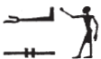

## Esna 59 {-}  
  
- Location: South-east door, Left   
- Date: Domitian  
- [Hieroglyphic Text](https://www.ifao.egnet.net/uploads/publications/enligne/Temples-Esna002.pdf#page=202){target="_blank"}  
- Bibliography: @sauneron-rde15, p. 50 (ending only)  
  
  
  
  

  
  
^1^ *ʿnḫ nṯr nfr  *  
*nbỉ ẖnmw   *  
  *m ȝ.t n.t snfr-ỉb  *  
*ỉwʿw n nḥp  *  
*(tmtỉʿns nty-ḫwỉ) *  
*ḏd=f n ỉt=f šps  *  
  *ẖnmw-Rʿ nb tȝ-sn.t  *  
  *sḫm šps  *  
  *nfr ỉrw  *  
  *ʿȝ sḫr.w  *  
  *wṯt nṯr.w rmṯ  *  
  *ṯȝw n ʿnḫ*   
     *n ʿš.tw n kȝ=f  *  
    
*ỉnk ḥʿw=f-ʿnḫ  *  
  *pr ḥr nḥp=f  *  
*ḫpr sḫr.w=ỉ  *  
  *m wḏ kȝ=k  *  
      
*mỉ m ḥtp  *  
*ẖnm=k ḥw.t=nṯr=k  *  
[...]  
  
^1^ Live the good god,  
fashioned by Khnum,  
  in the moment of pleasing the heart,  
heir of the Potter,  
(Domitian[^fn-59-1] Augustus)  
He says to his august father,  
  Khnum-Re, Lord of Esna,  
  august power,  
  beautiful of appearance,  
  great of plans,  
  who begets gods and men,  
  breath of life  
    for whomever calls[^fn-59-2] to his Ka:  
    
I am he whose body lives,  
  who emerged upon your potter's wheel,  
my plans came about   
  through the command of your Ka.  
  
Come in peace!  
Enter your temple   
[...]  
  

  
  

  
  
^2^ ***pʿ****y.t ỉsk   *  
  ***pʿ****pʿ=k* ***pȝ****wty.w ỉm=s  *  
  *šȝʿ.n=k ʿnḫ n tȝ m-ẖnw=f  *  
    
***s****ȝ-n-ʿnḫ  *  
  ***s****ḫn=k* ***s****rḫ=k ḥr=f  *  
*sn.t=k ỉs ḥnʿ=k  *  
*nṯr.w ỉm=f m ršw  *  
    
*mȝȝ=k smn.w ỉr.n=ỉ   *  
  *n pr=k  *  
*šsp=k sw m-ʿ=ỉ  *  
    
*ỉw ḥm-nṯr=k bȝ.w  *  
   *nỉ ỉw šw n pr=k  *  
    
*ỉw=ỉ [...] ḥr [...]  *  
*[...] rʿ-nb  *  
  
"(It is), meanwhile, the mound  
  from which you birthed the primeval ones,  
  you began life for the earth within it.  
    
"(It is) the stable of life,[^fn-59-3]  
  on which you joined your *serekh*,  
your sister, moreover,[^fn-59-4] is with you,  
the gods within it are in joy.  
  
"May you see the statues I made  
  for your temple,  
and receive it all from my hand.  
  
"Your priest is present [^fn-59-5],  
  no lack shall come to your temple.  
    
"I am [...]  
[...] every day.  
  

  
  
[^fn-59-1]: {width=25%} - This spelling is notable. The arm with water (traditionally: *ỉʿ*, "to wash") represents the medial vowels in "Domit***ia***n." The two kings do not write *nsw-bỉty*, but: *n* < ("red crown") + *s* < *sṯn* (acrophony).  
  
[^fn-59-2]: {width=10%} - Unusual spelling of this verb. For the phonetic change, cf. @kurth-1, p. 532.  
  
[^fn-59-3]: This phrase, originally "stable of goats (*ʿnḫ.w*)", usually designates a mammisi; cf. @klotz-caesar, p. 266, n. 270. In *Esna* II, 31, 61, this term designates the Temple of the Chicks, aka Per-Sahure, also identified with the primeval mound of creation. At *Edfou* III, 159, 5, however, it clearly designates the royal palace, which makes the most sense here.

[^fn-59-4]: {width=8%} - Reading suggested from the context. Acrophony: *ỉs* = *ỉ* < *ỉp.t*, "hippopotamus" (@meeks-delta, p. 100, n. 282) +  *s* < *sḫmty*, "double crown" (@sauneron-8, p. 174).  
  
[^fn-59-5]: For this verb at Esna, cf. @sauneron-rde15, pp. 49-51 (translating this example on p. 50).