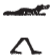
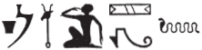
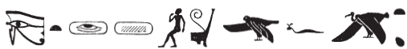
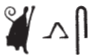

## Esna 60 {-}  
  
  
  
  
- Location: South Anta, Soubassement  
- Date: Uncertain, Vespasian  
- [Hieroglyphic Text](https://www.ifao.egnet.net/uploads/publications/enligne/Temples-Esna002.pdf#page=203){target="_blank"}  
- Bibliography: @sternberg, pp. 68-78; see also [Tempeltexte 2.0](http://www.tempeltexte.uni-tuebingen.de/portal/#/text-detail/488){target="_blank"}
  

  
  
^1^ *ỉr ỉȝ.t tn  *  
*Iwny.t rn=s  *  
*bw pw ỉw Rʿ r=s  *  
*ḏd=f n šw tfn.t  *  
*Iwnw=tn pw ḏr-bȝḥ  *  
*ḏd.tw Iwny.t m rn   *  
   
*[...]  *  
*ḥm.w=sn  *  
*ḫnt pw ỉr m ỉb=s  *  
*spr ḥm=s r wȝs.t šmʿ  *  
^2^ *ḏd=sn n=s  *  
*ḫntỉ r=[t] r Iwny.t  *  
*rsy Nỉw.t  *  
*nỉw.t tn ns-sw ẖnmw Mnḥy.t  *  
*ḏd.tw (tȝ)-sn.t  *  
*m rn n spȝ.t tn  *  
    
*[ỉw] ỉb=s [nḏm] r=s  *  
*wn=s [ḥr] ḏd  *  
*[ỉ]w=ỉ r ḫpr ỉm  *  
*ḫpr [rn] n pȝ [m]ỉ(t)  *  
*r pȝy m-mȝʿ  *  
*r-mn hrw pn  *  
  
^1^ As for this mound,  
Iunyt is its name.  
It is the place to which Re came,  
and he said to Shu and Tefnut:  
This is your Heliopolis (Iunu) of long ago!  
Thus it is called Iunyt.  
  
[...]  
their majesties.  
It was a desire to go south (*ḫnt*)[^fn-60-0] in her heart.  
Her majesty reached Upper Egyptian Thebes.[^fn-60-1]  
^2^ They said to her (there):  
'Go further south (*ḫnt*) to Iunyt,  
south of the City (Thebes).[^fn-60-2]  
That city belongs to Khnum and Menhyt.'  
Thus one says Esna  
as the name of this district.   
  
Her heart [was glad] about it,  
and she said:  
'I will be there (*ỉm *).'  
Thus the [name] of the [ro]ad  
became This one Truly (*m-mȝʿ.t*)  
until today.

[^fn-60-0]:  {width=6%} - @sternberg, p. 70, n. f, suggested multiple readings of this sign, but the most likely is the first choice, *ḫnt*, "to go upstream (south)." This text focuses primarily on Neith's journey south to Esna, ultimately resulting in an etymology for Khent-ta. The crocodile very frequently writes *ḫnt* at Esna.
[^fn-60-1]: In opposition to Lower Egyptian Thebes (*wȝs.t-mḥt*) near Neith's primary temple in Sais: @guermeur-sais.
[^fn-60-2]: Rather than "the southern city (*nỉw.t rsy.t*)", the syntax demands reading "south of the City", a reference to Thebes (the location of this speech) which was often called simple "the City." At the same time, there is an implied pun with the *Rs-n.t* chapel of Neith: cf. [Esna 63], 1; [Esna 84], 1, and eventually "Esna", similar to "*Resno" (south of the city).

*spr=s r ỉȝ.t tn  *  
^3^ *ḫpr N.t ỉm  *  
*ḥr zȝ ḥm=sn  *  
*m nỉw.t tn  *  
*tȝ štȝ.t rsy.t pw  *  
*n pȝ ḫnty tȝ  *  
*ḫpr ḫnt-tȝ   *  
*m rn n ỉȝ.t tn  *  
   
She arrived at this mound,  
and thus Neith came about  
protecting their majesties  
in this city.  
She is the southern vulture,  
of the limit (*ḫnt*) of the earth (*tȝ*).[^fn-60-2b]  
Thus came about 'Khent-ta' (*ḫnt-tȝ*)  
as the name of this mound.  

[^fn-60-2b]: This is apparently an allusion to Nekhbet as a vulture perched at the southern limit of the sky.

*ʿm nṯr.t ỉr=s ỉn tfn.t  *  
*n-mrw.t ỉr.t mk=s  *  
*m-ʿ ky.w sbỉ(.w)  *  
    
*wʿr=s r sḫ.t-Rʿ  *  
*mḥy nỉw.t ṯn  *  
    
^4^ *ḥn ỉr=f ỉn ḏḥwty  *  
*r bw wn=s ỉm  *  
*r mḥ.t wḏȝ.t  *  
*m ẖ.t=s  *  
*mḥ.t(w) m ḥkȝ=f  *

Tefnut swalled the diminished, divine eye,[^fn-60-3]  
from a desire to carry out its protection  
from the rebel enemies.  
  
She fled to the Field of Re,  
north of this city.  
  
^4^ Thoth meanwhile hurried  
to the place where she was  
in order to replenish the wedjat-eye  
in her belly:  
so it was filled through his magic (*ḥkȝ*).

[^fn-60-3]: {width=20%}{width=38%} - Partially following the ingenious reading of @sternberg, pp. 71-72, nn. q-r. However, she understood the two ovals after the wedjat-eye as dual markers, but the following narrative only refers to a single eye. Instead, I understand this as a reference to the new moon, diminished (*ʿnḏ*) and in need of both protection and refilling by Thoth.  The spelling of *nṯr.ty* evokes a very different reading: "and thus the turtle swallowed the *wedjat*-eye (*ʿm štw wḏȝ.t*)", a dangerous cosmic event alluded to with similar hieroglyphs in *Esna* II, 6, 17 and 14 (also involving Thoth and Menhyt). Here the spelling of Tefnut apparently derives *t* < *dwn-ʿ.wy*, "Dewenawy" + *f* + *n < nr.t*, "vulture."

*wbn ḏfḏ n ỉr.t-Rʿ  *  
*ỉmỉ.tw ỉḥ.ty=s  *  
*m twt n ḫprỉ  *  
*m ḥr n syf šps  *  
     
*ḏ(d).tw n=f ḥkȝ  *  
*wr-ḥkȝw kȝ n Rʿ  *  
   
*qbb ỉb=s ẖr=s  *  
^5^ *ỉṯ s(w) N.t  *  
*m ḥb Rnn.t  *  
*ẖnm sw šw m ʿ.wy=f  *  
  
The iris of the Eye of Re arose  
from between her thighs,  
in the form of a scarab beetle,  
with the face of an august child.  
  
One called him Heka (*ḥkȝ*),  
Greatest of Magic (*wr-ḥkȝ*), Ka (*kȝ*) of Re.    
  
Her heart was soothed with this.  
^5^ Neith takes him  
during the festival of Renenutet (Pharmouthi),[^fn-60-4]  
so Shu might embrace him with his arms.  

[^fn-60-4]: This is the festival of Renenutet, mother of grain, in the final month of summer, leading up to the birth of the divine child days later on [Pachons 1], the beginning of the harvest season.

*ḏd.ỉn Rʿ  *  
*ntṯ tmȝ.t  *  
*ḫpr m zp-tpy  *  
*mnḥ=t ḥʿw=f  *  
*mḥn=t ḥr-tp=f  *  
*ḏ(d).tw n=s Mnḥy.t  *  
   
*sḫm mwt.=f   *  
*m sbỉ ḥr=f  *  
*m rn=s n sḫm.t  *  
*ḏ(d).tw n=f   *  
*zȝ sḫm.t  *  
    
*ỉr.tw n=f msw-nṯr  *  
*m nỉw.t tn  *  
*ḏd Rʿ n tfn.t  *  
*ntṯ zȝ.t=ỉ wsr.t  *  
*ỉr=ṯ nb.t ww  *  
*ḏd.tw n=s nb.t-ww  *  
    
*šm=s r sḫ.t  *  
*m hrw ẖn.t  *  
*ỉwty [ȝb] rʿ-nb  *  
  
Then Re said:  
'You are the mother,  
who came about in the beginning:  
may you rejuvenate (*mnḥ*) his body,  
and encircle (*mḥn*) upon his head.'  
Thus she is called 'Menhyt (*Mnḥy.t*).'  
   
His mother took control (*sḫm*)  
over anybody who rebelled against him,  
in her name of 'Sakhmet' (*Sḫm.t*).  
Thus he is called  
'Son of Sakhmet.'  
  
One performs the Divine Birth ritual[^fn-60-5] for him  
in this city.  
Re said to Tefnut:  
'You are my mighty daughter.  
May you serve as Lady of the Field (*nb.t ww*).'  
Thus she is called 'Nebtu (*Nb.t-ww*).'  
  
She goes[^fn-60-6] to the field,  
on the day of the bark procession,  
without [fail], every day.  

[^fn-60-5]: This is the birth festival for Heka starting on [Pachons 1].
[^fn-60-6]: {width=10%} - sternberg, pp. 68-69, translated "sie begibt sich (*sḫm=s*)" without comment. In similar contexts, the most frequently used verbs are *ʿq*, "to enter" (e.g. *Esna* III, 197, 21; 340, 5; 346, 21), or *šm*, "to go" (*Esna* III, 340, 5; 346, 20 *bis*). The latter makes the most sense here, probably derived from *šmʿ*, "white crown."

<!-- to add: for the verb mnH, add Kurth/Budde, Studien zur Vokabular? Or Esna VII translation volume, for VII, 43-44 (similar epithet in relation to Menhyt: mnH Haw; same verb seems to occur in Esna 16, 2)--> 

