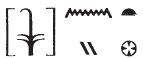
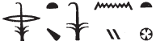
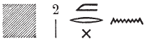
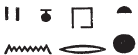
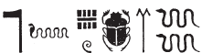
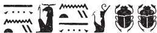
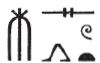

## Esna 63 {-}  
  
- Location: South-east door, left side  
- Date: Unknown, probably Domitian  
- [Hieroglyphic Text](https://www.ifao.egnet.net/uploads/publications/enligne/Temples-Esna002.pdf#page=208){target="_blank"}  
- Bibliography: @sayed-neith, p. 636 Doc. 1027 (partial translation)  
  
  
  
  

  
  
^1^ *rȝ* ***rsy sn.t*** *pw  *  
*kȝ.tw rn=f r* ***[rs]-n.t***     
  *m ḥw.t-N.t m tȝ-šmʿ  *  
*mw.t-nṯr štȝ.t m-ḫnt=f  *  
*s.t-ỉb=f pw  *  
  *ȝḫ sy r p.t  *  
  
*wṯz=s ḫʿ ỉm=f  *  
*mỉ wn=s ḫnt Nw.t  *  
*ḫʿ=s r [Pr-nṯr ?? ...]=sn  *  
*šmr.t m  * [...]  
[...] ^2^ *1/2 1/30 n 2.nw n pr.t  *  
   
     
*drp pȝwty.w ỉm=f  *  
*sṯȝm nṯr.w m-ḫnt=f  *  
*wrḥ psḏ.t m-ẖnw=f  *  
  
*ḥw.t-nṯr=s ḥnʿ.t m ỉḫt nb nfr  *  
*nỉ ḏd ḥȝ-n=ỉ m pr=s rʿ-nb  *  
  
*ḏr ḏd.tw n [...]  *  
*[...]   *  
*nṯrw nṯry.t nb n tȝ-šmʿ tȝ-mḥw   *  
  *ḥr s[...]  *  
  
^1^ This is the southern door of Esna,  
it is called the *[Rs]-n.t* (Southern Neith chapel)[^fn-63-1]  
  in the temple of Neith in Upper Egypt.  
The Mother of God, the mysterious, is in it,  
it is her favorite place,  
  it is more glorious than heaven.  
  
She goes out in procession from it  
  as if she were within heaven,  
she goes forth to [Per-netjer?...][^fn-63-2]  
a bow in [her hand...]  
[...] ^2^ the 16th of the second month of Peret (Meshir):[^fn-63-3]  
  
 the primeval gods are fed therein,  
 the gods are clothed therein,  
 the Ennead is anointed within it.  
  
Her temple is provided with all good things:  
Nobody says 'O would that I had...'[^fn-63-4] in it, daily.  
  
Since one said to [...]  
[...]  
gods and goddess of Upper and Lower Egypt  
   are [...]  
  

  
  
[^fn-63-1]: {width=12%} - The first sign is damaged, but it is most likely to be restored with an *r*, as in the beginning of this text: {width=15%}. Their is a phonetic pun here, linking the name "Esna" to the "Resnet" (*Rs-n.t* = "Southern Neith") chapel in Sais. For similar abbreviated spellings of Esna, usually in similar contexts involving "southern *Rs-n.t*", see @klotz-baboons, p. 42, n. a.  
[^fn-63-2]: Restoration uncertain, but the subsequent lines describe taking care of primeval ancestor gods. Moreover, the suffix pronoun for that location is always masculine, suggesting this might be *Pr-nṯr*, rather than any toponym beinning with *ḥw.t*. For Neith's voyage to Per-netjer to give food to the deceased gods, see [Esna 163], 26-28.  
<!-- to do: check Schott, RdE 19, 1967, 109, n. 7; apparently he restores both as Rsn.t-->  
[^fn-63-3]: {width=22%}{width=15%} - Although the beginning of this date is damaged, it appears to be: 1/2 + 1/30 = 15 + 1 = 16. However, there is no entry for 16 Meshir in the festival calendar from Esna. Rather, there is one ceremony for Neith on 8 Meshir (@sauneron-5, pp. 18-19, with n. d), and another specifically for Neith of Lower Egypt on 17 Meshir (ibid). The latter option seems most likely, since it appears to mention a "Festival of the Bow (*ḥb šmr.t*) for (*n* < *m* < *Mnw*) the Lady of Sais" ([Esna 55], 9; different translation by @sauneron-5, p. 19, n. e), and Neith specifically carries her bow in this text as well.  
  
[^fn-63-4]: Note that this is precisely the phrase Neith herself says before creating Sais at the beginning of time *Esna* III, 2-6, 2; cf. @sauneron-5, p. 255, n. a. The same phrase is used for her temple in *Esna* VII, 587, 16; 634, 9.  
  

  
  
^3^ *ḥw.t-ỉt pw *  
*n ỉt m ḥȝ.t  *  
*ḥw.t-mw.t mỉt.t*  
*n tmȝ.t m šȝʿ  *  
*nṯr wʿ pw ḫpr nṯr snw  *  
*tȝ-ṯnn N.t  *  
*ḫpr ḫpr.w (?) *  
    
*ḥw.t-ẖnmw n zȝ.w-n=sn  *  
  *stp.w-zȝ ḥȝ nṯr ʿȝ  *  
*s.t-nbỉ *  
  *n nbỉ nṯr.w  *  
  *qdỉ rmṯ ʿ.wt nb.w  *  
  *m rn=f n Ptḥ  *  
    *qmȝ swḥ.t *  
    *pr m [Nwn...]  *  
  
[...]      
^4^ *snṯ n ẖnmw  *  
   *r šms-ỉb=f m-ḫnt=f  *  
*nbỉ.n=f ḥr.w nb ḥr nḥp=f  *  
    
*qdỉ.w ms.tw m-wn  *  
  *r rmn m bȝḥ=f  *  
  *ḥr nḥ.t ʿnḫ=sn m-ʿ=f  *  
   
*nṯr.w nṯry.w m ỉȝw n ḥr=f  *  
  *r grg nỉw.wt m kȝ.t=f  *  
  *dỉ zȝ n dwȝ sw  *  
  *zȝ.t n dbḥ sw  *  
    
*ḏd [...]  *  
  
^3^ It is the Temple of the Father  
for the Father in the beginning,    
likewise the Temple of the Mother  
for the Mother at the start of time,[^fn-63-12]  
that means the sole god, who turned into two:[^fn-63-5]  
Tatenen and Neith,  
whose existence came about(?).[^fn-63-6]  
  
The Temple of Khnum of the guardian deities[^fn-63-7],  
  they perform protection around the great god,  
the Place of Fashioning   
  of He who Fashioned the gods,  
  and who built people and all animals  
    in his name of Ptah,  
      who created the egg   
      (and) who came forth from [Nun...][^fn-63-8]  
        
[...]   
^4^ being founded by Khnum,  
  in order to follow his heart in it,  
he fashioned everybody on his potter's wheel.  
  
The created-ones approach [^fn-63-9] in a hurry  
  to carry (themselves) before him,  
  requesting their life from him.  
  
Gods and goddesses are in praise to him,  
  to found cities through his work,[^fn-63-11]  
  to give a son to whomever worships him,  
    and a daughter to whomever beseeches him.[^fn-63-10]  
      
May [the temple] endure [...]  
  

  
  
[^fn-63-12]: Epithet of Neith immediately above this text: [Esna 62], 6.  
  
[^fn-63-5]: {width=22%} - A frequent epithet at Esna, which appears to refer to a primeval Kematef serpent (Neith) creating a similar, ophidian demiurge  (Khnum-Tatenen); cf. @klotz-caesar, pp. 173-173. The mother and father serpents are said to be indistinguishable in [Esna 65], 2.  
  
[^fn-63-6]: {width=25%} - Thanks to acrophony, Tatenen (*TN*) and Neith (*NT*) can be written as palindromes, as in the parallel [Esna 104], 4. Elsewhere this happens with a vulture (*n*) and scarab (*t*) (e.g. [Esna 71],6; cf. @lieven-toricht), so it is less clear what the two scarabs are doing here. They either refer to each divinity, or this is the beginning of a standard epithet such as occurs in [Esna 104, 4]: *ḫpr ḫpr.w, ḫpr ḫprw nb m-ḫt [ḫpr=sn]*.  
  
[^fn-63-7]: For these gods in general, cf. *goyon-gardiens.  
  
[^fn-63-8]: For this epithet of Ptah, creator of the primeval egg, see @mendel-karnak, pp. 44-51.   
  
[^fn-63-9]: {width=10%} - *Wb* II, 142, 7, records a rare term spelled this way, meaning "to show respect." Those examples seem to be related to the verb *hỉms*, "to approach respectfully" (*Wb* II, 484,4-8), hence the present translation.  
  
[^fn-63-10]: For this and similar epithets at Esna, cf. @klotz-baboons, pp. 38-39, n. c.  
  
[^fn-63-11]: Epithet of Khnum immediately above this text: [Esna 61], 6-7.