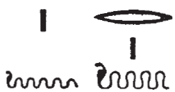
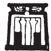
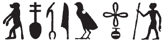
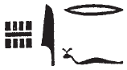

## Esna 64 {-}  
  
  
  
- Location: South-East Door, right   
- Date: Probably Domitian  
- [Hieroglyphic Text](https://www.ifao.egnet.net/uploads/publications/enligne/Temples-Esna002.pdf#page=209){target="_blank"}  
- Bibliography: @sayed-neith, p. 636, Doc. 1028 (partial)
- Parallels: Much of columns 1-2 finds exact parallels in *Esna* II, 17, 57-64.

  

^1^ *ỉr ỉȝ.t tn  *  
*ḫnt-tȝ rn=f  *  
*tȝ tpy n tȝ-ṯnn  *  
*ḫnt ʿ-rsy  *  
    
*zȝṯ nṯry  *  
*n nṯr.t-ʿnḫ  *  
*dỉ tp=s m Nwn  *  
*ḥnʿ Irỉ-tȝ  *  
  
*ḥw.t-ỉt pw  *  
*ḥw.t-Mw.t rn=f  *

^1^ As for this mound,  
Khent-ta is its name,  
the initial land of Tatenen  
within the Southern District.  
  
The divine earth  
of the Living Goddess  
who put her head out of Nun,  
together with Irita.  
  
It is the Temple of the Father,  
its name is Temple of the Mother.  
  

  

*ỉt m ẖnmw  *  
*ntf šȝʿ qdỉ  *  
  
*N.t m Mw.t  *  
*[nt]s šȝʿ.t ms.t  *  
    
*nḥp m-bȝḥ=f  *  
^2^ *msḫn.t m ḥr=s  *  
*r ṯz ỉwʿʿ   *  
*n ỉr (ḥr) mw=sn  *  
    
*nỉ tš wʿ r wʿ ỉm=sn  *  
*m ẖnmw nṯr.t ḥnʿ=f  *  
    
*ntsn pw ʿȝ.w mnḫ.w   *  
*nw tȝ r-ḏr=f  *  
    
*rȝ-ʿ.wy=sn   *  
*grg spȝ.wt nỉw.wt  *  
*kȝ.t=s nfr [...]  *  
*[...]  *  
*nn wrḏ.n=f   *  
*nḥm z m-ʿ šȝy=f  *

The father is Khnum,  
it is he who began to build.  
  
Neith is the mother,  
[it is] she who began to birth.  
  
The potter's wheel is before him,  
^2^ the birthbrick before her,  
in order to build an heir  
for who ever is loyal to them.  
  
One cannot be distinguished from the other,[^fn-64-2]   
as Khnum and the goddess with him.  
  
They are the great, beneficent ones  
of the entire land.  
  
(It is) their activity  
that settles districts and cities,  
her good work [...]  
[...] without tiring,  
who rescues a man from his Fate.  

[^fn-64-2]: {width=20%} - Note the spelling: a single stroke for "one", with a serpent determinative; the reading is confirmed by *Esna* II, 17, 63. Khnum and Neith are two primeval serpents (above, col. 1), Irita and the Living Goddess, impossible to tell apart.

  

^3^ *ptr pr pn   *  
*mỉ ȝḫ.t nt pt  *  
*sḫt-šzp=f   *  
*(ḥr) wbn ỉm=f  *  
*mỉ wn=f ḫnty Nw.t  *  
  
*bw dhn-tȝ pw  *  
*n nb wʿ  *  
*ḫft bs=f   *  
*r ḥw.t-nḥp  *  
*r mȝȝ ỉt=f   *  
*m ḥb=f nfr   *  
*n ḥb ʿḫỉ-pt  *  
*m 1/30 nw 3 pr.t  *

^3^ Behold this temple,  
like the Akhet of heaven!  
He who weaves his light  
shines within it,  
as if he were in the sky.  
  
It is the place of proskynesis,[^fn-64-3]  
for the Sole Lord (Re), [^fn-64-4] 
as he goes forth   
to the Temple of the Potter,  
in order to see his father (Khnum)  
in his good festival,  
the festival of Lifting Heaven,  
on III Peret 1 (Phamenoth 1).[^fn-64-5]

[^fn-64-3]: Literally: "the place of 'forehead to the ground'"
[^fn-64-4]: {width=10%} - The wrong harpoon is used to write *wʿ*, "sole."
[^fn-64-5]: This was one of the most important festivals at Esna; cf. [Esna 48 A].

  

^4^ *ẖnm=f ḥnʿ ṯȝ.wy=f  *  
*ḥʿʿ nṯr.w nṯr.yt *  
*n mȝȝ=f  *  
   
*nfr.wy ḫnty pn  *  
*nfr.wy s(w) r wnn ḫnt  *  
  *m mtr  *  
    
*p(t)r=f r ȝḫ.t n.t p.t  *  
*wḫ.w ẖr=f   *  
*mỉ zḫn.w twȝ nw.t  *  
    
*ʿrq.w m kȝ.t mnḫ.t n.t nḥḥ  *  
*ḥr swr šfy.t *  
*n nb nḥp  *  
*ḥnʿ psḏ.t=f  *  
*m ȝw n ḏ.t  *  
  
^4^ He unites with his children,  
and the gods and goddess rejoice   
from seeing him.  
  
How beautiful is this forecourt![^fn-64-5b]  
How more beautiful it is than it was,[^fn-64-6]  
  in truth!  
  
Seeing[^fn-64-7] it is like the Akhet of heaven,  
the columns holding it  
are like the supports that lift up Nut.  
  
It is complete in effective work of eternity,  
magnifying the prestige  
of the Lord of the Potter's Wheel,  
along with his Ennead,[^fn-64-8]  
for the duration of eternity.  

[^fn-64-5b]: {width=8%} - Good representation of the forecourt, including the intercolumnar panels.
[^fn-64-6]: {width=25%} - @sauneron-bifao62, p. 19, discussed first part of phrase. The *wȝs*-scepter stands for two grammatical elements: the -*wy* ending + the pronoun *sw*. However, he did not mention the standing man. Based on context, I suggest reading this sign as the adverb *ḫnt*, "before" < *ẖntỉ*, "statue."
[^fn-64-7]: {width=12%} - Similar spellings of *ptr* without the medial consonant (cf. Coptic: ⲡⲱⲱⲣⲉ) are known from the Graeco-Roman period: @sauneron-61, p. 240; @klotz-khepri, p. 71, n. 25.
[^fn-64-8]: Same ending to the monography in [Esna 85], 4, but there referring to Neith. 
