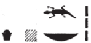

## Esna 67 {-}  
  
  
  
  
- Location: Facade, intercolumnar wall E
- Date: Claudius 
- [Hieroglyphic Text](https://www.ifao.egnet.net/uploads/publications/enligne/Temples-Esna002.pdf#page=211){target="_blank"}  
- Bibliography: @elgawady, pp. 198-199; additional entries in [Tempeltexte 2.0](http://www.tempeltexte.uni-tuebingen.de/portal/#/text-detail/503){target="_blank"}    
    
#### The King {-}   

  

^1^ *nsw.t-bỉty*   
*nb-tȝ.wy  *  
*(tbrys grwtys ksrs nty-ḫwỉ)|  *  
^2^ *zȝ-Rʿ nb-ḫʿ.w  *  
*(krmnyqs ȝwdgrtwr)|  *  
   
The King of Upper and Lower Egypt,  
Lord of the Two Lands,  
(Tiberius Claudius Caesar Augustus)|  
^2^ Son of Re, Lord of Appearances,  
(Germanicus Autokrator)|

#### Harsiese {-}   

 
^3^ *ḏd-mdw n ḥr-zȝ-Is.t  *  
*ỉwʿʿ mnḫ n (wn-nfr mȝʿ-ḫrw)|  *  
^4^ *nb ʿbw šȝʿ twr  *  
    
*ʿbw=k ʿbw ḏḥwty  *  
^5^ *ṯz-pẖr  *  
    
*ʿbw=k ʿbw Dwn-ʿn.wy  *  
*ṯz-pẖr  *  
   
*wʿb kȝ=k ḫr Rʿ  *  
^6^ *swʿb.n tw Is.t  *  
*m nṯr.t  *  
*snṯr.n tw m nṯr(?)  *  
   
*ỉw=k* ^7^ *mn.tw ḫʿ.tw  *  
*m nsw.t zȝ nsw.t  *  
*ḥr s.t-*^8^*ḥr*  
*ḫnty ʿnḫ.w   *  
*ḏ.t zp-snw nḥḥ zp-snw  *  
    
^9^ *ʿb.n tw ḥnʿ kȝ=k  *  
*m mw nṯry ỉỉ m snm.t  *  
*mỉ wʿb p.t n Rʿ   *  
  
Words spoken by Harsiese,    
beneficent heir of (Wennefer, justified)|    
lord of purity, who began purification.    
    
Your purity is the purity of Thoth,  
and vice-versa!  
  
Your purity is the purity of Dewen-anwy,  
and vice-versa!  
  
You Ka is pure before Re,  
since Isis purified you  
in Netjeri,[^fn-67-1]  
you were purified as Thoth.  
  
You remain and appear in glory  
as the king, son of a king,  
upon the throne of Horus,   
foremost of the living,  
for ever and ever!  
  
You were purified with your Ka,  
with divine water which came from Senmet,[^fn-67-3]  
just as the sky is pure for Re.  

[^fn-67-1]: Presumably Behbeit el-Hagar in the Delta, a toponym closely linked to Isis and purification rituals; cf. @favard-meeks-netjer. Unlikely that this should be identified as Dendera, as suggested by @elgawady, p. 198, n. 1384.
[^fn-67-3]: Biggeh Island, near Philae and Aswan.

#### Thoth {-}   

^10^ *ḏd-mdw n nb ḫmnw  *  
*nb mdw-nṯr  *  
*nb ʿbw šȝʿ swʿb  *  
   
^11^ *ʿbw=k ʿbw ḥr  *  
*ṯz-pẖr  *  
  
*ʿbw=k ʿbw* ^12^ *Gbb  *  
*ṯz pẖr  *  
    
*wʿb ḥʿw=k mỉ Itm(?)  *  
*nn mn.t* ^13^ *nb ḫr=k  *  
    
*ḏḥwty (ḥr) dr sḏb.w=k   *  
*twr* ^14^ *tw m p.t ḫr Rʿ  *  
*snṯr.n tw m tȝ ḫr psḏ.t=f  *  
    
*ỉw=k* ^15^ *mn.tw m bỉty n nḥḥ  *  
*ḥr ns.t n Rʿ   *  
*ḫnty ʿnḫ.w  *  
    
^16^ *ʿb.n tw m mw ỉp[n]  *  
*n ʿnḫ-wȝs  *  
*swʿb ḥʿw=k m mw rnp  *  
*pr m ṯpḥ.t  *  
  
^10^ Words spoken by the Lord of Hermopolis,  
Lord of Hieroglyphs,  
Lord of purity, who began purification.  
  
^11^ Your purity is the purity of Horus,  
and vice-versa!  
  
Your purity is the purity of ^12^ Geb,  
and vice-versa!  
  
You body is pure like Atum,[^fn-67-4]  
without any illness upon you.  
  
Thoth is repelling all your impurity,  
you are purified in heaven before Re,  
you were censed on earth before his Ennead.  
  
You remain as king for eternity,  
upon the throne of Re,  
foremost of the living.  
  
You have been purified with this water  
of *ʿnḫ-wȝs*; [^fn-67-5] 
your body is purified with fresh water  
which came forth from the Cavern.  

[^fn-67-4]: {width=18%} - A similar spelling occurs in [Esna 54], 12; [Esna 163], 13, with the usual determinative of Atum (reading noted by @sauneron-2, p. 54, n. b); see also *Esna* III, 218, 9. I read: *ỉ* < *ỉtn*, *t* < *tȝ*, *m* < *ỉm*. Since the boat is backwards in the other example, Sauneron suggested Atum's named was reversed, which would presumably involve: *ỉ* < *ỉm* (acrophony), *t* < *tȝ*, *m* < *mȝwy*, "rays" (a variant of the shining sun hieroglyph usually found in spellings of Atum). @elgawady, p. 198, read Re-Chepri", but this does not explain the boat sign or take into account the Esna parallels.
[^fn-67-5]: In this scene, the purifying water is made entirely of *ʿnḫ* and *wȝs* symbols.

#### Menhyt {-}

^17^ *ḏd-mdw n Mnḥy.t wr.t  *  
*nb(.t) ḫnt-tȝ  *  
*sḫm.t* ^18^ *ʿȝ.t   *  
*nb.t sḫm.wt nb.wt  *  
  
*nb(.t) ʿbw   *  
*ḥtp(.t) ḥr twr  *  
*ỉr(.t) nty  *  
^19^ *qmȝ(.t) wnn.t  *  
*Bȝšt.t(?) ʿšȝ ḥb.w  *  
    
^20^ *ḏỉ=ỉ pr n=k ḥʿpỉ *   
*m ṯpḥ.t=f  *   
*r ʿȝ wr  *  
  
Words spoken by Menhyt the great,  
Lady of Khent-ta,  
Sakhmet the great,  
Lady of all the Sakhmets.[^fn-67-6]  
  
Lady of purity,  
who is pleased with cleanliness,  
who made what is,  
and created what exists:  
Bastet(?),[^fn-67-7] numerous of festivals.  
  
I cause Hapi to come forth   
from his grotto for you,  
very greatly.  

[^fn-67-6]: Remarkable epithet, paralleled in multiple variants (*LGG* IV, 133c), including the Litany to Neith: *Esna* III, 216, 7 (32).
[^fn-67-7]: {width=20%} - Reading uncertain, but the alternative option ("father of all multitudes") seems less likely. "Numerous of festivals" is a very common epithet of Menhyt and Nebtu at Esna (*LGG* II, 225c-226a) but usually preceded by "lady of drunkenness (*tḫ*)" or "lady of jubilation (*ỉhȝy*)."