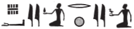
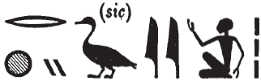
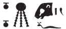

## Esna 70 {-}  
  
- Location: Facade, intercolumnar wall D  
- Date: Tiberius (not Claudius, as Sauneron claimed; cf. @grenier-1988, pp. 57-59)  
- [Hieroglyphic Text](https://www.ifao.egnet.net/uploads/publications/enligne/Temples-Esna002.pdf#page=215){target="_blank"}  
- Bibliography: None  
  
  
  
### The King {-}  
  

  
^1^ *nsw.t-bỉty   *  
*nb-tȝ.wy  *  
*(ṯybrys) *  
^2^ *zȝ-Rʿ nb-ḫʿ.w  *  
*(kysrs nty-ḫwỉ) *  
   
^1^ The King of Upper and Lower Egypt,  
Lord of the Two Lands,  
(Tiberius),  
^2^ Son of Re, Lord of Appearances,  
(Caesar Augustus)  
  

  
  
### Nekhbet {-}  
  

  
^3^ *ḏd-mdw ỉn Nḫb.t *  
*ḥḏ.t Nḫn  *  
    
*dmḏ=ỉ ḥnʿ sn.t=ỉ *  
  *ḥr ḫfʿ ʿ.wy=k  *  
     ^4^ *r mȝȝ=k ỉt=k  *  
       *ẖnmw nb nṯr.w rmṯ  *  
    
^5^ *bs r ḥw.t-nṯr n ỉt=k   *  
  *nb Iwny.t  *  
  *ỉr=f ʿnḫ r fnḏ=k  *  
    
*ỉmy n=ỉ ʿ.wy=k  *  
*snb=ỉ ḥʿw=k  *  
*mȝȝ=k nṯr  *  
  *ỉỉ.n=k ḫr=f  *  
   
^3^ Words spoken by Nekhbet,  
the luminous one of Nekhen:  
  
I join together with my sister,  
  grasping your hands,  
    ^4^ so you might see your father,  
      Khnum, Lord of gods and people.  
        
^5^ Approach the temple of your father,  
  the lord of Iunyt,  
    so he might create life for your nose.  
  
Give to me your hands,  
I shall make your body healthy,  
so you might see the god,  
  before whom you have come.  
  
  

  
  
  
### Wadjet {-}  

    
^6^ *ḏd-mdw ỉn Wȝḏy.t *  
*nb.t ḏp P  *  
    
*ḫʿỉ=k ḥnʿ=n  *  
*šzp.tw=k*   
  ^7^ *nb nḥp m [nḏm/ȝw.t]-ỉb  *  
*sʿšȝ=f ḏȝm.w=k  *  
    
^8^ *spr r ḥw.t-ẖnmw  *  
*ỉt-ỉt.w [...]  *  
*sšm=ỉ k(w) (ḥr) wȝ.t  *  
  *sqd=k ỉm=s  *  
*snṯr(=ỉ) k(w) *   
    *r pʿ.t rḫy.t  *  
   
^6^ Words spoken by Wadjet,   
Lady of Dep and Pe:  
  
May you appear together with us,  
so the Lord of the Potter's wheel   
  ^7^ might receive you in joy,  
and magnify your population.  
  
^8^ Arrive to the Temple of Khnum,  
the father of fathers [...]  
I guide you (upon) the path [^fn-70-0]  
   through which you travel,  
I make you more sacred   
   than nobles or commoners.[^fn-70-1]  
  

  
  
  
  
### Before both goddesses {-}  

  
^9^ *mỉ ḥnʿ=n m bȝḥ ỉt=k ẖnmw  *  
*šzp=f tw=k m nfr  *  
  *ỉw ỉb=f hr.w  *  
    
*dỉ=f n=k *  
  *nḥḥ m nsw.t tȝ.wy  *  
  *ḏ.t m ḥqȝ ȝw.t-ỉb  *  
   
^9^ Come with us before your father, Khnum,  
so he might receive you well,  
   his heart being glad.  
  
May he give you  
   cyclical eternity as king of the two lands,  
   linear eternity as ruler of happiness.  
  

  
  
  
### Heka {-}  

   
^10^ *[ḥ]kȝ pȝ ẖrd  *  
*ʿȝ wr tpy n ẖnmw  *  
  
^10^ Heka the Child,  
the very great first-born of Khnum.  
  

  
  
  
### Khnum-Re Lord of Esna {-}  

  
^11^ *ḏd-mdw ỉn ẖnmw-Rʿ nb tȝ-sn.t  *  
*sḫm šps  *  
*ḥry nṯr.w nb  *  
*Km-ȝ.t=f* ^12^ *qmȝ wnn.t  *  
*kȝ ỉr kȝ.w  *  
*ḫpr ḫnt  *  
   
*nfr-ḥr*   
*nb šwty wr  *  
*bȝ pw ỉr nṯr.w  *  
  
^13^ *wbn tp=f  *  
  *ỉw tȝ ȝbḫ(.w) m zmȝwy  *  
*ỉr.t=f ḥr sḥḏ tȝ.wy  *  
    
^14^ *qdỉ rmṯ ms nṯr.w   *  
  *ʿ.wt nb mỉt.t  *  
*wnn.t nb ḫpr=sn m ʿ.wy=f  *  
^15^ *ẖnm.n=f tȝ (r)-ḏr(=f)  *  
  *ḥr nḥp=f  *  
    
*ʿnḫ ʿnḫ.tw ỉm=f  *  
*ṯȝw n ʿnḫ tp-rȝ=f  *  
^16^ *Imn wr *  
*ḫpr ẖr-ḥȝ.t  *  
*ỉr p.t tȝ dwȝ.t *  
    *mw ḏw.w  *  
  *nṯr ʿȝ ḥr-ỉb Iwny.t  *  
    
^17^ *dỉ=ỉ n=k rsy.t r-ʿ ṯȝw  *  
  *mḥy.t r-ʿ mw  *  
*tȝ.wy nb (ḥr) snỉ-tȝ n bȝw=k  *  
   
^11^ Words spoken by Khnum-Re, Lord of Esna,  
the august power,  
chief of all the gods,  
Kematef, ^12^ who created what exists,  
Ka serpent who made the Kas,  
who came about before.  
  
Beautiful of face,   
lord of the double plumes,  
he is the Ba who made the gods.  
  
^13^ His head [^fn-70-2] arose   
  while the earth was mixed in darkness,  
his eyes illumined the two lands.[^fn-70-3]  
  
^14^ He who builds people and fashions gods,  
  all animals likewise,  
all things came about through his hands,  
^15^ he united the entire land  
  upon his potter's wheel.  
  
Life, through whom one lives,  
whose utterance is the breath of life,  
^16^ Amun the great,   
who came about in the beginning,  
who made heaven, earth, Duat,   
  waters and mountains:[^fn-70-4]  
    (in short) Great God within Iunyt.  
  
^17^ I give you the south as far as the wind,  
  the north as far as the water,  
all lands kiss the earth for your power.  
  

  
  
[^fn-70-0]: Wadjet uses the archaizing form of the second person masculine singular dependent pronoun *k(w)*, instead of *tw/ṯw*. Cf. @vernus-brown, pp. 208-213.  
  
[^fn-70-1]: {width=15%} - A notable heraldic spelling of *pʿ.t rḫy.t*, confirmed by a fuller writing in [Esna 191],11:  
{width=25%}.   
The first sign is relatively common, but the latter has not been registered before. Typically, a person holding a small bird or goose writes *zȝw*, "Sais" (@kurth-1, p. 132, 25e). The current phonetic value is apparently derived from two geese in the word *rḫ.ty*, "washers" (Wb II, 448, 9-11). A similar goose appears in this word in Esna IV, 416, 2: {width=18%}  
  
[^fn-70-2]: {width=15%} - Elsewhere at Esna, a similar animal head typically writes *ȝ.t*, "moment." This is most likely a hippopotamus head, which elsewhere writes *Dp*, "Buto", via substitution with the human head (@klotz-philae, p. 104, n. 136).  
  
[^fn-70-3]: The same cosmic event, the initial creation of light by Khnum, is described in greater detail in *Esna* II 17, 12-15, with a direct parallel to this text: "while the earth was mixed in darkness (*ỉw tȝ ȝbḫ(.w) m zmȝwy*) (...) he opened his eyes, and light came into being immediately (*ptḥ.n=f ỉr.ty=f ḫpr wyn ḥr-ʿ*); cf. @pichel, pp. 34-39.  The text previously mentioned Kematef, the first serpent god who remains in Nun; his successor, Irita, is typically the one who rises from Nun, head first, to create light and solidify the earth: @klotz-caesar, pp. 122-125. Just like Amun in Thebes, Khnum at Esna embodied both "generations" of the creator.  
  
[^fn-70-4]: Typical epithets of Amun in the Graeco-Roman period, who is usually "lord" of this list of celestial regions: @klotz-caesar, p. 60, with n. 104. Applied to Amun elewhere at *Esna* II, 25, 8-9; *Esna* VI, 487, 10-11; 518, 8-9.