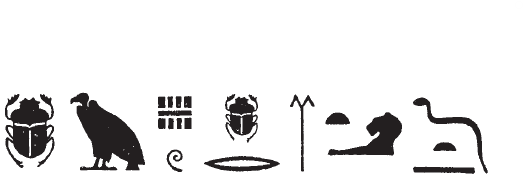
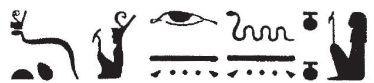
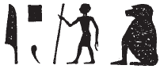
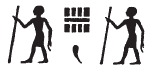

# North Anta (71-76) {-}   
  
## Esna 71 {-}  
  
- Location: North Anta  
- Date: Vespasian  
- [Hieroglyphic Text](https://www.ifao.egnet.net/uploads/publications/enligne/Temples-Esna002.pdf#page=218){target="_blank"}  
- Bibliography: @sayed-neith, p. 631, Doc. 1020 (partial)  
  
  
  
### The King {-}  
  

  
  
*rḏỉ(.t) pr n nb(.t)=f  *  
*ḏd-mdw  *  
    
*nfr.wy pr pn  *  
  *nỉ wn mỉt.t=f  *  
   
Giving the temple to its lady.  
Words spoken:  
  
How good is this temple!  
  Its peer does not exist.  
  

  
  
  
### The King {-}  
  

  
  
*nsw.t-bỉty   *  
*nb-tȝ.wy  *  
*(ȝwtkrtwr tỉtỉs ksrs) *  
*zȝ-Rʿ nb-ḫʿ.w  *  
*(wspsyns nty-ḫwỉ) *  
*ʿšȝ mšʿ  *  
*nb mnfy.t  *  
   
The King of Upper and Lower Egypt,  
Lord of the Two Lands,  
(Autokrator Titus Caesar)  
Son of Re, Lord of Appearances,  
(Vespasian Augustus)  
Great of armies,  
lord of infantries.  
  

  

  
  
*ḏd-mdw ỉn N.t wr.t  *  
*mw.t-nṯr nb.t tȝ-sn.t  *  
*ỉt-ỉt.w  *  
*mw.t-mw.wt  *  
*tȝ-ṯnn pw *  
    *ḫpr m ḥȝ.t  *  
*ḏ.t ỉr nn r-ȝw  *  
  *Nwn N.t ỉpw  *  
    
*tmȝ.t ḥr.t-tp  *  
*ḫpr ḏr pȝwty  *  
*mḥ p.t tȝ m nfrw=s  *  
    
*ḏỉ=ỉ n=k tȝ-mrỉ   *  
  *r-ȝw=s m ʿq  *  
  
Words spoken by Neith the great,  
Mother of God, Lady of Esna,  
Father of fathers,  
Mother of mothers,  
that means Tatenen (*TN*) [^fn-71-1]  
  who came about in the beginning,  
the primeval cobra [^fn-71-2] who made everything.  
That means:[^fn-71-3] both Nun and the *N.t*-waters.[^fn-71-4]   
  
The chief mother,  
who has existed since the Primeval one,  
who fills heaven and earth with her perfection.  
  
I give to you the Beloved Land (Egypt)  
  in its entirety in celebration.  
  
[^fn-71-1]: {width=35%} - Tatenen's name is her reduced to *t* (scarab) + *n* (vulture), precisely as recorded by Horapollo, XII; a similar reduced form of Tatenen occurs in [Esna 63],3 and [Esna 104], 4. In her litany, Neith's name is spelled with the same two signs, possibly read in reverse, or derived differently (*n* < *nṯr*, *t* < *tỉw*): *Esna* III, 216, 6 (25).  
[^fn-71-2]: {width=35%} - @sayed-neith, p. 631, translated this all as: "celle qui fut la mère au commencement de l'éternité." Although the serpent does look like the word "eternity", this actually refers to the feminine, serpentine demiurge who emerged from Nun alongside Irita at the start of creation; cf. @klotz-caesar, pp. 172-174). Neith's name is often written as the cobra wearing a red crown at Esna, and in her litany, this form is linked specifically to Irita-Tatenen (as in the present text): {width=30%} (*Esna* III, 216, 2, 6).  
[^fn-71-3]: {width=20%} - This appears to be a very full spelling of the copula pronoun *ỉpw*: first the group *ỉp* (with otiose *f*), then *w* < *wr* (acrophony; @sauneron-8, pp. 117-118), followed by the baboon (*ỉpw*). As I suggested in @klotz-baboons, pp. 55-56, the baboon likely writes *pw* from its more common use as *ỉp*, and this example would seem to provide further support. However, a similar group occurs in a very different context in *Esna* III, 385 B, so this might be an epithet instead: {width=20%}
[^fn-71-4]: The androgynous creator Neith is both the primeval Nun waters, as well as the first water of creation (*n.t*), homophonous with her name.  
  

  
  
### Isis {-}  
  

  
  
*ḏd-mdw ỉn Is.t wr.t  *  
*mw.t-nṯr ḥr.t-ỉb ḥw.t-bȝ.w  *  
*Nb.t-ww pw ḫnt ww  *  
    
*ḥȝp sn=s Wsỉr  *  
  *m-ḫnt ʿbȝ=f   *  
*dwȝ.t štȝ.t pw   *  
  *[ẖ]r ʿḫm.w=f  *  
*wnn=f m-ẖnw=s  *  
    
*ḏỉ=ỉ n=k ḏry.t=k  *  
  *mn.tw ẖr nfrw=k  *  
*mỉ ȝḫ.t mn.tw   *  
  *ẖr ỉtn.wy  *  
  
Words spoke by Isis the great,  
mother of god within Temple of the Bas,  
that means Nebtu, foremost of the field.  
  
She who conceals her brother  
  within his tomb,  
that is the secret Duat  
  [bear]ing his cult images,  
in which he is.  
  
I give to you your chapel  
  enduring with your perfection,  
like the luminous sky enduring  
  with the two disks.  
  

  
  
### Behind the Goddesses {-}  
  

  
  
*šzp.n=n s.t=k  *  
*wʿb ỉry.w=f [nb]   *  
  *m wʿb wʿb=f  *  
    
*ʿq.n=k ḥw.t=nṯr  *  
*ḥtp ỉb=ỉ  *  
  *ḥr rȝ-ʿ.wy=k  *  
  
*srwḏ=ỉ nt-ʿ=k  *  
  *ḥr s.t-ḥr  *  
*wḥm.n=k ḥḥ n ḥb.w-[sd]  *  
*mỉ Rʿ d.t  *  
   
We have received your place  
  [all] of its parts being purified  
    by a wʿb-priest who is purified.  
  
As you have entered your temple,  
my heart is pleased  
  because of your work.  
    
I support all your business  
  upon the throne of Horus,  
having repeated millions of [Sed] festivals,  
like Re, eternally.  
  

  
  
