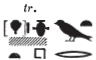
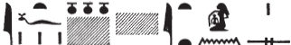

## Esna 73 {-}  
  
  
  
  
- Location: North Anta, middle
- Date: Domitian
- [Hieroglyphic Text](https://www.ifao.egnet.net/uploads/publications/enligne/Temples-Esna002.pdf#page=222){target="_blank"}  
- Bibliography: @kinnaer, pp. 83-84  (only the offering formulas); see also [Tempeltexte 2.0](http://www.tempeltexte.uni-tuebingen.de/portal/#/text-detail/402){target="_blank"}  
- [Photograph](http://www.temples-egypte.net/sud/esna/devant/montantNord.html#B2){target="_blank"} 
    
#### The King {-} 

  

^1^ *nsw.t-bỉty*   
*nb-tȝ.wy  *  
*(ȝwtwkrtwr kysrs)|  *  
^2^ *zȝ-Rʿ nb-ḫʿ.w  *  
*(twmtỉnỉs nty-ḫwi)|  *  
  
^3^ *šzp ỉmỉ.t-pr*  
*n ỉt ḫr zȝ  *  

^4^ *[ḫ]f(?)=i m [...]  *  
*snsn(?) [...]  *  
*[...] ḥb-sd  *  
*ẖnm=ỉ ỉtn m ỉrw=f  *  

*ʿq=ỉ ḫr=k   *  
*dgȝ=ỉ nfrw=k  *  
*ḥqȝ=ỉ ẖn nb n ỉtn  *  
*snfr=ỉ tȝ-sn.t  *  
*ḫwỉ=ỉ pr-nṯr  *  
*m ỉḫt nb  *  
*ḏỉ=k n=ỉ   *  
   
*ỉw=ỉ ḥr ns.t=k  *  
*ḥr ỉr(.t) mr=k  *  
*ỉw ʿȝ=k r nṯr nb  *

^1^ The King of Upper and Lower Egypt,    
Lord of the Two Lands,    
(Autokrator Caesar)|    
^2^ Son of Re, Lord of Appearances,    
(Domitian Augustus)|    
    
^3^ He who receives the *ỉmỉ.t-pr* deed,[^fn-73-1]    
of a father for a son.    
  
^4^ I [gl]impse(?) in [...]  
and unite(?) [...]  
[...] Sed-festival,  
I unite with the disk in his form.  
  
I enter before you,  
I view your perfection,  
I rule the circuit of the sundisk,  
I improve Esna,  
I protect Per-netjer,  
with all things  
which you gave to me.  
  
I am upon your throne,  
doing the things you desire,  
since you are greatest of all the gods.

[^fn-73-1]: To understand the terminology in this scene, see @kinnaer. The *ỉmỉ.t-pr* document is a property deed, and it is usually contained within the protective *mks* (lit. "it protects") document holder. The divine property deed encompasses all of creation, especially products from the earth, so Khnum passes this on to Domitian in this scene.  @kinnaer, p. 84, remarked the unique appearance of the falcon-headed *mks*-document holder in this relief; a hieroglyph version of this determines the same word in *Esna* III, 358, 35.

#### In front of Khnum {-}

^5^ *nṯr pn šps  *  
*ẖnmw nb.t ww m Iwny.t  *  
*ḥr.t-tp(?) wr.t m wȝs.t  *  
^6^ *ḫnt=sn nty m Iwnw  *  
*ḫprw=sn nty m ḥw.t-kȝ.w-ptḥ  *  
*Sḫm.t ʿȝ.t Nfr-tm  *  
*sšm.w ʿȝ.t nt m ṯnỉ.t  *  
*šw Tfn.t* ^7^ *mr Rʿ  *  

*šȝʿ Rʿ m ms=sn  *  
*ỉwty(?) mw.t r ms.t=w  *  
*ỉšš.n=f m wʿ  *  
*tfn.n=f m k.t  *  
*m tpy šmw  *  
  
^8^ *ḏd.n=f  *  
*nṯr.w tw=k rnp  *  
*ms.t[w] ḥr-sȝ kḥkḥ  *  
*šȝʿ Rʿ m rw  *  
*ṯȝ.wy=f m rw.ty  *  
^9^ *qmȝ.n=f ḫmt  *  
*ỉt=w Nwn ȝṯt.n s(n)  *  
  
*qdỉ rmṯ msỉ nṯr.w  *  
*bȝ n Rʿ m zp-tpy  *  
*Ptḥ pn qmȝ ḥmw.w  *  
*ḥr-ỉb* ^10^ *ṯpḥ.t-ḏȝ.t  *  
  
*nsw.t-bỉty   *  
*ẖnmw-Rʿ [...]   *  
*Mnḥy.t wr.t nb.t ḫnt-tȝ  *  
*nṯr.w ʿȝ.w ḥr-ỉb Iwny.t  *  
*ḫw=w zȝ=w mr=w  *  
*(tmdyns)| ḏ.t  *  
  
^5^ This august god,  
Khnum and Nebtu in Iunyt,  
the great uraeus(?)[^fn-73-2] in Thebes,  
their statues which are in Heliopolis,  
their forms which are in Memphis,  
(namely) Great Sakhmet and Nefertem,  
their greate images which are in Thinis,  
Shu and Tefnut, ^6^ whom Re adores.[^fn-73-3]

Re began to give birth to them,  
without(?) a mother to bear them.[^fn-73-4]  
He expectorated (*ỉšš*) one,  
he spat (*tf.n(=f)*) out the other,[^fn-73-5]  
on the first day of I Shomu (Pakhons 1).[^fn-73-6]  
  
^8^ He said:  
Gods, you are rejuvenated!  
Reborn after having aged.  
Re began as a (single) lion,  
his children as two lions,  
^9^ thus he created three.  
It is their father, Nun, who nursed them.[^fn-73-6b]  
  
He who built people and birthed gods,  
the Ba of Re in the first moment,  
this Ptah, who created the craftsmen,  
within ^10^ the Tjepehet-Djat.  
  
The King of Upper and Lower Egypt,  
Khnum-Re [...][^fn-73-7]  
Menhyt the great, lady of Khent-ta,  
the great gods within Iunyt,  
may they protect their beloved son,  
(Domitian)| forever.  

[^fn-73-2]: {width=10%} - Presumably this means Nebtu is the great uraeus (i.e. Mut) in Thebes.
[^fn-73-3]: Khnum is identified with Shu (Heliopolis), Shu-Onuris (Thinis), and Nefertem (Memphis). Nebtu-Menhyt with Tefnut (Heliopolis), Tefnut-Mehyt (Thinis), and Sakhmet (Memphis). [^fn-73-4]: {width=35%} - Reading uncertain, since this passage mixes traditional 3rd person plural suffix pronouns (*=sn*) with later forms (*=w*). Assuming the first two signs (*t*+*n*) are an error for the negative arms.
[^fn-73-5]: These are traditional puns on the names of Shu and Tefnut, as in *Esna* II, 55, 11-12; 31, 58.
[^fn-73-6]: In an earlier offering scene, Khnum-Re Lord of the Field is identified with Shu, and the divine column says Atum created him and his sister ("on the first day of Pakhons (*m hrw tpy nt ḥb-ḫnsw*)" (*Esna* II, 8, 14; similarly *Esna* III, 361, 16). According to the Esna calendar, meanwhile, (*Esna* II, 77), [Pakhons 1] is the birthday for Shu and Tefnut, and their son Heka-Geb; cf. @sauneron-5, pp. 9, 22, n. a.
[^fn-73-6b]: {width=30%} - Difficult passage, restored after the parallel in [Esna 104], 7.
[^fn-73-7]: Most likely the gap contains an epithet of Khnum here (e.g. Lord of Esna, Lord of the Field), but one could reasonably restore the name of Nebtu for the composite Nebtu-Menhyt, since she is actually present in this offering scene.

#### Khnum Lord of the Field {-}

^11^ *ḏd-mdw n ẖnmw nb ww  *  
*nṯr šps ḫnty [sḫ.t=f?]  *  
*[...]* ^12^ *mnḫ nb [...]  *  
*ʿḥʿy nfr [n Km.t]  *  
*m [...] nṯry [...]  *  
^13^ *[ỉmỉ.t-pr]  *  
*n zȝ=f mr=f   *  
^14^ *[...]  *  
*mks *  
*n ʿḥʿ ḥr ns.t=f  *  
  
^15^ *ḏỉ=ỉ mks nty mȝʿ-[ḫrw]  *  
*r-ʿ ḥfn.w n rnp.wt  *  
    
^16^ *ḏỉ=(ỉ) n=k  *  
*bw nb wbn Rʿ ḥr=sn  *  
*ḥr snỉ-tȝ  *  
*r-rwty wr.t=k  *  
  
^11^ Words spoken by Khnum Lord of the Terrain,[^fn-73-8]  
august god, foremost [of his field?]  
[...] ^12^ beneficent, lord [...]  
Good agathos-daimon [of Egypt]  
in [...] divine [...]  
^13^ [the *ỉmỉ.t-pr* deed]  
to his beloved son,  
^14^ [...]  
the *mks*-container  
to he who stands in his place.  
  
^15^ I give the *mks*-container of justi[fication],  
for up to millions of years.  
  
^16^ I grant for you  
that all places over which Re shines  
are kissing the ground  
outside your palace.  

[^fn-73-8]: Khnum here takes on the epithet of his consort, as if his name were Neb***u***. This occasionally happens elsewhere at Esna: *LGG* III, 605b. 

#### Nebtu {-}   

 

^17^ *ḏd-mdw n [Nb.t-ww...]  *  
*tfn.t zȝ.t Rʿ  *  
*ḫnt.t Iwny.t  *  
*ḥr.t-tp* ^18^ *wr.t  *  
*ḫpr m ḥȝ.t  *  
*ṯnỉ sw r nṯr.w nṯry.t  *  
*šps.t nfr.t  *  
*ỉỉ(.t)* ^19^ *ḥnʿ sn=s  *  
*ȝw-ỉb ỉn Rʿ mȝȝ=f st  *  
  
^20^ *ḏỉ=ỉ n=k tȝ-šmʿ tȝ-mḥw  *  
*m ỉmỉ.t-pr  *  
*m ḥḥ.w n rnp.wt  *  
*m ḥb-sd.w ʿšȝ.w wr.w  *  
  
^17^ Words spoken by [Nebtu...],  
Tefnut, daughter of Re,  
foremost of Iunyt,  
great ^18^ uraeus,  
who came about in the beginning,  
distinguished over gods and goddesses,  
the good August one,  
who arrived ^19^ with her brother,  
Re was happy when he saw them.[^fn-73-9]    
    
^20^ I give to you Upper and Lower Egypt,    
in the *ỉmỉ.t-pr* deed,    
with thousands of years,    
and very numerous Sed-festivals.

[^fn-73-9]: A reference to the union of Khnum-Shu and Nebtu-Tefnut on 1 Khoiak; cf. [Esna 81], 4-6. At that time, Nebtu takes the form as "the august one (*šps.t*)", just as in this text: *Esna* III, 346, 24; 351 A.

#### Behind the Gods {-}  

 

^21^ *mn n=k ỉmỉ.t-pr  *  
*n šn n tȝ  *  
*grb   *  
*n ỉfd.w n nw.t  *  
*pr m Nwn  *  
*ḫpr [n tȝ]  *  
*ỉr m [...]  *  
*[...] ḥw.t-Rʿ (?)  *  
*n ḥp.ty [...]  *  

^21^ Receive the *ỉmỉ.t-pr* deed,  
of the circuit of the earth,  
the *grb*-document,  
of the four corners of the sky,  
what comes forth from Nun,  
what comes about [from the earth],  
wht is made [...]  
[...] the temple of Re(?),  
for the limits [...]

