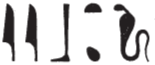
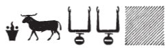
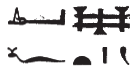

## Esna 74 {-}  
  
  
  
  
- Location: North Anta, bottom
- Date: Domitian
- [Hieroglyphic Text](https://www.ifao.egnet.net/uploads/publications/enligne/Temples-Esna002.pdf#page=224){target="_blank"}  
- Bibliography: None; see also [Tempeltexte 2.0](http://www.tempeltexte.uni-tuebingen.de/portal/#/text-detail/412){target="_blank"}  
- [Photograph](http://www.temples-egypte.net/sud/esna/devant/montantNord.html#B3){target="_blank"} 
    
#### Title {-}

^6^ *ḫʿỉ m ʿḥ  *  
*dỉ-ʿ ḥr m[ṯn]  *  
*[...]  *  
*r ḥw.t-nṯr  *  
*r mȝȝ wtṯ s(w)  *  
  
^6^ Appearing from the palace,  
setting a path on the ro[ad]  
[...]  
to the temple,  
to see The one who begot him.

    
#### The King {-} 

  

^1^ *nsw.t-bỉty*   
*nb-tȝ.wy  *  
*(ȝwdwgrtwr kys[rs])|  *  
^2^ *zȝ-Rʿ nb-ḫʿ.w  *  
*(twmtỉnỉs ḫwỉ)|  *  
  
^3^ *ḥr kȝ-nẖt  *  
^4^ *ḫʿỉ [m ʿḥ]  *  
*[...] s.t-ḥr  *  
^5^ *dỉ ʿnḫ-ḏd-wȝs [nb]  *  
*ʿnḫ wȝs nb ḥȝ=f  *  
*mỉ Rʿ [ḏ.t]  *  
  
^1^ The King of Upper and Lower Egypt,    
Lord of the Two Lands,    
(Autokrator Caesa[r])|    
^2^ Son of Re, Lord of Appearances,    
(Domitian Augustus)|  
  
^3^ Horus, the Mighty Bull  
^4^ who appears [from the palace]  
[...] the throne of Horus,  
^5^ who gives [all] *ʿnḫ-ḏd-wȝs*,  
all life and dominion surrounds him,  
like Re, [eternally].  

^7^ *nṯr nfr*   
*ḫʿỉ m ʿḥ  *  
*ẖn[bb ...]   *  
*[p]ẖr r-ḥȝ   *  
*m sḏd n* ^8^ *ỉtn  *  
*dỉ=f sw  *  
*(ḥr) wdỉ mȝwy  *  
*mỉ ȝḫty  *  
*psḏ m ḥȝ[y]*    
*[...]=f nt* ^9^ *qdỉ  *  
    
*šzp=f bỉȝ.t nfr.t   *  
*r ḥw.t-N.t  *  
*bqnqn.w šps[.w]  *  
*[...]* ^10^ *[...]  *  
*m Mnḥy.t  *  
*mḥn=s ḥr-tp=f  *  
*ỉr=s st=[s]   *  
*[ỉmỉ.tw] ỉnḥ.wy=f  *  
      
^7^ The good god,   
who appears from the palace,  
and who hur[ries ....]  
and [en]circles all around (it),  
as a likeness of ^8^ the sundisk  
as he appears,  
sending out rays,  
just like Akhty.  
Who shines in brightness,  
his [...] of ^9^ the Builder (Khnum).  
  
He takes up the good route  
towards the Temple of Neith,  
the august guardian deities   
[....] ^10^ [...]  
as Menhyt,  
she coils upon upon his head,  
making [her] seat,  
[between] his eyebrows.  

^11^ *ʿq r ȝḫ.t   *  
*r mȝȝ ỉmỉ=s  *  
*wṯz[-nfrw ? ...]  *  
*[n ḥry nḥ]p=f  *  
*sʿḥʿ=f ḥm=k  *  
^12^ *ḥr ns.t n nb.wy  *  
    
*ḥkn psḏ.t [...]  *  
*[...] sw  *  
*wdỉ=f snḏ=k  *  
^13^ *r ḥp.ty  *  
*šfy.t=f  *  
*(r) r'-ʿ st.wt  *  
    
*ỉw=k [ḫʿ].tw   *  
*[ḥr] s.t-ḥr  *  
*ḫnty-ʿnḫ.w ḏ.t  *   
  
He who enters the Akhet,  
to see what is inside it,  
who carries [his perfection ?...]  
[of the Chief of] his [Potter's] Wheel,  
so he might install his majesty  
^12^ upon the throne of the Two Lords.  
  
The Ennead rejoices [...]  
[...] him,  
he sends fear of you  
^13^ to the limits (of the cosmos),  
and your prestige,  
as far as the rays (of the sun).  
    
May you [appear in glory]  
[upon] the throne of Horus,  
foremost of the living, eternally.  

#### Falcon over the King {-}

^14^ *Bḥdty nṯr ʿȝ nb p.t  *  
*zȝb-šwty   *  
*prỉ m ȝḫ.t  *  
       
^14^ Behdety, great god, lord of heaven,  
dappled of plumage,  
who emerges from the Akhet.  

#### The Palace {-}

^15^ *pr-ḥʿʿ  *  
*wbn n* ^16^ *nsw  *  
  
^15^ The House of Rejoicing:  
'The King ^16^ has arisen!'  
       

#### Menhyt {-}

^17^ *ḏd=mdw n Mn[ḥ]y[.t] wr.t  *  
*nb.t [ḫn]t-[tȝ]  *  
*ȝsb.t n(t) Rʿ  *  
*nb.t-ʿḥ  *  
^18^ *nb.t-(r)-ḏr m-m nṯr.w  *  
*ḥʿʿ psḏ.t n mȝȝ=s  *  
     
*wsr.t m p.t  *  
*ʿnḫ.t* ^19^ *m tȝ  *  
*nb.t nrw m stp-zȝ  *  
*ḥqȝ.t m šnw nb n ỉtn  *  
   
*mḥn.t ḥr tp n nṯr nb  *  
*nn* ^20^ *nṯr mḥn=f sw  *  
*ḥr tp=s  *  
    
^17^ Words spoken by Men[h]y[t] the great,  
Lady of [Khen]t-ta,  
Uraeus[^fn-74-1] of Re,  
Lady of the Palace,  
^18^ All-Lady among the gods:  
the Ennead rejoices to see her.  
  
The mighty one in heaven,  
the living serpent ^19^ on earth,  
lady of fear in the palace,  
Ruler over the whole circuit of the sundisk.  
  
Uraeus on the head of every god,  
without ^20^ a god who would coil himself  
upon *her* head.

[^fn-74-1]: {width=15%} - Emending the second reed leaf to a tall *s* sign, for this term for a uraeus: *Wb* I, 20, 19-20.

*nfr.wy mȝȝ=s   *  
*ṯḥn.wy* ^21^ *ptr=s  *  
*ṯnỉ.tw r Rʿ*   
*m ȝḫ.w=s  *  
^22^ *ʿpr.tw m nfrw=s   *  
*[...]   *  
*[m] rn=s ḏ.t  *  
    
^23^ *mḥn=ỉ ḥr tp=k  *  
*wsr=ỉ tp ḥm=k  *  
*wḏ=ỉ hh=ỉ r ḫfty.w=k  *  
  
How beautiful to see her!  
How scintillating to behold her!  
Even more distinguished than Re   
through her excellent powers,  
^22^ equipped with her perfection   
[...]  
[in] her name (of) eternity.  
  
^23^ 'I coil upon your head,  
I am mighty above your majesty,  
I command my flame against your enemies.'

#### Behind Menhyt {-}

^24^ *ỉỉ.tw m ḥtp   *  
*[...] nfrw=k  *  
*rdỉ=ỉ m ḥr [...]  *  
*ḫʿỉ m [...]  *  
*ḥr kȝ nḫt [...]  *  
*[...] Rʿ  *  
*ḫʿ.tw ḥr ns.t=f  *  
  
^24^ Welcome!  
[...] your perfection.  
I put in the face [...]  
who appears as [...]  
Horus, the Mighty Bull [...]  
[...] Re,  
you appearing upon his throne.  

#### Incense Hymn above Iunmutef {-}

^25^ *ỉr(.t) snṯr n ỉʿrr.t  *  
*ḏd-mdw  *  
    
*ʿbw snṯr wr.t-[ḥkȝw]  *  
^26^ *Wȝḏy.t nb.t pr-wr  *  
*ḥnw.t nb.t pr-nsr  *  
*Sḫm.t nsr.t  *  
*Wȝḏy.t P ḏp  *  
*Wn.t  *  
*Mnḥy.t  *  
*Nỉw.t-š=s  *  
*ḥw.t-wr  *  
*Rs-n.t   *  
*Mḥ-n.t  *  
*nb.t Sšn  *  
^27^ *nb.t ḫȝbs  *  
*Nb.t-ḥtp.t  *  
*Tȝy.t  *  
*ḥkn.t-m-ʿnḫ  *  
*ḫr ỉt=t Rʿ  *  
    
*wʿb=t wʿb* ^28^ *ẖȝb   *  
*dmỉ ẖȝb   *  
*r sḥḏ p.t  *  
    
*wʿb=t wʿb mỉz(.t)  *  
^29^ *dmỉ mỉz(.t)   *  
*r sḥḏ p.t  *  
    
*wʿb k(y) ḥr  *  
*snṯr k(y) ḏḥwty  *  
*wʿb tn* ^29^ *nṯr.w ṯȝy.w  *  
*snṯr tn nṯr.yt ḥm.wt  *  
   
*stp=tn zȝ=tn  *  
*wr.t-ḥkȝ   *  
*nb.t pr-wr   *  
*nb.t pr-nsr  *  
    
*sḫm.t zp-snw  *  
*nsr.t zp-snw  *  
*ḥtp.t zp-snw  * 

*[s]ḥtp tn nṯr.w nb.w  *  
*dwȝ tn nṯr.yt nb.w  *  
*ʿ.wy=sn mḥ(.w)  *  
*ẖr mr=ṯ  *  
     
^31^ *ḥtp=t ḫw=t  *  
*nsw.t-bỉty  *  
*(twmtyns nty-ḫwỉ)|  *  
*mr=t s(w) ḏ.t  *  
  
^25^ Giving incense for the uraeus.[^fn-74-2]  
Words spoken:  
  
The incense purifies, o Weret-[hekau],  
Wadjyt, Lady of the Per-wer,  
Mistress, Lady of the Per-neser,  
Sakhmet, the fiery tongue (*nsr.t*),  
Wadjyt of Pe and Dep,  
Wenet,  
Menhyt,[^fn-74-3]  
*Nỉw.t-š=s*,  
*ḥw.t-wry.t*,  
*Rs-n.t*,  
*Mḥ-n.t*,  
Lady of *sšn.t*,   
^27^ Lady of *ḫȝbs*,  
Nebet-hetepet,   
Tayet,[^fn-74-3b]  
She who Rejoices in Life,   
before your father, Re.  
  
As you are pure, the coil[^fn-74-4] ^28^ is pure:   
touch the coil,  
in order to illumine[^fn-74-4b] the sky!  
  
As you are pure, the point[^fn-74-5] is pure:  
^29^ touch the point,  
in order to illumine the sky!  
  
As Horus purifies you,  
so Thoth censes you.  
As the male gods purify you all,  
so the female goddesses cense you all.  
  
May you protect them!  
Weret-hekau,  
Lady of the Per-wer,  
Lady of the Per-neser.  
  
Sakhmet!  
Nesret (the flaming one)!  
Hetepet (the appeased one)!   
  
As all the gods [ap]pease you all,  
so all the goddesses praise you all:  
their arms are filled  
with what you love.  
  
^31^ As you are peaceful, so may you protect  
the King of Upper and Lower Egypt  
(Domitian Augustus)|  
May you love him, forever! 

[^fn-74-2]: The following hymn for giving incense to the uraeus occurs was part of the Daily Statue Ritual and the Ritual of Opening the Mouth, and as such it appears many times in temple scenes from the New Kingdom onwards. In the Graeco-Roman period, it frequently occurs in scenes like the present one, where the king emerges from the palace, being simultaneously protected and purified from incense. For many examples, see @kurth-edfu7, p. 344, n. 4; @thiers-tanent, pp. 314-315, n. ad; @cauville-noms, pp. 45-46. These variants enable the minor restorations throughout the present version.
[^fn-74-3]: Menhyt, the goddess of Esna represented in this scene, is mentioned in most examples of this text going back to the New Kingdom.
[^fn-74-3b]: {width=15%} - As @sauneron-bifao64, pp. 4-5, demonstrated, this spelling of *tȝy.t* is based on confusion of similar hieratic groups.
[^fn-74-4]: The "bend" or "coil" here refers to the curly part of the red crown.
[^fn-74-4b]: {width=8%} - *sḥḏ*, "to illumine" < *s(r)*, "ram" + *ḥḏ(.t)*, "white crown."
[^fn-74-5]: This is the pointy part of the red crown (Meeks, *AL* I, 1657; see [Projet Karnak](http://sith.huma-num.fr/vocable/1673)). Not to be confused with *mỉz.wt*, "white crown" (*Wb* II, 44, 15-16).

#### Iunmutef {-}

 

^32^ *Iwn-mw.t=f  *  
*ʿbw pr-wr  *  
  
^32^ Iunmutef,   
who purifies the Per-wer.

#### Above the Gods on the Standards {-}

 

^33^ *bqnqn[.w ...]  *  
*ḥr mk.t [...]  *  
*ḥr ḏsr wȝ.wt=f  *  
*nỉ sḫm ḏȝ ḏȝ.t   *  
*m r'-wȝ.t[=f]   *  
*[...] tȝ.wy  *  

^33^ The protector god[s...][^fn-74-6]  
protecting [...]  
sanctifying his roads,  
so no evil, male or female,   
might be powerful in [his] vicinity  
[...]
[Lord] of the two lands.[^fn-74-6b]  

[^fn-74-6]: {width=22%} - This phonetic variant sportively alludes to the first god on a standard (a ram, Khnum the Good Protector), and the royal Ka which usually accompanies the king in such scenes. 

[^fn-74-6b]: For the restoration, see [Esna 74], 39.

#### The Ram {-} 

 

^34^ *ẖnmw p(ȝ)-nḫy-nfr  *  
*ḥr swr nmt.t=f  *  
*p(ȝ) nfy ỉqr  *  
*[ḥr ...] m[ṯn]=f  *  
*r snỉ-tȝ n nb *  
*ỉȝ.t-ṯȝ.wy  *  
*ḥnʿ psḏ.t=f  *  
*m sḫr.w=f   *  

^34^ Khnum the Good Protector  
magnifies his steps,  
the Excellent Wind,[^fn-74-7]  
[...] his p[ath],  
to kiss the earth for the Lord  
of the District of the Chicks,  
along with his Ennead  
in his forms.  

[^fn-74-7]: For this frequent epithet of Khnum the Good Protector, a manifestation of Shu, see *LGG* IV, 206a-b; *Esna* VIII, 553, 9.

#### The Double Plumed Crown {-} 

^35^ *wr-sḫm.w  *  
*ḥr ḏsr wȝ.t=f  *  
*ḥr-tp wȝḏ.ty  *  
*ḥr swr mỉ.t=f  *  
*r wṯz-nfrw   *  
*n mḥn.t  *  
*m-ẖnw n pr=s  *  

^35^ Greatest of Powers  
is sanctifying his road;  
Chief of the Uraei,  
is magnifying his path,[^fn-74-8]  
in order to carry the perfection  
of the uraeus,  
within her domain.  

[^fn-74-8]: {width=15%} - Unusual spelling of *mỉ.t*, "path." The medial diphthong (cf. Coptic ⲙⲟⲉⲓⲧ) seems to have been rendered by the uniliteral *f*, for which one might compare spellings of Arsin***oe*** in hieroglyphs, where the final diphthong appears as *nf*: @quaegebeur-jnes, pp. 260-261. 

#### Falcon {-}

^36^ *sỉȝ nṯry  *  
*ḥr ḫw.t=f  *  
*ʿpy wr  *  
*ḥr ʿpy ḥr=f  *  
*r mȝȝ Rs.t-ḥw.wt=s  *  
*m ḥw.t-nṯr=s  *  
   
^36^ The divine falcon  
is protecting him;  
the great flying scarab,  
flies over him,  
to see *Rs.t-ḥw.wt=s* (Neith)  
in her temple.

#### The Khonsu Emblem {-}

^37^ *tỉ.t [štȝ.t]  *  
*ḥr zȝ sšš.t=f  *  
*ḫnsw ḥr ḥn=f m [ʿnḫ?]  *  
*r ẖnm nb sḫ.t  *  
*m ʿḥ=f ỉmn  *  

^37^ The [mysterious][^fn-74-9] image   
protects his road;  
Khonsu guards him in [life?],  
to join the Lord of the Field  
in his hidden palace.  

[^fn-74-9]: For the restoration, see [Esna 52], 23; *KO* 73; 198.

#### The Ibis {-}

^38^ *tḫn šps   *  
*ḥr hb tp-ʿ=f  *  
*ỉb n Rʿ  *  
*ḥr ḥsb [...]  *  
*r ỉr(.t) nfrw  *  
*n sḏ ỉqr  *  
  
^38^ The august ibis,  
sends forth before him;  
the Heart of Re (Thoth)  
reckons [...]  
to do good things  
for the excellent youth.

#### Behind the Standards {-}

^39^ *ḥȝ=tn r=tn  *  
*ḏȝ ḏȝ.t  *  
*m swȝ.w *  
*n nb-tȝ.wy  *  
      
*zmȝ.t=f s[...]  *  
*[...] tpy.w ỉȝw.t=sn  *  
*m ỉỉ ḥm=f  *
   
^39^ Go back, all of you,  
enemies, male or female,  
from the area  
of the Lord of the Two Lands!  
  
His road is made [...]  
the ones upon their standards [...]  
when his majesty comes.

