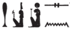
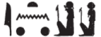

## Esna 75 {-}

- Location: North Anta, base
- Date: Unknown, probably Domitian
- [Hieroglyphic Text](https://www.ifao.egnet.net/uploads/publications/enligne/Temples-Esna002.pdf#page=228){target="_blank"}
- Bibliography: @klotz-baboons, p. 41, No. 7 (excerpt).

#### Title {-}

| *s.t tn n nṯr.t  *
|   *pḏ-nmṯ.t ḥr sỉn=s (?)  *
| *(w)ḏ(ȝ)=s wḏȝ tȝ  *
|   
| *ḥw.t-Nt pw snḏm=s ỉm=s  *
|   *ḥr sʿnḫ ṯȝ.wy n zȝ=s  *
|   
| *mr.t n Mnḥy.t  *
| *nfr.t n Nb.t-ww  *
| *pr-ḥʿʿ n ḥkȝ-pȝ-ẖrd [...]  *
| *[...]  *
| *[snsn ḥm=sn] ỉm r nḥḥ  *
|   
| *bw sḏm spr.w *  
| *[...]  *
| *[dỉ zȝ] zȝ.t  *
|   *n šm-ḥr-mw=f  *
|     
| *snỉ=s r gb.t  *
|   *ẖr ỉtn.wy  *
|  
| This place of the goddess,
|   broad of step while hurrying,
| if she is well, the land is well(?)[^fn-75-1]
|
| That is, the Temple of Neith, in which she sits,
|   nourishing the children of her son.
| 
| The desert (***m****r.t*) of **M**enhyt [^fn-75-2],  
| the good (place) (***n****fr.t*) of **N**ebtuu,  
| the House of Rejoicing (*pr*-***ḥ****ʿʿ*) of **H**eka the child,  
| [...]  
| [their majesties][^fn-75-3] consort there eternally.  
|
| It is the place of hearing requests  
| [of Khnum?...]
| [who gives a son][^fn-75-4] and daughter
|  to whomever is loyal to him.
| 
| It resembles [^fn-75-5] the heaven 
|  bearing the two celestial disks.[^fn-75-6]

[^fn-75-1]: {width=20%}. Reading uncertain. The initial epithet seems likely, assuming the first sign writes *pḏ*, "to stretch out (wings)" (*Wb* I, 568, 2).

[^fn-75-2]: A desert region (*mr.t*) of Esna is mentioned on the funerary pOIC 25389 (35, 8) belonging to a Latopolite priest: @herbin-ldpe, p. 273.

[^fn-75-3]: That is, Shu and Tefnut: {width=10%}

[^fn-75-4]: Restoration suggested by Sauneron. For similar epithets, see @klotz-baboons, pp. 38-39, n. c.

[^fn-75-5]: Note the spelling of the preposition *r* (< *ỉȝ.t*): {width=8%}. Not mentioned by Kurth, EP I, p. 323, No. 68.

[^fn-75-6]: That is, sun and moon, as evident from the determinatives: {width=10%}
