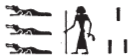
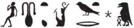
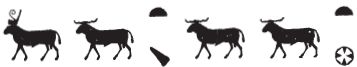

## Esna 76 {-}  
  
  
  
  
- Location: North Anta, Soubassement  
- Date: Domitian  
- [Hieroglyphic Text](https://www.ifao.egnet.net/uploads/publications/enligne/Temples-Esna002.pdf#page=229){target="_blank"}  
- Bibliography: @tattko-2014, pp. 414-415 (description only); @sayed-neith, pp. 661-662, Doc. 1092. 
- [Photograph](http://www.temples-egypte.net/sud/esna/devant/montantNord.html#B4){target="_blank"}
  
#### The King {-}

  

^1^ *nsw.t-bỉty  *  
*(ỉwtwgrtr ksrs)|  *  
^2^ *zȝ-Rʿ   *  
*(tmdinis nty-ḫwỉ)|  * 
  
^3^ *ḏd-mdw n zȝ-Rʿ  *  
*(tmd[ỉnỉs...])|  *  
*ỉỉ.n=ỉ ḫr=t  *  
*N.t wr.t mw.t-nṯr  *  
*nb.t tȝ-sn.t  *  
  
*ỉn=ỉ n=t ỉḫt nb  *  
*pr.w m ww=t  *  
*ḥrr.w nb   *  
*ḫpr.w m sḫ.t  *  
^4^ *šȝ nb wȝḏwȝḏ nb  *  
*sm.w sgb ỉdb.w  *  
*nty nb ḫpr m tȝ  *  
*mzỉ.tw n kȝ=t  *  
  
*ntṯ nb.t ww  *  
*ṯḥn sm.w  *  
*šms-ỉb=t (m) ỉdḥ.w  *  
  
^1^ The King of Upper and Lower Egypt  
(Autokrator Caesar)|  
^2^ Son of Re  
(Domitian Augustus)|  
  
^3^ Words spoken by the Son of Re  
(Domit[ian...])|  
I have come before you,  
Neith the great, Mother of God,  
Lady of Esna.  
  
I bring to you all good things  
which come forth from your field (*ww*).  
All flowers,  
which emerge from the field (*sḫ.t*).  
^4^ All marsh plants, all greenery,  
plants which flood the cultivated areas:  
all that comes forth from the earth  
is brought here for your Ka.  
  
You are the Lady of the Field (*ww*),  
scintillating of plants,  
you follow your heart in the papyrus marsh.

#### First Hapi {-}

^5^ *ḥʿpỉ mḥw  *  
*bʿḥ* ^6^ *ẖȝ.wt ỉmỉ.w=s  *  
*m rm.w  *  
   
^7^ *ḏd-mdw   *  
*ỉỉ n nsw.t-bỉty  *  
*(ỉwtgr[tr...])|  *  
*[ḫr=t]  *  
*[N.t wr.t mw.t-nṯr]  *  
*[nb.t tȝ]-sn.t  *  
  
*ỉn=f n=t ḥʿpỉ mḥw  *  
*ẖr ỉmỉ=f  *  
^8^ *mw nṯry ỉỉ m sn[m.t(?)]  *  
    
*[...] pw  *  
*swr(.t) Nwn  *  
*ỉr(.t) ʿnḫ n tpy.w-tȝ  *  
  
^5^ Hapi of Lower Egypt,  
who floods ^6^ the lagoons within it  
with fish.  
  
^7^ Words spoken:  
The King of Upper and Lower Egypt  
(Autokr[ator]...)|  
has come [before you],  
[Neith the great, Mother of God],  
[Lady of E]sna.  
  
He brings to you Hapi of Lower Egypt,  
with what is in him,  
the divine water which came from Senmet(?).[^fn-76-1]  
  
[...]   
who magnifies Nun,  
and makes life for those upon earth.

[^fn-76-1]: Unless this is restored differently, this would refer to the southern origin of the Nile in Biggeh Island, near Aswan.

#### Second Hapi {-}

^9^ *Nwn* ^10^ *spr=f  *  
*r nw=f  *  
  
^11^ *ḏd-mdw  *  
*ỉỉ.n zȝ-Rʿ  *  
*(tmd[ỉnỉs...])|  *  
*[ḫr=t]      *  
*[N.t wr.t mw.t-nṯr] *  
*[nb.t tȝ-sn.t]    *  
    
*ỉn=f n=t Nwn  *  
*[m?] wn-šps=f  *  
*ẖr* ^12^ *nṯr.w-wr.w  *  
*pr(.w) [m ...]  *  
*[...]  *  
    
*[ntt...] ḥr.t-tp  *  
*wbn m Nwn  *  
*štȝ.t sḫpr nty nb  *  
  
^9^ Nun[^fn-76-2] ^10^ as he arrives   
at his time.  
  
^11^ Words spoken:  
The Son of Re     
(Domit[ian...)|    
[has come before you],    
[Neith the great, Mother of God],    
[Lady of Esna].   
  
He brings to you Nun,  
[as?] Wenshepsef,[^fn-76-3]  
bearing the great gods[^fn-76-4]  
which come forth [from ...]  
[...]  
  
[You are ...] the uraeus,  
who arose from Nun.  
The mysterious one who created all that is.  
  

[^fn-76-2]: {width=10%} - A trio of crocodiles frequently substitutes for the expected triple water signs in this and other words. 
[^fn-76-3]: This god was linked to Diospolis Parva in Upper Egypt, and seems to have been a form of Osiris who rejuvenates like the phoenix: *LGG* II, 379b.
[^fn-76-4]: {width=15%} - Just as in the spelling of Nun, this could alternatively write "great waters (*mw wr.w*)."
 
#### Third Hapi {-}

^13^ *ỉṯ-kȝ* ^14^ *bʿḥ tȝ.wy   *  
*n kȝ=f  *  
  
^15^ *ḏd-mdw  *  
*ỉỉ.n nsw.t-bỉty  *  
*(ỉwtgrtr kysrs)|  *  
*ḫr=t  *  
*N.t wr.t mw.t-nṯr  *  
*nb.t tȝ-sn.t  *  
   
*ỉn=f n=t ỉṯ-kȝ  *  
^16^ *ẖr pr ỉm=f  *  
*ḥʿʿ-ỉb=t m sṯỉ.n=ṯ  *  
*swr=f sm.w m ḥr=t nfr  *  
  
*ntt sṯ.t ḥʿpỉ m ṯpḥ.t=f  *  
*r bʿḥ tȝ.wy  *  
*ȝḫ.t rwḏ(.tw) m sṯỉ.n=t  *  
  
^13^ *ỉṯ-kȝ* who floods the two lands  
for his Ka.  
  
^15^ Words spoken:  
The King of Upper and Lower Egypt  
(Autokrator Caesar)|  
has come before you,  
Neith the great, Mother of God,[^fn-76-5]  
Lady of Esna.[^fn-76-6]  
  
He brings to you *ỉṯ-kȝ*,  
^16^ carrying what comes forth from him,  
you rejoice from what you had poured out,  
he magnifies plants before your eyes.  
  
You are she who pours out[^fn-76-7] Hapi from his grotto  
in order to flood the two lands,  
the field flourishes from what you poured out.  
  

[^fn-76-5]: {width=30%} - The spelling of Neith evokes the legend of Methyer and Re, since it consists of: the child (*n* < *nww*) + the mother (*t* < *tmȝ.t*). The use of the hippo to write "mother" seems unique (@kurth-1, p. 177, n. 682, cites only this example). Elsewhere, the same sign writes *wr.t* (< Ta-weret) in the name "Neith the Great (*N.t* ***wr.t***): *Esna* IV, 461, S; 463, S.
[^fn-76-6]: {width=35%} - Remarkable spelling of this epithet using all rams, recalling the Ram Hymn of [Esna 103]. Most elements occur elsewhere, except perhaps the second ram for *tȝ*. Presumably this is derived from *ṯȝy*, "male."
[^fn-76-7]: A similar spelling of this verb occurs in [Esna 184], 12. 