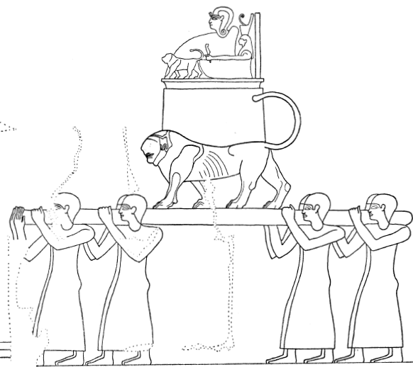
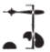
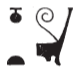
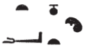
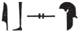
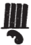
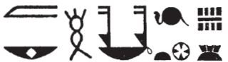
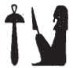

---
output:
  pdf_document: default
  html_document: default
---
# Calendar II (77) {-}

## Esna 77 {-}  
  
  
  
- Location: North-East Door, right   
- Date: Probably Domitian  
- [Hieroglyphic Text](https://www.ifao.egnet.net/uploads/publications/enligne/Temples-Esna002.pdf#page=234){target="_blank"}  
- Bibliography: @sauneron-5, pp. 20-28 (complete); @grimm.

### Phamenoth (Peret III) {-}

#### Phamenoth 1 {-}

  

^10^ *ḥb Ptḥ  *  
*ḥb ʿḫỉ-p.t  *  
*ḥb ẖnmw-Rʿ nb tȝ-sn.t  *  
*[s]ḫʿ n nṯr pn  *  
*ḥnʿ psḏ.t=f  *  
*m tr n dwȝw  *  
    
*ẖnm-ỉtn ḥtp  *  
*m wsḫ.t   *  
*ẖr pȝ sḥ n ḥbs  *  
    
*fȝỉ ỉḫt  *  
*ỉr(.t) ỉrw-nb  *  
*mỉ nty r *   
*pȝ smn-nḥp  *  
  
^10^ Festival of Ptah.  
Festival of Raising the Sky.  
Festival of Khnum-Re Lord of Esna.  
[Pro]cession of this god  
together with his Ennead,  
at the time of morning.  
  
Union with the disk, return,  
in the broad court,  
under the clothing kiosk.  
  
Elevating offerings,  
performing all rites,  
like what is in the (papyrus):  
'Establishing the Potter's Wheel.'[^fn-77-0] 

[^fn-77-0]: The festival of "lifting up heaven" on Phamenoth 1 is widely attested since the New Kingdom, and most frequently involves the Memphite demiurge Ptah-Tatenen; cf. @berlandini-1995, pp. 29-31. At Esna, this coincided with the major festival of installing the potter's wheel by Khnum-Re-Tatenen: @sauneron-5, pp. 71-88, 81-244; @leitz-loeffler. 

#### Phamenoth 5 {-}

*ḥb Nb.t-ww  *
  
Festival of Nebtu.

#### Phamenoth 10-11 {-}

*hrw 10  *  
*sḫʿ n ẖnmw p(ȝ)-nḫy-nfr  *  
*ẖnm-ỉtn ḥtp  *  
*m pr-sȝḥw-Rʿ  *  
   
*ỉr(.t) mỉt.t m dwȝw  *  
*n hrw 11  *  
*sḫʿ n ḏḥwty   *  
*ḥr-ỉb ḥw.t-ṯȝ.wy  *  
*ḥnʿ nṯr pn  *  
*m tr n (r)whȝ  *  
*[ẖnm-ỉtn ḥtp]  *  
  
Day 10  
Procession of Khnum the Good Protector,  
Union with the disk, return,  
in Per-Sahure.  
  
Do the same in the morning  
of Day 11:  
Procession of Thoth  
within Temple of the Chicks,  
along with this god  
at the time of (eve)ning.  
[Union with the disk, return]

#### Phamenoth 14 {-}

*sḫʿ n ẖnmw p(ȝ)-nḫy-nfr  *  
*r pr-ẖnmw  *  
   
*ỉr(.t) qbḥw snṯr  *  
*r pr-sȝḥw-Rʿ  *  
*nfryt r hrw 18  *  
*ḥtp m ḥw.t-ẖnmw  *  
  
Procession of Khnum the Good Protector,  
to Per-Khnum.  
  
Perform cool water and incense  
at Per-Sahure,  
until day 18.  
Return to the Temple of Khnum.

### Pharmouthi (Peret IV) {-}

#### Pharmouthi 1 {-}

*ḥb ʿq n p.t  *  
*ỉr(.t) mỉ ḥb   *  
*ʿḫỉ p.t  *  
  
*ʿq*-festival of heaven.  
Act like the festival  
of Raising the Sky (cf. [Phamenoth 1]).  

#### Pharmouthi 11 {-}

^11^ *sḫʿ n N.t ḥkȝ pȝ-ẖrd  *  
*m tr n dwȝw  *  
*ẖnm-ỉtn ḥtp  *  
   
*ḥb ẖn.t nṯr.t tn  *  
*ỉr(.t) msw.t-nṯr n Rʿ  *  
*m hrw pn   *  
*ỉr(.t) msw.t-nṯr n ḥr  *  
*m ȝbd n ȝbd pn  *  
     
^11^ Procession of Neith, Heka the Child  
at the time of morning.  
Union with the disk, return.  
  
Bark procession of this goddess.  
Perform the Divine Birth rite for Re  
on this day.  
Perform the Divine Birth rite for Horus  
on the second lunar day of this month.
   

   

#### Pharmouthi 28 {-}

 

*ḥb ḥr-zȝ-Is.t  *  
*sḫʿ n ḥkȝ pȝ-ẖrd  *  
*ḥr-zȝ-Is.t m hrw pn  *  
    
Festival of Harsiese:  
Procession of Heka the Child,  
and Harsiese on this day.  
   

#### Pharmouthi 30 {-}

 

*sḫʿ n Nb.t-ww m Iwny.t  *  
*ḥtp m pr-ms  *  
*ỉr(.t) ỉrw nb r ḥḏ-tȝ  *  
  
Procession of Nebtu in Iunyt,  
return to the Mammisi.  
Perform all rites until dawn.  

### Pakhons (Shomu I) {-}

#### Pakhons 1 {-}

*ḥb ẖnmw Nb.t-ww ḥkȝ ḏḥwty  *  
*Ntr.w nṯr.yt  *  
*ms.tw šw tfn.t ḥkȝ pȝ-ẖrd  *  
*Gbb pw zȝ=sn mr=sn  *  
     
*ỉn šw ḏḥwty ỉr.t n nb=s  *  
     
*ỉr ḥr-sȝ wn-ḥr   *  
*m ḥw.t-ẖnmw  *  
   
*ỉỉ ỉn p(ȝ) ḥm-nṯr   *  
*nty m ʿbw-wr  *  
  
^12^ *dỉ ḫʿ ḥkȝ p(ȝ)-ẖrd   *  
*r-ḥry ḫndw n nbw  *  
*m pȝy=f šn n ms  *  
      
*sḫʿ n Mnw-Imn r pr-ms  *  
*ḥtp m-bȝḥ Nb.t-ww  *  
*ỉw ḥr=f r-ẖnw  *  
*ỉr(.t) wn-ḥr ỉr(.t) ỉrw [nb]  *  
*[...]*   
*wnw.t 2.t m hrw pn  *  
     
*sḫʿ n ḥkȝ p(ȝ)-ẖrd  *  
*Mnw m-sȝ=f  *  
*m-bȝḥ ỉt=f  *  
     
*sḫʿ n ẖnmw-Rʿ nb tȝ-sn.t  *  
*ḥnʿ psḏ.t=f  *  
*ẖnm-ỉtn ḥtp  *  
      
*ḫʿ n pȝ-ẖrd  *  
*pẖr nỉw.t=f  *  
*m-bȝḥ ỉt=f  *  
*m pr-ẖnmw  *  
    
*sṯȝ r pr-ms  *  
*m bȝḥ mw.t=f  *  
*ḥtp  *  
    
*sḫʿ n ẖnmw-Rʿ nb sḫ.t  *  
*ḥnʿ psḏ.t=f  *  
*n pr-ẖnmw  *  
*pr-sȝḥw-Rʿ mỉt.t  *  
   
*ỉr.t hrw-nfr m hrw pn  *  
*ḥb Rnn.t ḫ(r).tw r=f  *  
  
Festival of Khnum, Nebtu, Heka, Thoth,  
and gods and goddesses.  
Shu, Tefnut, and Heka are born,  
that is Geb, their beloved son.  
  
Shu and Thoth bring back the eye to its lord.  
  
Afterwards, revealing the face   
in the Temple of Khnum.  
  
The the priest arrives  
being in a state of great purification.  
  
^12^ Causing Heka the Child,  
upon his golden portable throne,  
to appear in his child's lock of hair.[^fn-77-5]  
  
Procession of Min-Amun to the mammisi,  
stopping before Nebtu,  
while he faces inward,  
revealing the face, doing [all] rites   
[...]  
2nd hour of this day.  
  
Procession of Heka the Child,  
Min behind him,  
before his father.  
  
Procession of Khnum-Re Lord of Esna  
along with his Ennead,  
union with the disk, return.  
  
The Child appears,  
going around his city  
before his father  
in Per-Khnum.  
  
Return to the mammisi  
before his mother,  
rest.  
  
Procession of Khnum-Re Lord of the Field  
along with his Ennead  
in Per-Khnum,  
Per-Sahure likewise.  
  
Performing hrw-nfr on this day.  
It is also called the 'Festival of Renenutet.'

[^fn-77-5]: {width=5%} - This is precisely the throne Heka is carried upon in *Esna* VI, 542, where the king offers him his ceremonial child's lock (*ẖʿq*), just as described here: {width=30%}

#### Pakhons 3 {-}

*s[ḫʿ nṯr] pn *
*m ʿȝ.t m pr-ms  *  
^13^ *wḥm=f n.t   *  
*m-bȝḥ ỉt=f  *  
  
Pro[cession] of this [god]  
with the *ʿȝ.t*-crown {width=12%} in the mammisi.   
^13^ He repeats with the red crown {width=10%}   
before his father.  

#### Pakhons 7 {-}

*ḥḏ.t m pr-ms  *  
*sḫmty m-bȝḥ ỉt=f  *  
   
White Crown {width=8%} in the mammisi,  
Double Crown {width=8%} before his father.  

#### Pakhons 14 {-}

*tʿn.t m pr-ms  *   
*ȝḫ.t m-bȝḥ ỉt=f  *  
   
{width=16%} in the mammisi,  
{width=10%} before his father.  

#### Pakhons 15 {-}

*___ m pr-ms  *   
*___ m-bȝḥ ỉt=f  *  
*ṯz r pr-sȝḥw-Rʿ  *  
*ỉr(.t) ỉrw nb.w  *  
     
*sṯȝ m bȝḥ mw.t=f  *  
*ḥtp  *  
   
*ḫʿ n Mnw-Imn  *  
*ḥtp m pr-ms  *  
*ỉw ḥr=f r-bnr  *
   
{width=10%} in the mammisi,  
{width=8%} before his father.  
Going up to Per-Sahure,  
performing all rites.  
  
Return before his mother,  
rest.  
  
Appearance of Min-Amun,  
stopping in the mammisi,  
his face to the outside.  

#### Pakhons 16 {-}

*pȝ ỉbs m pr-ms  *   
*šw.ty m-bȝḥ ỉt=f  *  
  
  
   
{width=20%} in the mammisi,  
{width=5%} before his father.  

#### Pakhons 18 {-}

*___ m pr-ms  *   
*____ m ḥw.t-ẖnmw*   
   
{width=10%} in the mammisi,  
{width=10%} in the Temple of Khnum.  

#### Pakhons 20 {-}

*____ m pr-ms  *   
*____ m ḥw.t-ẖnmw  *  
*nn pẖr nỉw.t=f  *  
  
   
*ỉw r pr-ms  *  
*ḥnʿ mw.t=f Nb.t[-ww]  *  
*[...] m pr-ms  *  
*^14^ ʿȝ m bȝḥ ỉt=f   *  
*mw.t=f m-sȝ=f  *  
  
  
*m wnw.t 8.t nt hrw  *  
*ḥtp ỉn Nb.t-ww m tȝ-sn.t  *

{width=8%} in the mammisi,  
{width=10%} in the temple of Khnum.  
No going around his city.  
  
Coming to the mammisi  
with his mother, Nebt[u]:  
[...] in the mammisi,  
^14^ great {width=8%} before his father,  
his mother behind him.  
  
At the 8th hour of the day,  
Nebtu returns to Esna.

#### Pakhons 22 {-}

*___ m pr-ms  *   
*pẖr nỉw.t=f  *  
*swʿb nṯr pn  *  
*ḥtp ḥr s.t=f wr.t  *  
*m ḥw.t-ẖnmw  *  
*m-bȝḥ ỉt.w=f  *  
  
{width=10%} in the mammisi,  
going around his city,  
purifying this god,  
resting upon his great throne  
in the Temple of Khnum,  
before his parents.  

#### Pakhons 25 {-}

*sḫʿ n nn nṯr.w ʿȝ.w  *  
*m ḥb wȝḥ-sȝḥW-Rʿ  *  
   
*ḫʿ nt ʿḥ Rnn.t  *  
*ḫr.tw r=f  *  
*mḥ hrw 6  *  
  
Procession of these great gods,  
in the festival of Wah-Sahure.[^fn-77-25]  
  
Procession of the Palace of Renenutet,  
so it is also called.  
Complete 6 days.  

[^fn-77-25]: {width=30%} - @sauneron-5, p. 24, notes m-n, split up this text differently, but noted the toponym with *wȝḥ* might represent a bark station between the temples. As such, the following *p*-sign is likely the determinative to that toponym, a representation of a socle, rather than the definite pronoun for what follows.

### Payni (Shomu II) {-}

#### Payni 1 {-}

*ʿḥȝ-nfr  *  
*sḫʿ n ẖnmw N.t Nb.t-ww  *  
*ẖnm-ỉtn  *  
*wṯz r pr-sȝḥw-Rʿ  *  
*ỉr(.t) ʿr 4 m r' 4  *  
*m zbỉ-n-sḏ.t  *  
*m-rwty pr pn  *  
*nỉ(?) mȝȝ ỉn wʿb-sḫm.t  *  
*ỉr.t m qmȝ-(m)-n.t  *  
  
Good-bad.[^fn-77-26]  
Procession of Khnum, Neith, Nebtu.  
Union with the disk.  
Going up to Per-Sahure,  
making 4 goats at the 4 doors  
as burnt offerings  
around this temple.  
Not(?) seen[^fn-77-27] by the Sakhmet priest.  
Making (ritual objects) as "thrown in the water."  

[^fn-77-26]: For this entire festival, see the more detailed version in *Esna* III, 199, 27-28; cf. @sauneron-5, p. 25, n. b; and the discussion of @quack-water, pp. 9-10. In the lenghtier account, the 4 sacrifical goats are identified with markings with enemies of the king and gods. Finally, wax figures of the enemies are thrown into the water.
[^fn-77-27]: {width=30%}  - @sauneron-5, p. 24, and @quack-water, p. 9, both understood the first *nw*-pot as a negation, and Quack argued perhaps the Sakhmet priest was not required to inspect these type of animal sacrifices, since the goats are not eaten. However, one of the chief purposes of the Sakhmet priest was to make recognize special markings so people would not accidentally kill sacred animals; moreover, I know of no parallels at Esna for this spelling of a negation. Perhaps the *n* belongs to the former group, or perhaps the former signs should have been *m-rwty* ***n*** *pr pn*.

#### Payni 4 {-}

*ḥtp m tȝ-sn.t  *  
  
Resting in Esna.

#### Payni 9 {-}

*ʿq Rʿ m-ẖnw s.t-ḥr.t  *  
*r* ^15^ *mȝȝ zȝ=f šw  *

Re enters inside the Upper Place,[^fn-77-28]
to ^15^ see his son, Shu.

[^fn-77-28]: The 'Upper Place' north of Esna is defined in [Esna 129] and *Esna* III, 196. It is the location where Re sees his son, Khnum-Shu, slaughtering his enemies.

#### Payni 10 {-}

*ḥtp n ḥkȝ p(ȝ)-ẖrd  *  
*ẖnm-ỉtn ỉr(.t) hrw-nfr  *  
*m pr-ms  *  
*mỉt.t tpy šmw  *  
  
Return of Heka the Child,  
Union with the disk, *hrw-nfr*  
in the mammisi,  
just like on Shomu 1 ([Pakhons 1]).

#### Payni 14 {-}

*ḥb ḥw.t-ḥr nb(.t) ʿgny  *  
*ỉr(.t) ỉrw nb  *  
*n ẖn.t Nb.t-ww   *  
*ẖnmw [...]  *  
  
Festival of Hathor Lady of Agny.  
Perform all rites  
of the boat procession of Nebtu,  
Khnum [...]  

#### Payni 15 {-}

*ḥtp n tȝ-sn.t  *  
  
Resting in Esna.

#### Payni 16 {-}

*ḥb Mnḥy.t  *  
*ḥb Bȝst.t  *  
*sḥtp Sḫm.t  *  
  
Festival of Menhyt,  
Festival of Bastet,  
Pacifying Sakhmet.  

#### Payni 26 {-}

*wp-rnp.t wn-ḥr  *  
*m ḥw.t-N.t  *  
   
*dỉ.t mnḫt n nṯr.w   *  
*mỉ nty r II pr.t 8  *
  
New Year, Revealing of the Face,  
in the Temple of Neith.  
  
Giving cloth to the gods[^fn-77-163-1]
like on Peret II day 8 ([Meshir 8]).  

[^fn-77-163-1]: The presentation of cloths to other gods in this festival is described in more detail in [Esna 163], 22.

#### Payni 30 {-}

*sḥtp Sḫm.t  *  
  
Appeasing Sakhmet.

### Epiphi (Shomu III) {-}

#### Epiphi 1 {-}

*ḥb ẖnmw-Rʿ nb sḫ.t  *  
*šd msw.t-nṯr mḥ-2.t  *  
*n ḥkȝ p(ȝ)-ẖrd  *  
  
Festival of Khnum-Re Lord of the Field.  
Recite the Divine Birth rite a second time  
for Heka the Child.

#### Epiphi 4 {-}

*mỉt.t  *  
  
Likewise.

#### Epiphi 13 {-}

*ḥb N.t wnn=s [...]   *  
*m ḫwỉ zȝ=s Rʿ  *  
*m-ʿ ms.w=f  *  
   
^16^ *ỉr=s sw ỉmỉ.tw wp.t=s  *  
*mḥỉ=s ẖr=f ḥr mw  *  
*ỉw=s r nỉw.t=s  *  
*m tr n III šmw 13  *  
     
*ḏd.n Rʿ n nṯr.w  *  
*šzp (r)-ḥȝ.t N.t  *  
*sḫʿ n nṯr.t tn  *  
*ḥnʿ psḏ.t=s  *  
      
*ḥtp m wsḫ.t-ḫʿ  *  
*ỉr(.t)-ỉrw.w   *  
*nw dỉ(.t) ȝh.t km.t  *  
*m tr n rwhȝ  *  
      
*ỉr(.t) ỉrw nb.w  *  
*mỉ nty r nt-ʿ  *  
  
Festival of Neith,[^fn-77-30] as she [...]  
guarding her son Re  
from his children.  
  
^16^ She puts him between her horns,  
she floats with him on the water,  
and she comes to her city,  
at the time of Epiphi 13.  
  
Re said to the gods:  
'Make a light before her.'[^fn-77-31]  
Procession of this goddess,  
together with her Ennead.  
  
Resting in the court of appearances.  
Perform all rites  
of giving a black cow  
at the time of evening.[^fn-77-32]  
  
Perform all rites  
like what is in the ritual.

[^fn-77-30]: More details of this major festival of Neith occur on the festival columns:  @sauneron-5, pp. 246-308.
[^fn-77-31]: @sauneron-5, p. 26, translated this literally: "Faites accueil à Neith."  However, in the more detailed parallel (*Esna* III, 206, 15, §21), the verb Szp has a sun determinative, and a similar passage earlier in that text (*Esna* III, 206, 14, §18), makes it clear this is actually: "light up (a torch) in front of her" (the last example correctly understood by @sauneron-5, p. 270, n. c; cf. @klotz-baboons, pp. 57-58. This festival celebrates Neith giving birth to Re, hence the light, and torches are carried before her sacred cow in the evening ritual on Epiphi 19 (*Esna* III, 207, 23; @sauneron-5, p. 302, n. a).
[^fn-77-32]: The evening rituals for this black sacred cow, identified with Neith as Mehet-weret, are detailed further in *Esna* III, 207; cf. @sauneron-5, pp. 295-302.

#### Epiphi 19 {-}

 

*ḫʿ n ẖnmw p(ȝ)-nḫy-nfr  *  
*r pr-ẖnmw  *  
*ḥtp m-ẖnw r'   *  
*n š ḏsr  *  
*ỉr ḥr=f nfr r zȝ-ẖn.t  *  
  
*ỉḫt (ḥr) ḫȝw.t  *  
*r ḥḏ-tȝ  *  

Appearance of Khnum the Good Protector  
towards Per-Khnum.[^fn-77-33]  
Stop inside the entrance  
of the Red Lake,  
his good face towards the *zȝw-ẖn*-lake.[^fn-77-34]  
  
Offerings upon the altar,  
until dawn.  

[^fn-77-33]: This is the beginning of a major festival celebrating the slaughter of enemies near the Red Lake: cf. @sauneron-5, pp. 309-378.
[^fn-77-34]: For this lake north of Esna, see @sauneron-5, pp. 325-326, n. c.

#### Epiphi 20 {-}

*ḥb ṯȝy ʿwn.t  *  
*sḫʿ n ẖnmw-Rʿ nb sḫ.t  *  
*m ʿbȝ.t  *  
*ỉw ḥr=f r-ẖnw   *  
*r snḏm ỉb n ỉt=f Itm  *  
*ḥtp m mȝrw  *  
     
*ỉr ḥr-sȝ ḥn(.t) rwhȝ  *  
*ḫʿ n nṯr pn r s.t-ḥr.t  *  
*smȝ.n=f sbỉ  *  
*ỉr.t ʿḥȝ* ^17^ *ḥnʿ=f  *  
*m s.t ṯn  *  
      
*ṯtf ỉrp ʿšȝ ḥr ḥtp.w  *  
*m-bȝḥ nṯr pn  *  
*ỉw ḥr=f r mḥ.t  *  
*r zȝ-ẖn  *  
*r snfr ỉb=f  *  
*ḥr ỉr(.t) qbḥw snṯr  *  
*n nṯr.w nty.w ỉm  *  
     
*ỉr(.t) nt-ʿ n snfr sḫ.t  *  
  
Festival of Taking the Baton.  
Procession of Khnum-Re Lord of the Field  
in Aba,  
with him facing inside,  
to please the heart of his father, Atum.  
Resting in the Maru-garden.  
  
Now after the evening service,  
this god appears in the Upper Place,[^fn-77-28]  
where he slaughtered the rebel,  
engaging in combat ^17^ with him  
in this place.  
  
Pour out copious wine upon the altars  
before this god,  
while he faces the north  
towards the *zȝw-ẖn* lake,[^fn-77-34]  
in order to please him,  
by offering cool water and incense  
to the deceased gods.  
  
Perform the rite of beautifying the field.

#### Epiphi 21 {-}

*sḫʿ n ẖnmw-Rʿ nb sḫ.t  *  
*ḥnʿ psḏ.t=f  *  
*ẖnm-ỉtn ḥtp  *  
*ẖn.t m ỉtrw  *  
*ḥb Nb.t-ww  *  
*šd.t sš n swḏȝ sḫ.t  *  
  
Procession of Khnum-Re Lord of the Field  
along with his Ennead.  
Union with the disk, return.  
Boat procession on the river.  
Festival of Nebtu.  
Reciting the book of making the field thrive.

#### Epiphi 29 {-}

*ḥb nṯr.w   *  
*m ḥb ḥm.t=s  *  
*ỉr.t nt-ʿ=sn  *  
*mḥ hrw 3  *  
  
Festival of the Gods  
being the Festival of her Majesty.  
Performing their rites,  
complete 3 days.  

### Mesore (Shomu IV) {-}

#### Mesore 1 {-}

*ḥb ẖnmw-Rʿ nb tȝ-sn.t  *  
*ḏd Rʿ n nṯr pn  *  
*ỉm ms Nw.t m ȝbd pn  *  
*ms.n wỉ ỉm=f  *  
   
*ṯtf ỉrṯ.t m ḫft-ḥr  *  
*ḫʿ nṯr pn  *  
  
Festival of Khnum-Re Lord of Esna.  
Re said to this god:  
'Nut may not[^fn-77-40] give birth in this month,  
in which I was born.'  
  
Pouring out milk in the forecourt,  
appearance of this god.  

[^fn-77-40]: {width=7%} - Notable spelling of the negative verb *ỉm*. For an explanation of this text, see @sauneron-5, p. 27, n. a.

#### Mesore 20 {-}

*ḥb Mnḥwy  *  
*ỉḫt (ḥr) ḫȝw.t  *  
  
Festival of Menehwy.[^fn-77-41]  
Offerings (upon) the altar. 

[^fn-77-41]: {width=7%} - Unusual spelling of the local butcher god.

#### Mesore 30 {-}

*ḥb ẖnmw ỉr(.w) m pr-ẖnmw  *  
^18^ *ỉr ỉw wnw.t 12.t n rwhȝ  *  
*[s]ḫʿ n ẖnmw ḥry s.t=f wr.t  *  
*r [Xnm] itn  *  
*sṯỉ tkȝ ʿšʿ [ỉn?] z nb  *  
    
Festival of Khnum, done in Per-Khnum.  
^18^ Now when the 12th hour of night comes  
[pro]cession of Khnum upon his great throne,  
to [unite with] the disk.[^fn-77-41b]  
Lighting many torches [by?] all men.  

[^fn-77-41b]: For this passage, see also the detailed analysis by @sauneron-mesore.

### Epagomenal Days {-}

#### Extra Day 1 {-} 

*ms Wsỉr ḥb   *  
*ỉr(.t) mnḫt n ẖnmw-Rʿ nb tȝ-sn.t  *  
*ḥnʿ psḏ.t=f  *  
*ỉḫt (ḥr) ḫȝw.t  *  
  
Birth of Osiris, festival.  
Give cloth to Khnum-Re Lord of Esna,  
along with his Ennead.  
Offerings (upon) the altar.

#### Extra Day 2 {-} 

*ms ḥr   *  
*ḥb ḥkȝ p(ȝ)-ẖrd  *  
*wn-ḥr m r-pr.w  *  
*m wnw.t 8.t tn  *  
  
Birth of Horus,  
Festival of Heka the Child,  
Revealing the face in temples  
at the 8th hour.  

#### Extra Day 3 {-} 

*ỉḫt (ḥr) ḫȝw.t  *  
   
Offerings (upon) the altar.

#### Extra Day 4 {-} 

*ms Is.t  *  
*ḥb pn nfr n p.t-tȝ  *  
*ỉr(.t) mnḫ.t n ẖnmw  *  
*ḥnʿ psḏ.t=f  *  
  
Birth of Isis.  
This good festival on heaven and earth.  
Give cloth to Khnum  
along with his Ennead. 

#### Extra Day 5 {-} 

*ms Nb.t-ḥw.t ḥb  *  
*wn Is.t m pr-Ntr  *  
*ḫʿỉ r tp hrw 10  *  
  
^19^ *[...]*  
  
Birth of Nephthys, festival.  
Isis is in Per-netjer,  
appearing every 10 days.  
  
^19^ [...]

