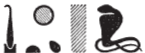

# Esna 78 {-}

  

- Location: South Face of North Pillar
- Date: Possibly Domitian
- [Hieroglyphic Text](https://www.ifao.egnet.net/uploads/publications/enligne/Temples-Esna002.pdf#page=240){target="_blank"}
- Bibliography: None

*ʿnḫ [nṯr nfr]  *  
*[ḥwnw] ʿn m ḫprw=f  *  
*šw.ty m tp=f  *  
*Mnḥy.t m ḥȝ.t=f  *  
*m sḏḏ=f n ẖnmw  *  
*ỉt nṯr.w  *  
  
*ḫʿỉ m ʿḥ  *  
*ḏỉ-ʿ ḥr mṯn   *  
*šzp [sw] nb.wy  *  
*smn=w ḥp.ty=f  *  
*bs=sn [...]  *  
*[ḥr z]mȝty  *  
*r mȝȝ mw.t=sn  *  
     
*sš=f ḥḏ=s   *  
*m ḏsr wr  *  
*gm=f ḥm=s  *  
*hr psḏ.t=s m nḏm-ỉb  *  
    
*mȝȝ=f [...]  *  
*smn [...]=f ḥr tȝ ḏ.t  *  
  
Live [the good god]  
[the youth], beautiful in his form,  
double plumes on his head,  
Menhyt[^fn-78-1] on his brow,  
in his form of Khnum,  
father of the gods.[^fn-78-2]  
  
Processing from the palace,  
setting on the path,[^fn-78-3]  
the two Lords receive [him],[^fn-78-4]  
they establish his limits,  
the introduce him [...]  
[upon] the [r]oad  
to see their mother (Neith).  
  
He opens her shrine,  
in great sanctity,  
he finds her Majesty,  
and her Ennead is pleased at heart.  
  
He sees [...]  
establishes his [...] on earth, forever.  

[^fn-78-1]: {width=15%}- Note the spelling of 'Menhyt' as *mn-ḫt*.
[^fn-78-2]: Descriptions of the king leaving the palace, as in [Esna 52] and [Esna 74], in which he wears the double plumes of Khnum, with a uraeus (Menhyt) on his brow. Similar text in [Esna 56].
[^fn-78-3]: Direction quotation of [Esna 74], 6.
[^fn-78-4]: These two Lords are presumably Thoth and Harsiese (cf. [Esna 56]), who purify the king in [Esna 67], and introduce him to Khnum in [Esna 88].