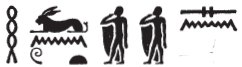
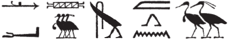
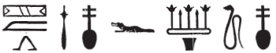

## Esna 80 {-}  
  
  
  
  
- Location: North-East Door, exterior, lintel
- Date: Probably Domitian 
- [Hieroglyphic Text](https://www.ifao.egnet.net/uploads/publications/enligne/Temples-Esna002.pdf#page=242){target="_blank"}  
- Bibliography: @sternberg, pp. 80-84; see also [Tempeltexte 2.0](http://www.tempeltexte.uni-tuebingen.de/portal/#/text-detail/483){target="_blank"}  

<!--also check Abraham's book for parallels -->

  

^1^ *[...] Rʿ   *  
*ḥwn.tw=sn ỉs m-ḫnt=f  *  
*rhn=sn r=f  *  
*m rdỉ st Rʿ r tȝ  *  
   
*rwḏ rd.wy ḥm=f  *  
*ḥnʿ ḥm.wy=sn  *  
*r ỉȝ.t tn  *  
*ḏr nỉw.t pw   *  
*nty nb ʿnḫ  *  

^1^ [...Neith....] Re,  
they rejuvenated[^fn-80-0] within it,  
they rested there,  
when Re gave birth to them.  
  
The legs of his majesty were set,  
along with their majesties,[^fn-80-1]  
towards (going to) this mound,  
since it is the city  
of the Lord of Life.  

[^fn-80-0]: {width=20%} - @sternberg, p. 92, n. b, translated *ḥwn.wy=sn*, "ihre Sprößlinge".
This translation is based on the parallel in *Esna* II, 31, 60 (not mentioned by Sternberg), also concerning Re and Neith: "they rejuvenated their bodies in the form of the children of Re (*ḥwnw ḏ.t=sn m ṯȝ.wy n Rʿ*)"; cf. @pichel, p. 136.
[^fn-80-1]: Shu and Tefnut.

  

*ḏd.ỉn Rʿ n šw Tfn.t  *  
*ḫpr=tn dy   *  
^2^ *[...]  *  
*[...]  *  
*ỉw[=k] m ỉwn n ʿnḫ  *  
*ỉw sn.t[=k ...]  *  
*[...]=ṯn pw ḏr-bȝḥ  *  
    
*ḏd.tw ỉwn m rn n šw  *  
*Iwny.t m rn n spȝ.t=tn  *  
  
Then Re said to Shu and Tefnut:  
You shall stay here   
^2^ [...]  
[...]  
[You] are as an air-pillar of life,  
[your] sister [...]  
it is your [...] since the beginning.  
  
Thus one says 'Iun' as the name of Shu,  
and 'Iunyt' as the name of this district.

  

*šd s.t mw.t=f N.t  *  
*m ḥḏ.t=s  *  
*ỉw=sn m [sbk.wy...]   *  
    
^3^ *[...]  *  
*ẖnmw m ršw ḥnʿ=t  *  
*[n]t[t] nb n ww  *  
*ḏd.tw n=s Nb.t-ww  *  
    
*ỉtn=s(n) m ỉtn.wy  *  
*ỉb.w ḥtp [...]  *  
*[...] n ḏr-ʿ  *   
  
Their mother, Neith, nursed them  
with her white milk,  
they being as [two crocodiles...][^fn-80-2]    
  
^3^ [...]  
being united with you in joy,  
you [are] the Lady (*nb.t*) of the Terrain (*ww*),  
thus she is called 'Nebtu.'  
  
They shine as the two disks,[^fn-80-2b]    
hearts are quiet(?) [...]  
[...] since the beginning.  
  

[^fn-80-2]: Possibly understanding an allusion to Shu and Tefnut as the two baby crocodiles nursed by Neith, as in [Esna 104], 7 (*ỉw=sn m sbk.wy*)
[^fn-80-2b]: Restored based on the parallel in *Esna* II, 31, 39; for Shu and Tefnut as the two disks, see also [Esna 81], 6; *Esna* III, 346, 22.

  

*ỉb=f ȝw[...]  *  
^4^ *[...]  *  
   
*[...].n=f wʿ n ḫmt  *  
*sšm n sn.wy  *  
*wrš=f ỉm   *  
*ḥr zȝ n ḥm [n] Rʿ  *  
  
*wbn Rʿ r mȝȝ=sn  *  
*m ẖr.t-hrw  *  
  
*ẖnm=f st   *  
*m bȝ ḥr-ỉb ṯȝ.wy=f  *  
*ḫpr ỉȝ.t-ṯȝ.wy    *  
*m rn n ỉȝ.t tn  *  
  
^5^ [...]  
  
His heart is glad [...]  
^4^ [...]  
  
[...] he [...] one of the three,[^fn-80-3]   
guide of the two siblings,  
he stands guard there,  
protecting the majesty [of] Re.  
  
Re rises just to see them,  
every day.  
  
He unites with them  
as the Ba amidst his chicks,[^fn-80-4]  
thus 'Mound of the Chicks' came about  
as the name of this mound.  

[^fn-80-3]: {width=35%} - This is a reference to Thoth in North Esna; cf. @klotz-baboons, p. 38, n. b.  Based on the examples in *Esna* III, 309, 27, and *Esna* VI, 493, 9, the two birds here write *sn.wy*, "the two (siblings)" (i.e. Shu and Tefnut), and not *bȝ.wy* (contra @sternberg, p. 83, n. o).
[^fn-80-4]: Similar narrative, from "one of the three" to "Ba amidst his chicks" in *Esna* II, 31, 62-63. 

  

^5^ *[...]=s [r] tr r [tr]  *  
*[...]  *  
*ẖnmw pȝ [n]ḫy nfr  *  
*m gs-dp.t  *  
*ḥr sḥr ḏȝ.t m r'-wȝ.t=sn  *  
^6^ *[...]  *  
  
*[...] m Nwn  *  
*sḫȝ.n ỉb=f Iwnw [...]  *  
*[...]  *  
*nʿỉ=f r=s  *  
*m šmʿ-nfr  *  
*šȝy-nfr zȝ nỉw.t=f  *  
*zbi.n=f ḥb.w   *  
*nỉ wšr  *  
   
^7^ *s.t [pw nt] nbỉ *  
*n qdỉ-qdỉ.w  *  
*šms nṯr ʿȝ [m] ḥḏ=f  *  
*tȝ-ṯnn pw   *  
*ỉr nn r-ȝw  *  
*[...] ḥr tȝ [...]  *  
*m-ḫm kȝ=f  *  
   
*p.t tȝ mn.tw r nḥḥ  *  
*nb nḥp mn.tw *  
*r ỉḫt=f  *   
*ỉw=f ḥr ỉr(.t) nt.w-ʿ=f  *  
*mỉ sf  *  
*nỉ ȝb rʿ-nb  *  
  
^5^ she [...from] season to [season]  
[...]  
Khnum the Good [P]rotector  
is on guard,  
repelling evil from their vicinity  
^6^ [...]  
  
[...] from Nun,  
his heart remembered Heliopolis (*Iwnw*) [...]  
[...]  
he went towards it,  
as Shemanefer,  
the good Shai-serpent[^fn-80-5] who protects his city,  
having run through festivals,  
without fail.  
  
^7^ [It is] the place fashioning,  
[for] the Builder of builders,  
who directs the great god [in] his shrine,  
that means Tatenen,  
who made all of this.  
[...] on earth [...]  
without his Ka knowing.  
  
Heaven and earth remain forever,  
the Lord of the Potter's wheel remains  
at his things,  
he carries out all his actions,  
just like yesterday,  
without cease, every day.

[^fn-80-5]: {width=30%} - This spelling of Shemanefer links him with the agathos-daimon serpent Shai.