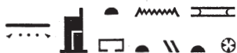
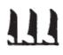
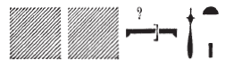

## Esna 81 {-}  

  
  
- Location: North-East Door, exterior, left
- Date: Probably Domitian 
- [Hieroglyphic Text](https://www.ifao.egnet.net/uploads/publications/enligne/Temples-Esna002.pdf#page=243){target="_blank"}  
- Bibliography: @sternberg, pp. 86-91 (only 1-5); see also [Tempeltexte 2.0](http://www.tempeltexte.uni-tuebingen.de/portal/#/text-detail/489){target="_blank"}  

<!--also check Abraham's book for parallels -->

  

^1^ *ỉr ỉȝ.t tn  *  
*tȝ-sn.t rn=s  *  
*spȝ.t pw nt N.t  *  
*m tȝ šmʿ  ḥr ỉmnt.t   *  
  
*mỉt.t N.t=s   *  
*m tȝ-mḥw  ḥr ỉȝbt.t  *  
  
*mw.t-Rʿ pw  *  
*ḏr ỉw=s ḥnʿ=f  *  
*r nỉw.t tn  *  
    
*ẖnm=f qmȝ sw  *  
*Ptḥ tȝ-ṯnn  *  
*ḫnt ʿ-rsy  *  
*m rn=f n   *  
*ẖnmw wr ỉt-ỉt.w  *  
  
*gm.n=s ỉȝt t(n)  *  
*m ḥr-ỉb n.t  *  
*ỉr=s s.t=s ỉm  *  
^2^ *ḏd.tw tȝ-sn.t  *  
*m rn n spȝ.t tn  *  
   
^1^ As for this mound,  
Esna is its name.  
it is the district of Neith  
in Upper Egypt in the West.  
  
A copy of her Neith nome  
in Lower Egypt in the East.  
  
She is the Mother of Re,  
when she came with him  
to this city.  
  
He joined his creator,  
Ptah-Tatenen  
within the Southern District,  
in his name of   
Great Khnum, Father of Fathers.  
  
She found this mound  
within the *n.t*-waters,  
and she made her seat (*s.t*) there.  
^2^ Thus one says 'Esna'[^fn-81-1]  
as the name of this district.  

[^fn-81-1]: {width=25%} - That is: "the seat of the *n.t*-waters".

 

*šm ḥm=s ḥr mḥ.t n nỉw.t tn  *  
*pr-ẖnmw n sḫ.t rn=f  *  
  
*ỉȝ.t nṯr.y   *  
*nỉ mỉt.t=s  *  
*ḏsr.tw wr.tw  *  
*ḫnty nỉw.wt spȝ.t  *  
  
*nn ḫnd=s ỉn ʿ.wt nb   *  
*ỉr ʿr z.t r=s  *  
*ḫpr ḫry.t m tȝ-r-ḏr=f  *  

*ʿḥ pw ḫpr [...]   *  
*ḏr=f [...]*   
^3^ *[...] nṯr ʿȝ m zp-tpy  *  
*štȝ.t m ẖnw=f  *  
*s.t ḥȝp sḫr.w  *  
*n Wsỉr nb-ʿnḫ  *  
*ḥnʿ ḏȝỉs.w wr.w nw Mḥ.t-wr.t  *  
*nty(.t) ỉmn(.t) m-ḫnt=s   *  
  
Her majesty went north of this city,[^fn-81-2]  
Per-Khnum of the Field is its name.  
  
It is a divine mound,  
without its like,[^fn-81-3]  
sanctified and great,  
foremost of cities and districts.  
  
No animal should tread over it;  
if a woman approaches it,  
disaster will befall the whole world.[^fn-81-4]   
  
  
It is the palace which came about [...]   
entire [...]  
^3^ [...] the great god in the first time.  
The crypt is in it,  
the place of hiding the condition[^fn-81-5]  
of Osiris[^fn-81-5b] of Neb-Ankh,  
along with the great Djaisu of Mehet-weret,  
who are hidden within it.  

 

[^fn-81-2]: Neith journeys north of Esna to Per-Khnum in her great hymn: [Esna 163], 26ff.
[^fn-81-3]: Same qualifications in [Esna 163], 26.
[^fn-81-4]: Very similar, misogynistic parallel describing Per-netjer in [Esna 127], 10; [Esna 156], 20; *Esna* III, 196, 2, and elsewhere.
[^fn-81-5]: Cf. [Esna 129], 3.
[^fn-81-5b]: {width=5%}{width=10%} - Note the spelling of Osiris, with initial *w* derived from *ww*, "cultivated area", and thus linked to the visit by Isis-Nebtu to the fields and this necropolis described later on. Same spelling in [Esna 110], 7; [Esna 163], 20.

*nḫỉ=s zȝ=s Rʿ ỉm  *  
*ḥnʿ zȝ=f šw  *  
*ḥtm=s ʿȝpp ḥnʿ zmȝ.w=f m *   
*[...]  *  
  
^4^ *wn tfn.t ḥr mnỉ r nỉw.t tn  *  
*m ỉỉ=s m Kns.t  *  
*mȝȝ=s sn=s m nb-pḥty  *  
*m ẖnw n ww.t ṯn nfr  *  
*ỉr.n=s ḫprw [m ...]  *  
  
*[...] r ȝw [...]  *  
*ỉw=f ỉm  *  
*ỉr=f n=s* ^5^ *wrh  *  
*sqȝ=f ḥm=s  *  
*ỉmȝ ỉb=sn m zp-wʿ  *  
  
She protects his son, Re, therein,  
as well as [^fn-81-6a] his son Shu,  
she destroys Apophis and his followers  
in [...][^fn-81-6]  
  
^4^ Tefnut stopped at this city,  
on her return from Kenset (Nubia),  
she saw her brother as the Lord of Strength,  
within this good field.  
She made her transformation [into ...][^fn-81-7]  
  
[...] entirely [...]  
he is therein,  
he made the *wrh*-dance ^5^ for her,  
he elevated her Majesty,  
and their hearts delighted together.[^fn-81-8]

[^fn-81-6a]: {width=5%} - Reading suggested by @sternberg, p. 91, n. p. This might alternatively write *prỉ*, "to come forth", alluding to Shu rushing to his father's defense in North Esna.
[^fn-81-6]: In more detailed accounts ([Esna 129], *Esna* III, 192), Khnum-Shu the Good Protector is the hero who destroyes the enemies of Re. In this version, centered initially around Neith, the goddess plays the active role.
[^fn-81-7]: An allusion to the Myth of the Wandering Goddess. Here Tefnut reaches North Esna, sees Khnum-Shu as a mighty warrior (i.e. Onuris), and she transforms into the kindly, human-faced Nebtu. Since the text later describes the festival of Khnum at North Esna on 1 Khoiak, this also relates to Nebtu's visit there on the same occasion; cf. @sauneron-5, pp. 58-60.
[^fn-81-8]: The famous *wrh*-dance of Shu for Tefnut-Menhyt-Nebtu at Esna takes place specifically at North Esna during the festival of 1 Khoiak: cf. @sauneron-5, pp. 60-62. A similar phrase occurs in a description of that festival: *Esna* III, 346, 23 (*ỉr=f n=s wrh, sqȝ=f ḥm=s*).

*mȝʿ-ḫrw ỉn ḥm=f  *  
*m wp.t=f nb  *  
*wd=sn qn *  
*n wḏ=s  *  
*m ḥb=f [nfr n] wḏʿ-mdw  *  
*[...] spȝ.wt  *  
*ỉb=s nḏm(.w)  *  
*ỉw.tw r mȝȝ=f m mȝʿ-ḫrw  *  

*[...] m ỉhy  *  
*m ḥb pn nfr   *  
*n 4-nw n ȝḫ.t 1/30  *  
*n ḥb kȝ-ḥr-kȝ  *  
^6^ *wpy ʿȝ ḫr.tw [...]  *  
*[...]  *  
*mȝȝ nfrw n ỉtn.wy  *  

Then his majesty was justified,  
in all his trials,  
and they caused suffering,   
at her command,  
in his [good] festival [of the Decision][^fn-81-9].  
[The gods of cities and] districts,[^fn-81-10]  
their hearts are pleased,  
one comes to see him in justification,  
  
[...] in jubilation,  
in this good festival,  
of IV Akhet Day 1 (= 1/30),  
in the festival of Khoiak,[^fn-81-11]  
^6^ also called 'the great *wpy*-festival'  
[...]  
seeing the beauty of the two disks.[^fn-81-12]

[^fn-81-9]: {width=20%} - Emended after close parallels in [Esna 127], 8; *Esna* III, 337 B; 346, 22. For the "festival of the decision" which also coincided with 1 Khoiak, see @sauneron-5, pp. 63-65.
[^fn-81-10]: Restored after *Esna* III, 337 B; 346, 22.
[^fn-81-11]: For references to the "great *wpy*-festival" of 1 Khoiak, named after the "judgement (*wp.t*)," see @klotz-baboons, p. 55, n. 118 (correct the interpretation of the date given there, where I did not recognize the fractional notation).
[^fn-81-12]: Presumably Shu and Tefnut. See in the same festival context *Esna* III, 346, 22; and [Esna 80], 3; [Esna 127], 9,

*ȝḫ.t ȝḫ[ȝḫ.tw...]  *  
*wȝḏwȝḏ [...] ʿntyw wr *  
*wr m ḫnm=f nḏm  *   

*sḫ.t nfr.t m grgb*  
*n wpy  *  
*tȝ-sn.t m ḥb  *   
*pr-nṯr m ḥʿʿ  *  
*ḥw.t-ṯȝ.wy m ȝw.t-ỉb   *  
*nỉ ȝb rʿ-nb  *  
  
The field is radiant [...]  
verdant [...] great myrrh,  
with his sweet smell.[^fn-81-13]  
  
The good field is overwhelmed  
from the *wpy*-festival.[^fn-81-14]  
Esna celebrates,  
Per-netjer rejoices,  
the Temple of the Chicks is delighted,  
without fail, every day.  

[^fn-81-13]: These are the great scents of the revitalized field (*sḫ.t-nfr.t*) of North Esna after Khnum-Shu and Nebtu enter it: cf. @sauneron-5, pp. 59-60. Presumably the masculine pronoun "his" refers to Per-netjer, or possibly Khnum-Shu.
[^fn-81-14]: Exact parallel in a hymn to Khnum-Shu and Nebtu on 1 Khoiak: *Esna* III, 346, 24; also 351 B. For the term *grgb*, see *Wb* V, 190, 8.

 