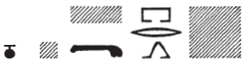
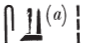

## Esna 82 {-}  
  
- Location: North-east door, right side  
- Date: Domitian  
- [Hieroglyphic Text](https://www.ifao.egnet.net/uploads/publications/enligne/Temples-Esna002.pdf#page=245){target="_blank"}  
- Bibliography: None  
  
  
  
  

  
  
^1^ *ʿnḫ nṯr nfr  *  
*wṯt n ẖnmw  *  
*zȝ smsw n ḥry-wḏb  *  
*nb-tȝ.wy  *  
*(tmdyns nty-ḫwỉ) *  
    
*nỉs=f n=k [ỉt]=f  *  
  *ẖnmw-Rʿ nb sḫ.t  *  
*ḏfn mnḫ*   
   *ḫnt ḥw.t-ỉt  *  
*wr-šfy.t  *  
*mȝỉ ʿȝ-pḥty  *  
*nw.w mn.ty ẖr s.t-ḥr=f  *  
  
*ỉn[k] [pr.t] pr [ỉm=k?]  *  
*pẖr ns.t=k ỉm=ỉ  *  
  *ȝb ỉb=k  *  
  
Live the good god,  
begotten of Khnum,  
eldest son of the *ḥry-wḏb*,[^fn-82-1]  
Lord of the Two Lands,  
(Domitian Augustus)  
  
He calls to you, his [father],  
  Khnum-Re Lord of the Field,  
beneficent ancestor   
  within the Temple of the Father,  
great of prestige,  
lion, great of strength,  
the waters and mountains are under his control:  
  
"I am the [seed] which came forth [from you?],[^fn-82-2]  
 I am your successor,  
  whom your heart desired.  
  

  

  
  
^2^ *mỉ m ḥtp  *  
*ẖnm=k pr-nṯr  *  
*s.t=k ḏr pȝwty.w  *  
*sḫ.t nfr.t   *  
  *ḥtp ḥm=k m-ḫnt=s  *  
*swȝw.w=s n=k m ʿbw  *  
    
*ḥr(.t) n bȝ=k  *  
*ḏd.t n smn.w=k  *  
*ỉmḥ.t n ḥtpty.w  *  
    
*ỉw=k m ḥtp   *  
*sḫn=k ḥw.t-[ṯȝ.wy?]  *  
  *[s.t]=k pw*   
    *ȝḫ m ỉb=k  *  
    
*bw.t [kȝ]=k  *  
  *wȝỉ.tw m ỉfdw=s m ḏ.t  *  
  
^2^ "Come in peace!  
 and enter Per-netjer,  
 your place since the (time of) the primeval gods,  
 the beautiful field  
  in which your majesty settles,  
 its areas belong to you in purity.  
   
 "(It is) a heaven for your Ba,  
 an enduring place for your statues,[^fn-82-3]  
 a necropolis for the departed ones.  
   
 "Come in peace!  
 and unite with the Temple [of the Chicks?],[^fn-82-4]  
  it is [your place],  
    excellent in your heart.  
  
"The abomination of your [Ka]  
  is far distant from its four corners forever."  
  

  
  
[^fn-82-1]: Royal and divine epithet, difficult to translate (lit. "chief of the cultivable areas near the river banks"), often associated with Shu as provider of divine offerings, and thus also appropriate to Khnum Lord of the Field. Cf. @inconnu.  
  
[^fn-82-2]: {width=25%} - Reading uncertain. Presumably the king is telling Khnum he is his child, as in the symmetric scene [Esna 59], 1: "I am he whose body is alive, who came forth upon your potter's wheel."  
  
[^fn-82-3]: {width=8%} - The correct transliteration is confirmed by *Esna* II, 4, 11.  
  
[^fn-82-4]: Tentatively restored after the similar parallel in *Esna* VII, 642, although this could easily refer to a different toponym.