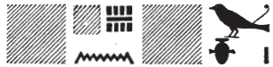

## Esna 84 {-}

- Location: North-east door, left side
- Date: Probably Domitian
- [Hieroglyphic Text](https://www.ifao.egnet.net/uploads/publications/enligne/Temples-Esna002.pdf#page=248){target="_blank"}
- Bibliography: None

  
^1^ *[...]  *  
*[...kȝ.t ʿ.wy?]=f  *  
*grg spȝ.wt nỉw.wt  *  
    
*ḏd.ỉn Rʿ n [zȝ]=f šw  *  
*šm=k [...]  *  
*[...]=k tȝš n nṯr nb n=f  *  
  
*ḫntỉ=sn r nỉw.wwt rsy.wt  *  
*r bw nty ỉw mw.t-nṯr ỉm  *  
*rsy-nỉw.t pw  *  
  
*ḏd.ỉn šw n Rʿ  *  
*s.t tn tȝ pw  [...]  *  

^1^ [...]  
[...the work of] his [hands?] [^fn-84-1] 
settles nomes and cities.  

Then Re said to his [son], Shu:  
"May you go [...]  
you [...] the area of every god for him."  
  
They went upstream to the southern cities,  
  to where the Mother of God (Neith) was,  
That is: south of the City (*Rs-n.t*).[^fn-84-2]  
  
Then Shu said to Re:  
"This place is the land of [...]"  

[^fn-84-1]: Tentative restoration based on [Esna 61], 1 and 6-7; [Esna 177], 11.

[^fn-84-2]: Another pun on Esna as the place "south of the City (Thebes)" and the *Rs-n.t* chapel of Neith: cf. [Esna 80], 2 (etymology made by local Thebans), and [Esna 63], 1. Thebes was frequently referred to simply as "the City."

 ^2^ [....]  
 *[...ḏd].tw [ḫnt]-tȝ  *  
   *m rn n spȝ.t tn  *  
   
 *ḫpr ḫnsw ḏḥwtỉ m s.t tn  *  
 *m ḥb dndn  *  
   *m-ẖnw pr pn ḥr=s*  
   *r-mn hrw pn  *  

^2^ [...]  
Thus one [says Khent]-ta  
   as the name of this district;[^fn-84-3]  
     
Khonsu-Thoth [^fn-84-4] came about in this place  
   in the Festival of Fury [^fn-84-5]  
     within this temple for that reason,  
   until today.  
   

[^fn-84-3]: Restoration suggested by @sauneron-2, p. 181, n. a. Presumably, Shu's damaged speech that began mentioning a "land (*tȝ*)" also mentioned the term *ḫnt* or a homophone.

[^fn-84-4]: @sauneron-2, p. 181, n. a., noted the names **Khon**su and **Tho**th acrophonically evoke the name of **Khent-ta**.

[^fn-84-5]: The "moment of fury" is mentioned in relation to Neith in [Esna 102], 2, but it that is not necessarily associated with the present text.  Khonsu-Thoth is mentioned in a procession with Heka on [Paophi [1?]] (*Esna* II, 55); while in *Esna* VII, 563, 9, the same god is said to "chop off the head of the furious one (*ḥsq tp n dndn*)." Daniel Arpagaus (personall communication) notes this most likely refers to killing the oryx, enemy of the sun, which might also be related to the apparent cutting up intestines on the same Paophi festival.

^3^ [...]   
[...] *sḫȝ ỉb=sn   *  
 *ḥnʿ ỉt=sn mw.t=sn  *  

^4^ [...]  
*nhm.tw n kȝ=s   *  
*[...]  *  
*[ʿq m pr] pn   *  
 *[m wrḏ?]-ỉb  *  
 *pr=f m snb-ỉb  *  
   
*sḫr.w n tȝ-r-ḏr=f   *  
 *m ḥr=s  *  

^3^ [...]  
[...] their hearts recall,  
 with their father and mother.  
   
^4^ [...]  
one rejoices for her Ka [...]  
[...]  
[if one enters th[is [temple]  
 [in ill] health(?),[^fn-84-6]  
 he leaves it in good health.  
  
The condition of the entire world  
 is before her face.  
 

[^fn-84-6]: {width=35%} - The precise negative adjective of the heart is unclear, but it clearly contrasts with *snb-ỉb* mentioned next.