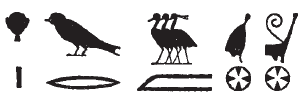

## Esna 88 {-}  
  
  
  
- Location: Intercolumnar Wall B 
- Date: Nero
- [Hieroglyphic Text](https://www.ifao.egnet.net/uploads/publications/enligne/Temples-Esna002.pdf#page=251){target="_blank"}  
- Bibliography: @elgawady, pp. 192-193. See additional entries in [Tempeltexte 2.0](http://www.tempeltexte.uni-tuebingen.de/portal/#/text-detail/512){target="_blank"}  
  
#### The King {-}  

  

^1^ *nsw.t-bỉty  *  
*nb-tȝ.wy  *  
*(nyrwn krwtys gysrs)|  *  
^2^ *zȝ-Rʿ nb-ḫʿ.w  *  
*(krmnyqs Awtkrtwr)|  *  
   
^3^ *nb šmʿ-s   *  
*ḥqȝ mḥw-s  *  
*ḏmd[.n]=f m sḫm.ty  *  
   
^1^ The King of Upper and Lower Egypt,  
Lord of the Two Lands,  
(Nero Claudius Caesar)|  
^2^ Son of Re, Lord of Appearances,  
(Germanicus Autokrator)|  
  
^3^ Lord of the White Crown,  
Ruler of the Red Crown,  
he unit[ed] them as the Double Crown.  

  
#### Harsiese {-}  

  
^4^ *ḏd-mdw n ḥr-zȝ-Is.t [...]  *  
*[...]=k  *  
^5^ *m sḫm.ty  *  
*šmʿ-mḥw wr.w*  
*m tp=k  *  
*zmȝ.n=k tȝ.wy m ḥtp  *  
*[ḥr] s.t-ḥr   *  
*ḫnty ʿnḫ.w  *  
   
^6^ *ȝm.n=k psš.ty  *  
*dmḏ m ḫfʿ=k  *  
*kȝwt wȝḏ.ty *  
*m [ʿ.wy]=k  *  
*[ḫʿ].tw m nsw.t-bỉty  *  
*ḥr s.t-ḥr ḏ.t  *  
  
^4^ Words spoken by Harsiese [...]  
[...]  
^5^ as the double crown,  
Upper and Lower Egypt are great  
on your head,  
having united the two lands in peace,  
[upon] the throne of Horus,  
foremost of the living.  
  
^6^ You have grabbed the two shares,  
united in your fist,  
carry the two papyrus scepters   
in your [hands],  
you [appear] as King  
upon the throne of Horus, forever.

  

#### Thoth {-}  

  

^7^ *ḏd-mdw n nb ḫmnw  *  
*nb [tȝ-s]n.t [...]  *  
^8^ *[...]  *  
^9^ *m zp[...]  *  
   
^10^ *ḏỉ sšd ḫʿỉ m sḫm.ty  *  
*ỉr[...]  *  
  
^7^ Words spoken by the Lord of Hermopolis,  
Lord of [Es]na [...]  
^8^ [...]  
^9^ as one[...]  
  
^10^ Who puts the diadem on the double crown,  
who does [...]  

  

#### Khnum-Re Lord of the Field {-}  

  

^11^ *ḏd-mdw n ẖnmw-Rʿ *  
*nb sḫ.t  *  
*šw zȝ-Rʿ  *  
*ʿ[n-ḫʿỉ]* ^12^ *ḥr wrr.t  *  
*m tȝ-šmʿ tȝ-mḥw  *  
*nfr-ḥr  *  
*bnr-mrw.t  *  
*bȝ šfy-ḥȝ.t  *  
*ḥqȝ ḥqȝ[.w ...]  *  
*[...]* ^13^ *ḥr mw=f   *  
*[...] r sḫr.w=f  *  
   
^14^ *ḏỉ=ỉ n=k ỉȝw.t n Rʿ  *  
*ns.t n šw  *  
*ỉmỉ.t-pr n zȝ Wsỉr  *  
  
^11^ Words spoken by Khnum-Re   
Lord of the Field,  
Shu, son of Re,  
Fi[ne of appearance] ^12^ upon the chariot  
in Upper and Lower Egypt,[^fn-88-1]  
Beautiful of face,  
Sweet of love,  
Ba, prestigious of face,  
ruler, who rules [...]  
[...] ^13^ who is loyal to him,  
[...] about his condition.  
  
^14^ I give you the office of Re,  
the throne of Shu,  
the *ỉmỉ.t-pr* deed of the son of Osiris.  

  
[^fn-88-1]: {width=20%} - Reading based on parallel epithets for Khnum Lord of the Field: [Esna 190], 1 .

#### Nebtu {-}  

  

^15^ *ḏd-mdw n Nb.t-ww nb.t-tȝ-sn.t  *  
*tfn.t ḥr.t-tp n Rʿ  *  
*mḥ.t p.t tȝ* ^16^ *m nfrw=s  * 
  
*nb.t wr.t  *  
*sšm.t tȝ.wy   *  
*rdỉ.t ỉȝw.t=s n mr=s  *  
*nỉ hb ʿḥ* ^17^ *m-ḫm=s  *  
*wʿ.t [...]  *  
    
^18^ *ḏỉ=ỉ n=k ẖry.w nw.t  *  
*ḥry.w sȝ Gbb  *  
*ḥtr[=ỉ] n-k tȝ.w nb  *  
*m wȝḥ-tp  *  
  
^15^ Words spoken by Nebtu Lady of Esna,  
Tefnut, uraeus of Re,  
who fills heaven and earth with her beauty.    
    
Great lady,  
who guides the two lands,  
who gives her office to whom she prefers,  
nobody enters the palace with her unaware,  
the sole one [...]  
  
^18^ I give to you what is below Nut,  
what is above the back of Geb.  
[I] force all lands to you in service  
with bowed heads.

  