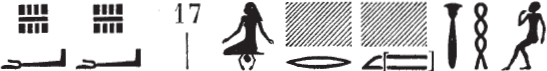

## Esna 91 {-}

- Location: Intercolumnar C
- Date: Nero
- [Hieroglyphic Text](https://www.ifao.egnet.net/uploads/publications/enligne/Temples-Esna002.pdf#page=255){target="_blank"}
- Bibliography: @sayed-neith, pp. 633-634, Doc. 1023b (partial translation)

#### The King {-}

| ^1^ *nsw.t-bỉty  *
| *nb-tȝ.wy  *
| *(nyrwn kr[d]ys [...])|  *
| ^2^ *zȝ-Rʿ nb-ḫʿ.w  *
| *(krmnyqs [...])|  *
|
| ^1^ King of Upper and Lower Egypt,
| Lord of the Two Lands,
| (Nero Clau[d]ius [..])|
| ^2^ Son of Re, Lord of Appearances,
| (Germanicus [...])|

#### Montu {-}

| ^3^ *ḏd-mdw n Mnṯw  *
| *kȝ nḫt nṯr ʿȝ*
| *wr-pḥty  *
| ^4^ *ẖnm zȝ=f mr=f  *
|   *m ^5^ ʿnḫ wȝs  *
|     *ḫnty kȝ.w ʿnḫ.w ḏ.t  *
|   
| ^6^ *[...] m[-bȝḥ] mw.t=k  *
|   *Mḥy.t-wr.t  *
| *ẖnm=k pr-wr   *
|   *n nb.t Zȝw  *
|
| *šzp=s tw=k m ḥʿʿ  *
| *dỉ=s tw=k m ḥr=s  *
|   *nn ʿnḏ  *
|
| ^3^ Words spoken by Montu,
| strong bull, great god,
| great of strength,
| ^4^ he embraces his beloved son,
|   with ^5^ life and dominion,
|      foremost of the living Kas forever.
|
| ^6^ [...] be[fore] your mother,
|    Mehet-weret,
| may you enter the Per-wer
|    of the Lady of Sais.
|
| She receives you in joy,
| she puts you before her,
|    without constraint.

#### Atum {-}

| ^7^ *ḏd-mdw ỉn Itm [...]  *
| *ḥry-nṯr.w  *
| ^8^ *nb wʿ  *
| *ḥry-tp tȝ.wy  *
| *ḥȝ.t nṯr.w  *
| *pȝwty [...]  *
| *ḫpr ^9^ nṯr.w[...] nṯry.t nb  *
|   *ḥr sȝ=f  *
|     
| ^10^ *ỉỉ.n=k ḥnʿ=ỉ   *
|   *r ḥw.t-N.t  *
|     *n Rs.t-ḥw.wt=s  *
| *ẖnm=s tw m nḏm=ỉb  *
|
| *ʿq.n=k m bȝ  *
| *pr.n=k m rw  *
|   *sqd.n=k m Wp-wȝ.wt  *
| 
| ^7^ Words spoken by Atum [...]
| Chief of the gods,
| ^8^ Sole lord,
| Chief of the Two Lands,
| First of the gods,
| Primeval one [...]
| ^9^ all the gods [...] and goddesses
|    came about after him.
|    
| ^10^ You have come with me 
|    to the Temple of Neith,
|      of *Rs.t-ḥw.wt=s*[^fn-91-1];
| she embraces you in happiness.
|
| As you have entered as a ram,
| so you have left as a lion,
|    having journeyed as Wepwawet.

#### Before the King and Gods {-}

| ^11^ *mỉ m ḥtp* 
|   *r s.t n.t mw.t  *
| *mȝȝ=k wr.t wsr.t [...]  *
| *[...] wṯz nfrw=k  *
|
| ^11^ Come in peace
|   to the place of the mother,
| and see the great, the mighty [...]
| [...] exalting your perfection.

#### Heka {-}

| ^12^ *ḥkȝ  * [...]
|
| ^12^ Heka [...]

#### Neith {-}

| ^13^ *ḏd-mdw ỉn N.t wr.t  *
| *mw.t-nṯr nb.t tȝ-sn.t  *
| ^14^ *ỉh.t wr.t ms.t Rʿ  *
| *nb zȝw ḫnt N.t  *
| 
| ^15^ *tmȝ.t wr.t  *
|   *ḫpr ẖr-ḥȝ.t  *
| *mw.t ḥnʿ ỉt m šȝʿ  *
| ^16^ *ṯz(.t) pr.t n nṯr.w rmṯ  *
|  
| *ʿȝ-šb.w wȝḏ-ḥw  *
|   *pʿpʿ^17^ [xp]r m wḏḥ  *
|     
| ^18^ *dỉ=ỉ n=k ỉȝbt.t r wbn ỉtn  *
|   *ỉmnt.t r ḥtp=f  *
|   *tȝ r-ḏr=f ḥtp ḥr-mw=k  *
|  
| ^13^ Words spoken by Neith,
| Mother of god, Lady of Esna,
| ^14^ the Great Cow who bore Re,
| Lady of Sais within the Neith nome.
|
| ^15^ Great mother,
|    who came into existence before,
| Mother with the Father in the beginning,
| ^16^ who bound the seed of gods and men.
|
| Great of offerings, verdant of food (*wȝḏ-ḥw*),
|    who bore ^17^ [Khep]ri[^fn-91-2] as a child (*wḏḥ*).
|
| ^18^ I give to you the East until the sunrise,
|    the West until its setting,
|    the whole land will be loyal to you.
  

[^fn-91-1]: For this epithet of Neith, nurse of the two children of Esna, see recently @thiers-tanent, pp. 312-314, n. c.
[^fn-91-2]: {width=30%}: Restored after exact parallels in *Esna* II, 26, 17; IV, 424, 2.