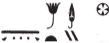

## Esna 94 {-}  
  
- Location: Central Door, Left Side, bottom  
- Date: Titus  
- [Hieroglyphic Text](https://www.ifao.egnet.net/uploads/publications/enligne/Temples-Esna002.pdf#page=260){target="_blank"}  
- Bibliography: None  
  
  
  
  

  
  
*nṯr nfr wṯt n ẖnmw  *  
*ỉr ȝḫ.w n ỉt=f  *  
*nb-tȝ.wy  *  
*(ȝwtwkrtwr Tỉtỉs gysrs) *  
*mry ẖnmw-Rʿ nb tȝ-sn.t  *  
  
The good god, begotten of Khnum,  
who makes benefactions for his father,  
Lord of the Two Lands,  
(Autokrator Titus Caesar)  
beloved of Khnum-Re Lord of Esna.[^fn-94-1]  
  

  
  
[^fn-94-1]: Note the spelling of Esna: {width=10%}. This inscription features agricultural deities (Hapi, Sekhet) bringing offerings from the field.  
  
