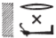
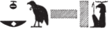
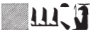
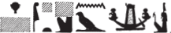

## Esna 96 {-}

- Location: Central Door, Left Side, pillar
- Date: Titus
- [Hieroglyphic Text](https://www.ifao.egnet.net/uploads/publications/enligne/Temples-Esna002.pdf#page=263){target="_blank"}
- Bibliography: None

| ^1^ *wnn nsw.t-bỉtỉ  *
| *(ȝwtkrtwr tỉtỉs kys[r]s)|  *
|   *ḥr ʿq m ḥtp r Iwny.t [...]  *
| *[...]  *
| *[nw]r=sn n ỉr.n=f  *
|   
| *sw m twr zȝ twr  *
|   *ḥr ỉn(.t) pr m Nwn  *
|     *wḥm-ʿnḫ ỉỉ m ṯpḥ.t  *
|       *r bʿḥ ȝḫ.t=k  *
|       *r sḏfȝ wḏḥw=k  *
|         *m ỉḫt nb nfr  *
|     
|   *ḥr* ^2^ *mḥ šnʿ.t=sn  *
|     *m kȝ.w ḏfȝw(?)  *
|   
| *ḫws.n=f ḥw.t-ẖnmw  *
|   *m ḥb nḥ[p]  *
| *ỉr.n=f ȝḫ.w   *
|   *[n ḫnty?]-sḫ.t  *
|   
| *ỉw=sn ḥr [rdỉ.t?] Mȝʿ.t n šw zȝ-Rʿ  *
|   *ḥr ḥnk=s m bȝḥ=f m ẖr.t-ḥrw  *
| *sḥtp=f nṯr šps*
|    *m mr=f  *
|   
| *wnn tȝ-sn.t mn.tw rʿ-nb  *
| *mỉ pt ḥr sḫn.w=s  *
|    
| ^1^ As the King of Upper and Lower Egypt,
| (Autokrator Titus Caesa[r])|
|   is entering in peace to Esna [...]
| [...]
|   they [trem]ble[^fn-96-1] from what he has done,
| 
| he is the Purifier, son of the Purifier,[^fn-96-2]
|   bringing that which comes from Nun,
|   the inundation which comes from the caverns,
|     to inundate your field,
|     to provision your altar,
|       with all good things,
|   
|   (and) ^2^ filling their storehouses
|     with food and provisions(?).[^fn-96-3]
| 
| As he built the Temple of Khnum
|   for the festival of the Po[tter] (Khnum),[^fn-96-4]
| so he made benefactions
|   [for the one Foremost] of the Field (Khnum).[^fn-96-5]
|
| They are [giving] Maat to Shu [^fn-96-6], the son of Re,
|   offering it before him daily:
| thus he pacifies the august god
|   with what he loves.
|
| So Esna[^fn-96-7] endures, night and day,
|   like the sky upon its pillars.

[^fn-96-1]: {width=10%}. This verb is used in [Esna 110],1; [Esna 127],6.
[^fn-96-2]: *Wb* V, 255, 1-2; *DZA* 30.974.690 and following.
[^fn-96-3]: {width=20%}. Reading uncertain, but assuming the *q* is a rare phonetic spelling of *kȝ* error. For these terms mentioned as a pair, compare [Esna 105],4.
[^fn-96-4]: {width=20%}. The horizontal sign is likely the sky (*p.t*), the vertical sign the potter's wheel.
[^fn-96-5]: {width=20%}
[^fn-96-6]: {width=25%}. Note the acrophonic spelling of Shu: *š* < *šnb.t*, *w* < *wỉȝ* (cf. @klotz-baboons, p. 34, n. 8); the divine name Shu is written with an elaborate bark also in [Esna 156], 25.
[^fn-96-7]: {width=20%}

