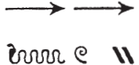
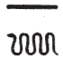
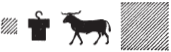

## Esna 97 {-}

- Location: Central Door, left side
- Date:Vespasian
- [Hieroglyphic Text](https://www.ifao.egnet.net/uploads/publications/enligne/Temples-Esna002.pdf#page=264){target="_blank"}
- Bibliography: @grenier-1987; @klotz-baboons, p. 35.

NB: The second half of this text is a shorter, partially damaged version of [Esna 47 A] and [Esna 47 B]. See those sections for references and full translation.

| ^1^ *[...]   *
| *nb nṯr.w  *
| *wʿ-wʿ.w  *
| *ʿnḫ tȝ m [...]  *
| ^2^ *[...] dỉ(.w) ʿnḫ ḏ.t  *
|   
| ^3^ *[...]  *
| *ỉty   *
| *ḥqȝ zȝ ḥqȝ  *
| *wḏ=k pw tkn r ḥr.t  *
| *sbty n bỉȝ [ḥȝ] Bȝq.t  *
| 
| *[mrỉ] sw ḥp-[ʿnḫ]  *
| *[sr]=f [n=f] [h]ȝ.w ʿšȝ.w nfr.w  *
|   
| *nsw.t-bỉty   *
| *nb tȝ.wy  *
| *([...] kysrs)|  *
| *zȝ-Rʿ nb-ḫʿ.w  *
| *(wspsyns nty-ḫwỉ)|  *
| *ʿnḫ(.w) ḏ.t mỉ Rʿ  *

| ^1^  [...]
| lord of the gods,
| the truly unique one,[^fn-97_1]
| the earth lives from [...]
| ^2^ [...] given life, eternally.
| 
| ^3^ [...]
| The sovereign,
| Ruler, son of the Ruler,
| it is your decree which reaches up to heaven,
| a wall of iron [around] all Egypt.
| 
| [The living] Apis [loves] him,[^fn-97_2]
| he [announces for him] numerous, great [ye]ars.
| 
| King of Upper and Lower Egypt,
| Lord of the Two Lands,
| ([Autokrator] Caesar)|
| Son of Re, Lord of Appearances,
| (Vespasian Augustus)|
| living eternally like Re.

[^fn-97_1]: {width=15%} - For this epithet, see *LGG* 2, 282, 3, with multiple references in Esna. The term "sole god (*nṯr wʿ*)" is frequently determined with a serpent at Esna, e.g. [Esna 63], 3; [Esna 64], 2; [Esna 104], 4. Note especially the simplified harpoon for *wʿ* in *Esna* VI, 424, 2: {width=7%} 

[^fn-97_2]: {width=20%} - Emending based on the parallels in [Esna 47 A] and [Esna 47 B].