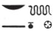

# Esna II, 100 {-}

- Location: Facade, Central Door, right side
- Date: Unknown, probably Vespasian
- [Hieroglyphic Text](https://www.ifao.egnet.net/uploads/publications/enligne/Temples-Esna002.pdf#page=266){target="_blank"}
- Bibliography: None

| *([...nty]-ḫwỉ)|  *
| *mry N.t wr.t  *
| *mw.t-nṯr *  
| *nb.t tȝ-sn.t  *
|  
| ([...] Augustus)|
| beloved of great Neith,
| Mother of God, 
| Lady of Esna ({width=15%})

