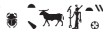

## Esna 102 {-}  
  
- Location: Central door, right (north) side  
- Date: Vespasian  
- [Hieroglyphic Text](https://www.ifao.egnet.net/uploads/publications/enligne/Temples-Esna002.pdf#page=200){target="_blank"}  
- Bibliography: @sayed-neith, p. 656, Doc. 1072 (partial).  
  
  
  
  

  
  
  
  
^1^ *wnn zȝ-Rʿ  *  
*(wspsynys nty-ḫwỉ) *  
*ḥr pr(.t) m qd   *  
  *r tȝ-sn.t m ḥʿʿ  *  
  *r wȝḥ ḥtp.w-nṯr   *  
    *n ḥnw.t-nṯr.w  *  
  *ḥr pẖr ȝḫ.t n mw.t-nṯr  *  
    *m ʿnty.w bhd  *  
  *ḥr šps pr-ḥḏ=s m ỉḫt nb [nfr]  *  
  *ḥr šms ʿntyw m-bȝḥ=s  *  
    *m ẖr.t-hrw  *  
  *ḥr dỉ.(t)* ^2^ *ỉȝw n mw.t=f wsr.t  *  
  *ḥr šzp sšš.wy=s  *  
  *ḥr rwỉ qnd=s  *  
  *ḥr swȝš kȝ[=s]  *  
  *ḥr sḥtp ḥm=s  *  
    *m ȝt dndn=s  *  
  *ḥr sʿr mȝʿ.t [...]  *  
    *ḥʿʿ ỉb=s n mȝȝ s.t  *  
  *mỉ wr kȝ=s r nṯr.w  *  
    
*wnn=s ḥtp.tw m tȝ-sn.t  *  
*zȝ.t mn.tw ẖr sštȝ=s  *  
  *mỉ tȝ ḥr bȝkȝ.wt=f  *  
  
^1^ While the Son of Re,  
(Vespasian Augustus)  
is coming out in ceremony  
  to Esna [^fn-102-1] in jubilation,  
    to leave offerings   
      for the mistress of the gods,  
  surrounding the Akhet of the Mother of God  
    with aromatic myrrh,  
  stocking her treasury with all good things,[^fn-102-2]  
  offering myrrh before her,[^fn-102-3]  
    every day,  
  giving ^2^ praise to his mother, the Mighty,  
  shaking her sistra,  
  repelling her anger,[^fn-102-4]  
  praising her Ka,  
  pacifying her majesty  
    at the moment of her fury, 
  elevating Maat [...]  
  her heart rejoices to see it,  
    since her Ka is greatest of the gods,  
      
She is at peace within Esna,  
while Sais endures with her mysterious form,  
  just like the earth upon its foundations.  
  

  
  
[^fn-102-1]: {width=18%}  - Note the spelling, featuring the primary gods, a ram (Khnum) and Neith.  
  
[^fn-102-2]: A reference, among other things, to the sacred items stored in the so-called [Laboratory (119-125)].  
  
[^fn-102-3]: E.g. [Esna 123].  
[^fn-102-4]: This exact phrase occurs in the scene of shaking sistra for Neith: *Esna* II, 14, 2.   
<!--[^fn-102-5]: The "fury (*dndn*)" of Neith is also mentioned in [Esna 84], 2.--> 