# (PART) Interior Eastern Wall (103-193) {-}

# Cryptographic Ram Text (103) {-}

## Esna 103 {-}

- Location: Interior Eastern wall, south corner
- Date: Unknown
- [Hieroglyphic Text](https://www.ifao.egnet.net/uploads/publications/enligne/Temples-Esna002.pdf#page=273){target="_blank"}
- Bibliography: @leitz-rams (complete); @morenz-rams

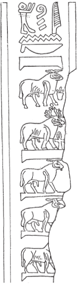{width=30%}

^1^ *ỉȝw n=k    *  
*pȝ bȝ ʿȝ ʿnḫ    *  
*ḥry nṯr.w    *  
  
^1^ Praise be unto you,  
o great living Ba,[^fn-103-1]  
chief of the gods.[^fn-103-1a] 

[^fn-103-1]: @leitz-rams, p. 254, note 2, provided two exact parallels for this epithet, including the definite article. To those examples, one could also add *Esna* III, 345, 14, and compare Khnum as the *bȝ-ʿȝ* (*Esna* III, 318, 7, 5; 360, 8; *Esna* IV, 430, 3), *bȝ ḥry-nṯr.w* (*Esna* III, 318, 7, 4). The mysterious ram-headed crocodile in [Esna 112], 1, is hailed as "Praise be unto you, o Ba great of form (*pȝ bȝ ʿȝ ỉrw*)."  @leitz-rams, pp. 254, 261, did not speculate on the origin of the value *ʿȝ*. It appears the ram wears the usual crown of Thoth (cf. the crown Thoth wears in [Esna 163], 27), and thus represents his typical epithet *ʿȝ* (cf. @kurth-1, p. 142, 81); just as the rams wearing Geb's crown represent his chief attribute. A ram wearing the same crown seems to write *ʿȝ* in another hymn to Khnum: *Esna* III, 262, 19, §5.
[^fn-103-1a]: It is worth noting that the ram on a standard, a variant of the usual falcon, is a frequent spelling of *nṯr*, "god" in the temple: [Esna 56]; *Esna* III, 202 A,B; 288, 8; 380, 25; 387, 3; 389, 13; 393, 21; 397, A,B; *Esna*, VII 571 B. A simple ram without attributes or standard can occasionally write this word as well: *esna* III, 298, A,B; *Esna* VI, 520, 2; 543, 10. 

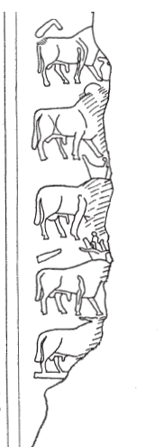{width=30%}  
  
*ẖnmw-Rʿ nb tȝ-s[n.t]*

Khnum-Re Lord[^fn-103-2] of E[sna].[^fn-103-3]

[^fn-103-2]: Both Leitz and Morenz correctly recognized this ram as *nb* (*n* < "red crown", *b* < *bȝ*), but @morenz-rams, pp. 90-91, thought it was an *ad hoc* value used just in this text. In fact, this spelling occurs quite frequently in various contexts throughout the temple: [Esna 53]; [Esna 146], 2 (damaged); [Esna 150], 2; [Esna 171] B; [Esna 184], 25; *Esna* III, 368, 29; 393, 23; *Esna* VI, 541 A; *Esna* VII, 549.
[^fn-103-3]: Neither author offered an explanation for the value of the ram wearing the elaborate crown, which also appears in col. 3. However, this is the characteristic crown of Geb, the god of the earth, who frequently writes *tȝ* at Esna, and already in the New Kingdom: cf. @klotz-baboons, p. 50, Doc. 23, n. b.  The next two signs are likely rams without crowns, writing *sn.t* < *s(r)* + *nt* (< *nṯr*). A similar writing of this toponym with three rams occurs in [Esna 76], 15; and two rams for *sn.t* in *Esna* II, 17, 5; *Esna* III, 318, 8 (6). In all of these cases, it is also possible the two rams write *sn* < *snw*, "two; siblings."

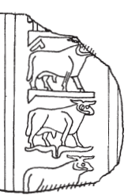{width=30%}  

*[msỉ?] nṯr.w  *  
*qdỉ ʿ[w.t]  [^fn-103-6] * 

[Who birthed] the gods,  
who built[^fn-103-4] live[stock] (?) 

[^fn-103-4]: In [Esna 58], 8, a similar group of a ram over disembodied horns appears to write Osiris (*w < wp* + *sr*), or possibly *bȝ-dmḏ*, "the united Ba." @leitz-rams, p. 255, 6, opted for the latter reading, but it is never used at Esna to describe Khnum. Alternatively, it might write *wsr*, "mighty", in the same manner. As another suggestion, I here suppose the ram write *q* < *kȝ*, "(male) ram", and the separate horns write *d* < *dmḏ* (regular value at Esna) via acrophony, thus obtaining the verb *qdi*.

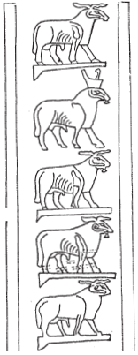{width=30%} 

^2^ *nṯr nb nṯr.w*  
  
^2^ God, Lord of Gods.[^fn-103-5]  

[^fn-103-5]: This reading is uncontroversial, as both values were established in column 1.

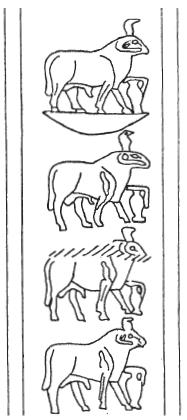{width=30%}

*ẖnmw nb ẖnmw.w*  
  
Khnum, Lord of Khnums.[^fn-103-6]  

[^fn-103-6]: @morenz-rams read this group the same way, but @leitz-rams, pp. 255-258 objected because this does not explain the uraei, and the usual epithet is "Khnum *who made* the Khnums." Instead, Leitz opted for *ʿnḫ ỉr ʿnḫ.w*, deriving uraeus = *ʿ < ỉʿrr.t*, ram = *n < nṯr*, and vessel = *ḫ < ẖnmw*. However, the first reading is preferable, since the uraeus nowhere else has that value phonetic within the temple. Rather, neither author mentioned that the uraeus often has a different phonetic value when it appears on a ram's head, in spellings of *wbn*, deriving the value *w < wȝḏ.t*. See already @sauneron-5, p. 155, n. h; @klotz-baboons, 34, n. b; and compare multiple texts that play on alliteration with "Wadjet (*Wȝḏy.t*) who shines (*wpš*) on the brow (*wp.t*) of the king": [Esna 58], 1; [Esna 169], 4-6.  As a result, the ram + vessel writes "Khnum" (standard group), while the uraeus serves as a final phonetic complement (*w*).  
This exact same combination writes "Khnum" in standard texts from Esna, already in the Ptolemaic Period: 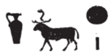{width=10%} (*Esna* II, 12, 8).   Note that the seated ideogram for Khnum sometimes appears with just a uraeus and no crown at Esna: e.g. [Esna 104], 4: 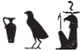{width=10%}, [Esna 104], 5: 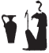{width=8%}.
Lack of direct parallels is not concerning, because the structure of this hymns has multiple epithets linked "N lord of the N's", and certain common epithets at Esna vary between *nb* and *ỉr*.
 
 

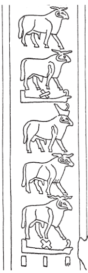{width=30%}

*qdỉ nb qdỉ.w*

Builder, Lord of Builders[^fn-103-7]

[^fn-103-7]: @leitz-rams, p. 256, 9, tentatively suggested *qn nb qn.w*, "strong, lord of the strong", but noted that epithet is not otherwise attested at Esna. Since the two rams with this determinative could write many things, I would instead opt for *qdỉ*, "builder", derived from *q < kȝ*, "(male) ram" + *d < ṯȝy*, "male. @leitz-rams, p. 259, 18, suggested that interpretation for an identical group of signs in column 3 (with the support of a parallel), and it seems such a group should have the same reading in both instances. Most importantly, *qdỉ nb qdỉ.w* is an extremely common epithet of Khnum at Esna, and elsewhere.

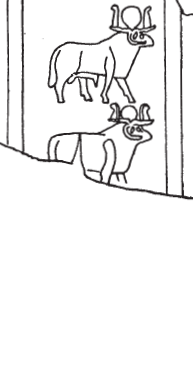{width=30%}
  
    
  
  
        
*tȝ-ṯnn ṯnỉ [r nṯr.w]*

Tatenen, most distinguished [of the gods].[^fn-103-8]

[^fn-103-8]: I wholly agree with the interpretation by @leitz-rams, pp. 256-257, 10. 

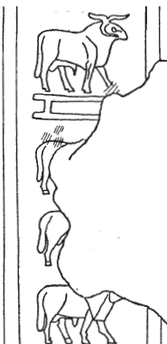{width=30%}

*kȝ(?) mrỉ snsn(?)*

Bull(?), who loves coupling(?).[^fn-103-9]

[^fn-103-9]: Partially following the arguments in @leitz-rams, p. 257, 11, but I assume the *n* belongs to the following group because of the sign layout. There is damage before this section, so it is unclear if the first ram is related to the phrase beginning with the *mr*-sign.

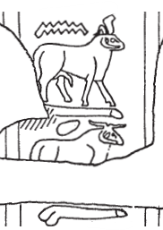{width=30%}

*wsn ỉr nḏmnḏm*

Lusty ram who makes sexual pleasure.[^fn-103-10]

[^fn-103-10]: @leitz-rams, pp. 257-258, 12, grouped the signs differently, and recognized the common epithet *kȝ-sṯỉ*, "ejaculating bull." Yet this assumes the first *n* is part of the preceding group, assigns a different value another value to the uraeus than in earlier in this column (*k*), and reading the egg as *s* (< *zȝ * or *swḥ.t*). While that is possible, I prefer to read the uraeus again with its standard value in Esna *w* (see above), with the ram writing *s*, as it does in words such as *psḏ*. This results in another popular epithet of Khnum, *wsn*, who is often said to "make (egg = *ỉr*, a standard spelling) sexual pleasure." In this spelling, the ram apparently writes the first two consonants *nḏ* < *nṯr*.

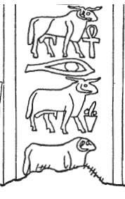{width=30%}

  
*bȝ ʿnḫ ỉr bȝ[.w...]  *  
   
Living Ba, who made the Ba[s...][^fn-103-10b]

 

[^fn-103-10b]: Both Leitz and Morenz read this epithet the same way. Although only two rams are preserved after *ỉr*, they are both different types, which suggests the final sign would have been yet a different variety. This would be the archaizing practice of indicating a plural through dissimilation, employing three different objects instead of plural strokes: cf. @thuault. 

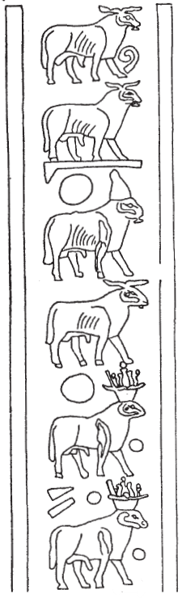{width=30%}

*wbn sḥḏ tȝ.wy  *  
  
He who shines,[^fn-103-11] and illumines[^fn-103-12] the two lands.[^fn-103-13]

[^fn-103-11]: The ram quite often writes the medial *b* in *wbn* at Esna (@klotz-baboons, p. 34, n. b). Unique here is the second ram on a standard, writing *n* < *nṯr*.
[^fn-103-12]: Since the first ram wears the white crown (*ḥḏ*), it is easy to obtain *s(r)+ḥḏ*, "to illumine," just as occurs in [Esna 74], 28. However, how do we interpret the second ram? In [Esna 164 A], a similar group includes the phonetic complement *t*: {width=5%} --  so the second ram could perform that function. Nonetheless, there is also an example in [Esna 53], where a ram with no crown appears in the word *sḥḏ*: 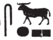{width=5%}; similarly in *Esna* III, 378, 12 and 14. This suggests the ram might derive its value from a toponym *sḥty* (var. *sḥḏ*) near Herakleopolis, often written with a ram's head: *Wb* IV, 221, 9; @yoyotte-rde15, pp. 101-106.
[^fn-103-13]: As noted in column 1, the two rams with the Geb crown write *tȝ*, due to that god's association with the earth.

 

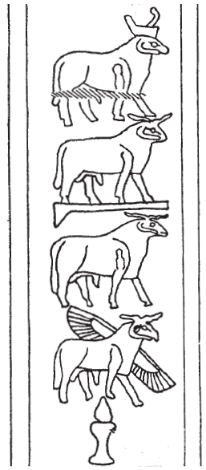{width=30%} 

  
*nb nḥp*  
  
Lord of the Potter's Wheel. [^fn-103-14]

[^fn-103-14]: Following @leitz-rams, p. 259 (17) for the first and third signs (*n < nṯr, p < pȝy*, "to fly"). As Leitz noted, this ram is quite different from the winged ram that writes *mḥ*, "north" in [Esna 163], 26: {width=5%}. Most importantly, the wings of this ram are in the same position as the usual *pȝ *-bird, hence the the substitution here. It is worth noting, however, that a simple ram elsewhere writes *p* in *nḥp* (>>add reference>>), probably via phonetic change from *b*.
Thus far in the inscription, the value *ḥ*as not appeared for the ram, although it does occur in the Cryptographic Litanies. @sauneron-8, p. 132, suggested it simply derived *ḥ* < *ẖ* < *ẖnmw*, "Khnum." Alternatively, I suggest this derives from the term hy, "male; husband", determined with a ram in *Esna* II, 17, 6; *Esna* III, 388, 9.

 

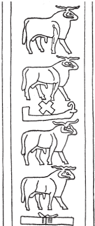{width=30%} 

*qdỉ nty  *  
  
He who built that which is.[^fn-103-15] 

 

[^fn-103-15]: @leitz-rams, p. 260 (18) tentatively suggested reading *qdỉ qmȝ*, "who built and created", based on a singular example of that epithet for Khnum. But as Leitz noted, this introduces the otherwise unattested value of *m(ȝ)* for the ram. The current proposal relies on the same reading for the first group as *qdỉ* employed twice in column 2, followed by *n(t)* + *t(ȝ)* = *nty*, "that which is," using two frequent phonetic values for the ram.

 

  
  

<!--For later, note ram write hy, male, in Esna 17, 6; also elsewhere in your dictionary. Also writes p in nHp elsewhere, probably just from bA;   also SAa-qma also occurs in 184, 17: SAa qmA=sn; other things: sHD occurs several times in Esna III, towards the end-->

