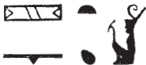

# Intercolumnar Wall F and South-East Door (104-110) {-}  

## Esna 104 {-}  

  
  
- Location: Intercolumnar Wall F, over the lintel
- Date: Probably Domitian 
- [Hieroglyphic Text](https://www.ifao.egnet.net/uploads/publications/enligne/Temples-Esna002.pdf#page=275){target="_blank"}  
- Bibliography: @sternberg, pp. 92-99; see also [Tempeltexte 2.0](http://www.tempeltexte.uni-tuebingen.de/portal/#/text-detail/593){target="_blank"}  
- Parallels: [Esna 65], 3 (partial); [Esna 73], 8-9 (partial)
- [Photograph](http://www.temples-egypte.net/sud/esna/envers/murBahutSud.html#B1){target="_blank"}

  

^1^ *ỉr ỉȝ.t-ṯȝ.wy  *  
*ḏ(d.tw) r Iwny.t  *  
*ḥw.t-ỉt pw  *  
*ḥw.t-mw.t mỉt.t  *  
*ḫpr m ḥȝ.t  *  
*štȝ(.w) m-ḫnt=f  *  
*nṯr ȝms-ỉb  *  
*ỉỉ n ʿš n=f  *  
*sḏm spr n tpy.w-tȝ  *  
   
*tȝ-ṯnn kȝ.tw m rn=f  *  
^2^ *qdỉ.n=f rmṯ  *  
*ỉr.n=f nṯr.w  *  
*ẖnm.n=f ḥr.w-nb   *  
*ḥr nḥp=f  *  
*sḫpr.n=f wnn.t nb  *  
*m rȝ-ʿ.wy=f  *

As for the District of the Chicks,  
so (one) calls Iunyt.  
It is the Temple of the Father,  
and the Temple of the mother likewise,  
He who came about in the begining,  
is kept secret within it,  
the kind-hearted god,  
who comes to whomever calls him,  
who hears prayers of those on earth.  
  
He is called Tatenen by name:  
as he built humans,  
so he made the gods,  
he joined everybody  
upon his potter's wheel.  
He created all the exists  
through his handiwork.  

 

*štȝ.t ỉm*  
*m nṯr.t ḥnʿ=f  *  
*ḫpr=sn ḫpr nty(.w) nb  *  
*qmȝ gb.t  *  
^3^  *wȝḥ ḫt-mn  *  
*ỉr ỉḫt nb  *  
*m qmȝ.n ỉb=sn  *  
    
*ḏd.ỉn ỉt n mw.t  *  
*ẖnm=ỉ ḥnʿ=ṯ  *  
*ḥʿw=ỉ tm(.w) n ʿnḫ  *  
  
*ḏd.ỉn mw.t  *  
*ỉw=ỉ mn.tw ḥnʿ=k  *  
*mḥn=ỉ ḥr-tp=k  *  
*mnḥ[=ỉ] ^4^ tp.w   *  
*nw ḫfty.w=k  *  
    
*ḫpr ẖnmw m rn n tȝ-ṯnn  *  
*mnḥy.t m rn n N.t  *  
*nṯr wʿ ḫpr m sn.w  *  
*tȝ-ṯnn N.t  *  
*ḫpr ḫpr.w  *  
*ḫpr ḫpr.w nb *  
*m-ḫt [ḫpr=sn]  *    
   
The Mysterious one[^fn-104-1] is therein,  
as the goddess together with him.  
As they came about, all that is came about.  
They who created the sky,  
^13^ who laid down the earth,  
who made all things  
through the creation of their heart.  
  
Then the Father said to the Mother:[^fn-104-2]  
I will join (*ẖnm*) with you,  
so my body is complete of life.   
  
Then the Mother said:  
I will remain (*mn*) with you,  
I will coil (*mḥn*) upon your head,  
and chop off (*mnḥ*) ^4^ the head(s)  
of your enemies.[^fn-104-3]  
  
Thus Khnum became the name of Tatenen,  
Menhyt the name of Neith:  
the single god who became two,[^fn-104-4]  
Tatenen (*TN*) and Neith (*NT*),[^fn-104-5]  
who made transformations,  
all that exists came about   
after they came about.  

[^fn-104-1]: {width=15%} - This is a frequent epithet of Neith at Esna, but this spelling could also be read simply as "Neith", as @sternberg, pp. 92, 95, n. i, understood this example. I prefer the epithet here because of the narrative: the chief divinities are referred to only as "father" and "mother" so far, only receiving their official names later via etymologies.
[^fn-104-2]: From the determinatives, Khnum and Neith, even though neither divinity has been named yet. 
[^fn-104-3]: Same speech of Menhyt in *Esna* II, 15, 19; [Esna 66].
[^fn-104-4]: {width=20%} - Close parallel in [Esna 63], 3. For the reading of this epithet, see @klotz-caesar, pp. 173-174. It seems to refer to Neith-Kematef as the first serpent, who then generates Khnum-Irita and Menhyt-Neith (the *ḏ*-serpent) as the second generation. The result is a pair (Neith-Menhyt and Khnum), unlike the Heliopolitan triad mentioned below (lines 6-7, partially damaged), where Re creates Shu and Tefnut, but remains distinct from them who creates Shu and Tefnut and unites with them as a triad, as "the sole god who became three."  
[^fn-104-5]: {width=25%}- For the palindromic spellings of Tatenen and Neith, cf. also [Esna 63], 5; [Esna 71], 5.

^5^ *[ỉt] m ẖnmw  *  
*mw.t m Mnḥy.t  *  
*Nb.t-ww kȝ.tw r kȝ=s  *  
*ntsn ʿȝ.w wr.w mnḫ.w  *  
  
*wnn ḫy šp(s)*   
*pr (ḥr) nḫb   *  
*m qȝy qȝ [...]  *  
^6^ *[zȝ?] N.t pw  *  
*ỉwʿʿ n tȝ-ṯnn  *  
*nhq.n ỉb=f  *  
*r ỉqḥ ḥw.t-ỉt  *  
*r mȝȝ sḫr.w n Nwn-wr  *  
  
^5^ [The father] is Khnum,  
the mother is Menhyt,  
her Ka is also called Nebtu:  
they are the very great, beneficent ones.[^fn-104-6]    
    
The august[^fn-104-7] child   
who came forth (upon) the lotus  
in the High Mound [...]  
^6^ That means [the son] of Neith,  
the heir of Tatenen:  
his heart was inspired [^fn-104-8]  
to enter the Temple of the Father,  
to see the condition of Great Nun.  

[^fn-104-6]: So *Esna* 17, 63-64; [Esna 64], 2.
[^fn-104-7]: {width=10%} - This spelling is missing the final *s*, as found in [Esna 59], 1; [Esna 106], 1 (noted by @sternberg, p. 96, n. q)
[^fn-104-8]: For the verb *nhq*, see primarily @sauneron-bifao62, pp. 18-19.

*snḏm=f ỉm  *  
*ẖnm=f m-ḫnt=f  *  
*ỉw=f m rw  *  
*ṯȝ.wy=f m rw.ty [...]  *  
^7^ *[...]  *

*ỉt=w Nwn ȝṯt.n=sn  *  
*ʿnḫ=sn m ỉrṯ.t *  
*n.t mw.t=f  *  
*ỉw=sn m sbq.wy  *  
*ḥr ỉmḥ (i)m=s  *  
*swr=s pḥty=sn  *  
*m ỉrṯ.t=s  *  
*sḫr.n=f sbỉ=s[n]   *  
^8^ *[wdỉ]=s šsr=s  *  
*r sṯ(.t)=s r ḫfty.w  *  
  
*ḫpr=sn m nb(.wy) pḥty  *  
*nḫt-ḫpš.w  *  
*smȝ=sn sbỉ.w nw ỉt=sn  *  
*m-ẖnw ỉȝ.t tn  *  
*nty ḥr mḥ.t n nỉw.t ṯn  *  
  
He installs himself there,  
and unites with him within it.  
He is as a lion[^fn-104-9a]  
his two children are the two lions [...]  
^7^ [...][^fn-104-9]  
  
It is their father Nun who nursed them,  
and they live from the milk  
of his mother (Neith),  
they being as two crocodiles[^fn-104-10]  
nursing[^fn-104-11] from her,  
she increases their strength  
through her milk.  
She struck down their rebels,  
^8^ [shooting] her arrow  
so she might strike against the enemies.  
  
The turned in to Lords of Strength,[^fn-104-12]  
mighty of limbs,  
they slaughter the rebels against their father,  
within this mound,  
which is to the north of this city.[^fn-104-13]

 

[^fn-104-9a]: The hieroglyph is technically a cat, which makes perfect sense for Re (so @sternberg, p. 97, n. t). However, the context and parallel in [Esna 73], 8, suggests this should actually be translated "lion." The same use of the cat to write "lion" in standard epithets also occurs in [Esna 187 A], [Esna 187 B]; and possibly [Esna 127], 5.
[^fn-104-9]: Based on the parallel in [Esna 73], 9, probably restore: "thus he created the trio (*qmȝ.n=f ḫmt*)"; cf. also [Esna 80], 4. This is different from the pair of primeval gods (Khnum-Tatenen and Menhyt-Neith) evokes above, line 4.
[^fn-104-10]: Another allusion to Neith as the crocodile mother (*Rs.t-ḥw.wt=s*) nursing two crocodiles at the same time: cf. @thiers-tanent 312-314, n. ac. Here the chidlren appear to be new manifestations of Shu and Tefnut, previously identified as lions (line 6).
[^fn-104-11]: For this verb, see @sauneron-bifao64, p. 8.
[^fn-104-12]: {width=35%} - For reasons of dissimilation, the false dual *pḥty*, "strength" is written with a lion and lionness (Shu and Tefnut).
[^fn-104-13]: Reference to the slaughter of enemies in Per-netjer (North Esna) on [Payni 9], discussed in greater detail in *Esna* III, 196; cf. also [Esna 127], [Esna 129].

*pr-ẖnmw n [sḫ.t]  *  
^9^ *[ʿb].tw r ʿb  *  
*ḫw.tw r ḫrwy.t  *  
*nỉ ʿq ỉḫt nb ḏw m-ẖnw=s  *  
   
*ḏd.ỉn šw  *  
*zȝ(ṯ)=i pw zȝ.tw*    
*n mw.t-nṯr  *  
*m nỉw.t rsy.t  *  
*ḫpr tȝ-sn.t pw  *  
     
*wnn* ^10^ *[ʿnḫ]=ỉ ḥnʿ sn.t=ỉ  *  
*m ỉrṯ.t=s  *  
*ỉw=n m ṯȝ.wy m nỉw.t ṯn  *  
*ḏd.tw ỉȝ.t-ṯȝ.wy   *  
*m rn n spȝ.t tn  *  
    
*zȝ=sn mr=s[n]  *  
*[...]* ^11^ *[...]  *  
*ỉḥy nfr zȝ nỉw.t=f  *  
*Gbb pw kȝ.tw r kȝ=f  *  
*nt.w-ʿ=f mn(.w) m-ẖnw Iwny.t  *  
*wḥm.n=f msḫʿ.w m tr r tr  *  
*n tr=f [...]  *  
  
Per-Khnum of [the Field],  
is [purified][^fn-104-14a] from all impurity,  
protected from all calamity,  
nothing evil can enter inside it.  
  
Then Shu said:  
'This my land is protected (*zȝw*)  
for the Mother of God  
in the southern City (*nỉw.t*)!'  
So came about 'Esna.'[^fn-104-14]  
  
'I am [living] with my sister  
from her (Neith's) milk.  
We are as chicks in this city.'  
Thus 'Mound of the Chicks' is said  
as the name of this nome.    
  
Their beloved son,  
[...Heka?...] ^11^   
good Ihy, who protects his city,  
that means Geb, as he his Ka is called.  
His activities endure within Iunyt,  
having repeated births from time to time,  
at his season [...]

[^fn-104-14a]: @sternberg, p. 99, n. ag, restored *ḏsr*, but that misses the alliteration here.
[^fn-104-14]: {width=20%} - That is, "the land of protecting (*zȝw*) the city (*nỉw.t*)." Such spellings of Esna are not uncommon. A curious detail is that Shu employed the rarer term *zȝṯ*, "ground; land", rather than *tȝ*, which would have made the etymology clearer. The same occurs in the Neith-Methyer cosmogony, where there are multiple puns between *zȝṯ*, "ground" and *Zȝw*, "Sais": *Esna* III, 206, 2, §5; 12, §17.