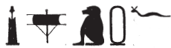

## Esna 106 {-}

- Location: South-east door, left side
- Date: Domitian
- [Hieroglyphic Text](https://www.ifao.egnet.net/uploads/publications/enligne/Temples-Esna002.pdf#page=279){target="_blank"}
- Bibliography: None. But see @lieven-himmel, p. 135, for a translation of the close parallel.
- Parallels: *Esna* IV, 436.

  

^1^ *wnn Iwny.t m sḫr.w *  
   *n hȝy.ty  *  
*ỉrỉ-wḥm m ḥr-ỉb=s  *  
*psḏ n=s psḏ-m-nbw  *  
  
*ḫy šps  *  
*wb[n] m ỉh.t  *  
*tp-ʿ bẖ  *  
*m ỉtn nfr n tȝ-ṯnn  *  
*mȝwy=f ṯnỉ[...]  *  
*[...] sw  *  
*m Itm ḫntỉ Mȝnw  *
  
^1^ While Iunyt is formed in the design    
  of the double firmaments,   
the solar course[^fn-106-1] is within it  
and He-who-shines-as-gold shines[^fn-106-2] for it.  
  
The august[^fn-106-3] child,  
who ros[e] from the Ihet cow,  
at the beginning of dawn,  
as the beautiful disk of Tatenen,  
whose rays distinguish[...]  
[...] him,  
as Atum, foremost of Manu.

[^fn-106-1]: For this term, see @cauville-1994, 99, n. b.
[^fn-106-2]: {width=20%} - 
[^fn-106-3]: {width=20%} - 

 

^2^ *wnm.t=f ỉȝbt.t=f  *  
*ẖnm(.w) ỉm=s  *  
*nṯr.ty (ḥr) wbn  *  
*r-ḥr n nb=sn  *  
*(ḥr) srs ḥr.w-nb nmʿ  *  
  
*bȝ ḏsr ḫprw  *  
*m fdw ṯȝw  *  
*pr=sn *  
*m rn n ḥm=f  *  
*nšp[.tw m ẖn]m.ty=f   *  
*r šnw n ỉtn  *
  
^2^ His right and left eye    
are united therein,   
the divine eyes rise  
before their lord,  
awakening all who are sleeping.  
   
The Ba sacred of form,  
as the four winds,  
they come forth   
  at the name of his majesty,  
and [one] breathes from his [no]strils,  
to the circuit of the sundisk.
  

 

^3^ *sn.t=f nfr.t  *  
*(ḥr) ỉr.t wḏ m p.t  *  
  *ỉmy rnp.t=s  *  
*ḥnw.t n ḫȝbs.w  *  
*ḫpr ḫpr.w   *  
*ḫft kȝ=sn  * 
    
*ȝḫ.t=sn m-ẖnw Iwny.t  *  
*ỉwn ỉm=f  *  
*ẖnbb[.n=f] r ȝḫ.t  *  
    
*s.t-ỉb=sn   *  
*ȝḫ <sy> r p.t  *  

*ḫʿy.t pw [...]  *  
  
^3^ His good sister  
  makes commands in heaven  
  during her year,  
the Mistress of the Decan stars:  
all things come to pass  
according to what they say.[^fn-106-4]  
  
Their Akhet is within Iunyt.  
The Pillar (*ỉwn*) is in it[^fn-106-5],  
  [as he] travels toward the Akhet.  
    
Their favorite place,  
more excellent than heaven.  
  
It is the initial mound [...]

[^fn-106-4]: An astrological concept. The decan stars determine all things that happen on earth.
[^fn-106-5]: {width=25%} - In @klotz-baboons, pp. 49-50, I had discussed possible readings for this passage. Since there are problems with both interpretations suggested there, I am now inclined to see yet another example of 'banal acrophony' here, with the cartouche writing *m* < *mnš*, "cartouche"; cf. @sauneron-8, pp. 182, 193.

^4^ *[...] m nb  *  
*[...] ḥtp  *  
*pr m [...] ỉȝ.t  *  
*n ỉr wnn.t  *  
   
*bȝ n Rʿ m zp-tpy  *  
*wṯz-ḫʿ ỉm  *  
*ḥnʿ psḏ.t  *  
*ẖnm bȝ=f ḥnʿ ʿḫm=f  *  
*ḥȝy=f ḥr(.w)  *  
  *n ỉmy.w tȝ-sn.t  *  
  
*dỉ=sn ỉr zȝ-Rʿ  *  
*(twmtynz ḫwỉ)| [...]  *

^4^ [...] as the lord  
[...] peace,  
going forth [...] mound,  
of he who made what exists.  
  
The Ba of Re in the first moment,  
who holds processions there  
together with the Ennead,  
his Ba unites with his statue,  
he brightens the faces  
  of those within Esna.  
    
May the let the Son of Re,  
(Domitian Augustus)| [...]

