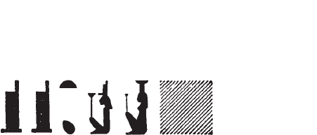

## Esna 107 {-}

- Location: South-east door, right side
- Date: Domitian
- [Hieroglyphic Text](https://www.ifao.egnet.net/uploads/publications/enligne/Temples-Esna002.pdf#page=280){target="_blank"}
- Bibliography: @sayed-neith, p. 638, Doc. 1033 (very brief)

  

^1^ *wnn tȝ-sn.t m tȝ ẖr nṯr.w  *  
*ʿḥʿy[-nfr] m ḫnt=s  *  
*[..sḫr].w nw tȝ r-ȝw=f  *  
    
*ỉt m šȝʿ  *  
  *ḥr qdỉ m nḥp=f  *  
*šȝʿ ʿnḫ n Km.t ḏs=f  *  
    
*Mnḥy.t mn.tw ḥnʿ=f  *  
*nỉ ḥr=[s r=f] rʿ-nb  *  
   
*štȝ.t m N.t  *  
*zȝ[=s...]  *  
*[...]* ^2^ *m šww  *  
    
*wnm.t=s ỉȝb.t=s m ỉtn.wy  *  
    
*nb sḫ.t (ḥr) ẖnm snt=f*  
*mḥy.t  *  
  *(ḥr) srwḏ rwḏ.w  *

^1^ Esna is the land bearing the gods,  
the [good] agathos-daimon is in it,  
[...condi]tions[^fn-107-1] of the entire world.  
  
The Father in the beginning  
is building with his potter's wheel,  
beginning life for Egypt by himself.  
  
Menhyt dwells (*mn*) with him,  
never leaving [him], daily.  
  
The remote sky is Neith,  
[her son ...]  
[...] ^2^ as the sun.  
  
Her left and right eyes are the two disks.  
  
The Lord of the Field joins with his sister,  
  the north-wind,  
  making plants thrive.

[^fn-107-1]: {width=18%}{width=10%} - Similar spellings of this word with the *nw*-pot occur in [Esna 129], 3; *Esna* III, 204 A; 277, 25 (10); *Esna* IV, 422, 2.

  

*ḏȝỉs.w wr.w (ḥr) ṯz Nwn r nw=f  *  
    
*(Wn-nfr mȝʿ-ḫrw)|  *  
  *ṯz.tw ḥr nmỉ.t=f  *  
  
*sn.ty [...]  *  
*[...]r=f *  
[...]  
  
The great Djaisu elevate Nun at his time.[^fn-107-3]    
    
(Wennefer, justified)|    
  is elevated upon his bier.    
    
The two sisters (Isis and Nephthys)[^fn-107-4] [...]    
[...] him.    
[...]    

^3^ *ḥkȝ m sḏty ỉqr  *  
*Rʿ m nḫn  *  
*m wḥm msḫʿ.w  *  
*Gbb pw sṯȝm.n=f ȝḫ.t  *  
*(ḥr) sḫpr ḫ.t-n-ʿnḫ n ʿnḫ.w  *  
    
*ẖnmw pȝ nḫy nfr m gs-dp  *  
*ṯȝw n ʿnḫ n tpy.w-tȝ  *  
    
*ỉb n Rʿ [...] ỉḫt  *  
[...]  

^3^ Heka is the excellent child,    
Re as a youth,    
repeating births,    
he is Geb, having fertilized the field,    
creating the 'wood of life' for the living.    
    
Khnum the Good Champion is on guard,    
the breath[^fn-107-5] of life for those on earth.    
    
The heart of Re (Thoth) [...] things    
[...]

[^fn-107-3]: The ancestor deities from Esna, created by Neith. Their name, *ḏȝỉs.w*, is an alternate spelling of *ṯz.w*, "utterances," hence the wordplay with the verb *ṯz*, "to lift up" here. Like the Ogdoad in Thebes, these gods apparently regulated the annual inundation of the Nile, as mentioned in [Esna 58], 2; *Esna* VI, 474.
[^fn-107-4]: {width=25%} - Unusual spelling that looks more like "the two Isises."
[^fn-107-5]: {width=10%} - This is a keyword in the theology of Khnum, and it often shows up in unorthodox, phonetic spellings. For this particular spelling with the phallus, see also [Esna 180 B]; *Esna* III, 277, 23 (8), 25 (11); 355, 3 (28), 6 (33); 371, 19; *Esna* IV, 422, 3.

  

[...] ^4^ *tȝỉty-zȝb(?)  *  
*(ḥr) sḥtp ḥm n rw.ty  *  
  
*ms.w Rʿ ḥʿʿ.w m pr=sn  *  
*sḫr.w n tȝ [m] ḥr=sn  *  
    
*twtw zȝ N.t   *  
*ḥr-tp n ḫȝty.w  *  
*šnw [n] tȝ ẖr wḏ=f  *  
    
*š(m)ʿ-nfr m [...] Iỉ-m-ḥtp  *  
*ỉwʿʿ n rsy-ỉnb=f  *  
*(ḥr) snfr mḥr.w nb m ḏ.t=f  *  
  
*dỉ[=sn ...]  *  
*[...] (twmtyns [...])|  *  
*[...]  *
   
[...] the judge,[^fn-107-6]  
pacifying the majesty of the Two Lions.[^fn-107-7]  
  
The children of Re rejoice in their temple,  
the affairs of earth are [be]fore them.[^fn-107-8]  
  
Tutu, son of Neith,  
chief of the avenging demons,  
the circuit of the earth is under his command.  
  
Shemanefer[^fn-107-9] is [...][^fn-107-10] of Imhotep,  
the heir of Resy-inebef (Ptah),  
healing all the sick with his body.  
  
May [they all] give [...]    
[... to] (Domitian [...])|  
[...]  

[^fn-107-6]: {width=20%} - Reading uncertain because of the preceding damage, but this apparently refers to either Thoth or Khonsu at Esna. The same epithet in *Esna* II, 31, 43.
[^fn-107-7]: That is, Shu and Tefnut.
[^fn-107-8]: This same expression occurs in [Esna 84], 4.
[^fn-107-9]: {width=15%} - Note the unique spelling, which etymologically links Shemanefer to the "Great Shai" serpent.
[^fn-107-10]: Because of the lacuna, it is unclear how precisely Shemanefer is related to Imhotep. He might be his "son", or also his "likeness", "living image."  