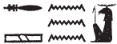

## Esna 115 {-}  
  
  
  
- Location: Intercolumnar Wall E, soubassement  
- Date: Domitian  
- [Hieroglyphic Text](https://www.ifao.egnet.net/uploads/publications/enligne/Temples-Esna002.pdf#page=291){target="_blank"}  
- Bibliography: @tattko-2014, pp. 414-415 (description only)  
  
### 1 - Nile {-}  
  

  
  
  
^1^ *ḥʿpỉ-sỉp-*^2^*r-nw=f  *  
^3^ *ḏd-mdw  *  
  
*ỉỉ.n nsw.t-bỉty  *  
*(ȝ[wdkrtr] kysrs)*  
  *ḫr=k  *  
  *ẖnmw-Rʿ nb tȝ-sn.t  *  
  
*ỉn=f n=k ḥʿpỉ sỉp [r nw=f...]  *  
^4^ *sḫpr.n=f [...]    *  
*mi [...]   *  
  
*ssȝ.n=f mȝy.w qȝy.w  *  
  *m ỉỉ=f r tr=f  *  
  
*ntk pr ḥʿpỉ m ṯpḥ.t=f  *  
  *ẖr ṯb.ty=k  *  
*r [...]  *  
  
^1^ Hapi-*sỉp-*^2^*r-nw=f* [^fn-115-1]  
^3^ Words spoken:  
  
The King of Upper and Lower Egypt,  
(A[utokrator] Caesar)  
has come before you,  
   Khnum-Re [^fn-115-2], Lord of Esna.  
  
He brings to you Hapi-*sỉp*[*-r-nw=f*...]  
^4^ having created for you [...]  
 like [....]  
  
He satiates the low and high lands[^fn-115-3]  
   when he arrives in his season.  
  
You are he from under whose sandals  
  the Inundation emerges from his grotto.[^fn-115-4]  
  in order to [...]  
  

  
  
[^fn-115-1]: The same Hapi shows up in *Esna* VI, 539, 58-61 (14). His name appears to mean "the flood that revises at his moment," perhaps a reference to territorial boundaries requiring new inspections after the annual Inundation.  
[^fn-115-2]: {width=15%} - The spelling of Khnum alludes to the prominent belly of Hapi, while the second two signs are aquatic.  Same spellings in *Esna* III, 211, 18; 294, 12; *Esna* VII, 628, 5.  
[^fn-115-3]: These are the two categories of Egyptian fields: cf. @meeks-donations, pp. 56, n. 18; 147-148.  
[^fn-115-4]: For the meaning of this epithet, cf. @gabolde-1995.  
  
### 2 - Field {-}  
  

  
  
^5^ *sḫ.t ks(.t)* ^6^ *ẖr ms.w=s  *  
^7^ *ḏd-mdw  *  
  
*ỉỉ.n zȝ-Rʿ  *  
*(tmtyns nty-ḫwỉ)*  
  *ḫr=k  *  
  *ẖnmw-Rʿ nb tȝ-sn.t  *  
*ỉn=f n=k sḫ.t [ks.tw ẖr ms.w=s]  *  
    
*[...] ^8^ ḏdȝ(.w) m pr.t nb.w  *  
  *Rnn.t ʿȝ.t  *  
*sḫpr=k m qȝ p.t  *  
  *m wsḫ n tȝ  *  
    
*ntk šȝy nfr ỉr [šȝy].w  *  
*ḥry-wḏb šd [...]  *  
  
^5^ The field *Ks(.t)-*^6^*ẖr-ms.w=s*[^fn-115-5]  
^7^ Words spoken:  
  
The Son of Re,  
(Domitian Augustus)  
has come before you,  
  Khnum-Re Lord of Esna.  
He brings to you the field [...]  
  
[...] ^8^ fattened(?)[^fn-115-6] with all seeds  
  of great Renenutet,  
you create to the height of heaven,  
    and the breadth of the earth.  
      
You are Shai, who made the [Shai spirit]s,[^fn-115-7]  
the *ḥry-wḏb*,[^fn-115-8] who raises [plants...]  
  

  
  
[^fn-115-5]: Lit. "the field who is bent over (from the weight of) carrying her products." A divinized field with a similar name (but without *ks*) appears in *Esna* VI, 539, 30-33 (7).  
[^fn-115-6]: {width=8%}  - The baboon sign elsewhere writes *ḏd-mdw* (@kurth-1, p. 204, No. 103). Since it refers to grain here, I tentatively suggest this is *ḏdȝ* (baboon = *ḏd*), tall bread sign = *dȝ* < *dỉ*), "to be fat." @elgawady, p. 210, n. 1519, suggested reading this sign as *spd*, "ausgestattet mit/versehen mit," i.e. *s* (baboon) + *spd*. 
[^fn-115-7]: Shai was an agathos daimon serpent, connected with food products. I don't know of parallels for this epithet, but Khnum is elsewhere "the Ka serpent who made Kas."  
[^fn-115-8]: For this divine and royal epithet related to fields and food production, cf. @inconnu.   
