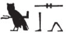

## Esna 120 {-}  
  
  
  
- Location: Laboratory, left panel  
- Date: Domitian  
- [Hieroglyphic Text](https://www.ifao.egnet.net/uploads/publications/enligne/Temples-Esna002.pdf#page=330){target="_blank"}  
- Bibliography: @vadas-2020, pp. 94-95.  
  
### Title {-}  

  
  
^1^ *ỉr(.t) snṯr n bȝ wr-šfy.t  *  
*sȝẖ kȝ=f m tp-rȝ=f  *  
^2^ *mzỉ dbḥ.w nw ỉḫt-nṯr  *  
^3^ *ỉr(.t) ỉrw nb   *  
  *n wʿb ʿȝ m hrw=f  *  
*ẖr.t-hrw nn ȝb  *  
  
^1^ Offering incense to the Ba, great of prestige,  
transfiguring his Ka with his utterance,  
^2^ bringing[^fn-120-1] the requirements of the divine rite,  
^3^ performing every ritual  
  by the priest, great in his day,  
daily, without interruption.  
  
  

  
  
[^fn-120-1]: {width=8%} - A standard spelling of the verb *mzỉ* (*Wb* II, 135, 7-21), and not *jmj sb(.tw)*, "May the (...) bring forth" (@vadas-2020, p. 94, with n. 7).  
  
### The King {-}  

  
  
^4^ [...]  
([...])  
^5^ [...]  
(*[tmt]yns xwỉ*)  
^6^ [...] *nfr* [...]  
^7^ *ỉr nty.w-ʿ   
   *m ḥw.t-ẖnmw  *  
  
^4^ [...]  
([...])  
^5^ [...]  
([Domit]ian Augustus)  
 ^6^ [...] good [...]  
^7^ who performs rituals   
    in the Temple of Khnum.  
  

  
### Knum-Re Lord of Esna  {-}  
  

  
  
^8^ *[...] n tȝ mỉ-qd=f  *  
^9^ *ẖnmw-[Rʿ] nb tȝ-sn.t  *  
*bȝ* ^10^ [...]    
*nb ʿnḫ  *  
*ỉỉ n ʿš* ^11^ *[n=f...]  *  
*[...] tȝ pn  *  
*nn tȝ šw* ^12^ [...]    
*[...]f sšr.w m tȝ r-ḏr=f  *  
  
^13^ *[...] nfr [...]  *  
*ỉr wnn.t  *  
*pȝwty tpy   *  
*ms pȝwty.w   *  
*ẖnm ḥr nb ḥr nḥp=f  *  
*wʿ ḫpr ḥḥ.w  *  
   *ẖnmw qdỉ m šȝʿ  *  
  
^8^ [...] of the entire land  
^9^ Khnum-[Re] Lord of Esna,  
Ba ^10^ [...]  
Lord of Life,  
who comes to whomever calls ^11^ [to him...]  
[...] this land,  
without any land devoid of ^12^ [...]  
[...] he [...] plans in the whole earth.  
  
^13^ [...] good [...]  
who made what exists,  
the first Primeval one,  
who birthed the Primeval gods,  
who joined everybody on his potter's wheel,  
the sole god who became millions:  
  Khnum, the builder in the beginning  
  
  

