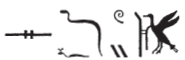
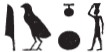

## Esna 121 {-}

- Location: Laboratory, lower bandeau
- Date: Domitian
- [Hieroglyphic Text](https://www.ifao.egnet.net/uploads/publications/enligne/Temples-Esna002.pdf#page=301){target="_blank"}
- Bibliography: @vadas-2020, p. 95 (full translation).  
  

| *ʿnḫ nṯr nfr  *
| *smn nty.w-ʿ   *
|   *m ḥw.t-ỉt  *
| *rwḏ-rȝ=f   *
|   *ḥr ȝḫ *
| *nfrw=f  sḏfȝ ḥtp.w *
|   *r nw=f  *
| *sȝḫ kȝ=f ḥr wḏḥw  *
|   *mn(.w) r ḥn.ty  *
|
| Live the good god,
| who established rituals
|   in the Temple of the Father,
| whose mouth is firm [^fn-121-0]
|   upon (saying) what is excellent; 
| it is his perfection that provisions [^fn-121-1] offerings
|   at its proper time,[^fn-121-2]
| and transfigures his Ka upon the altar,
|   enduring for all eternity.
  
  

[^fn-121-0]: In *Esna* II, 4, 12, Khnum grants the king "mouths are firm (*rȝ.w rwḏ.w*) recalling your perfection (*(ḥr) sḫȝ nfrw=k*)."

[^fn-121-1]: {width=15%} - @vadas-2020, p. 95, split this group into two words ("the supplier who created") but the alighting bird is just a determinative for this verb, a variant of the usual *dfA* bird. Cf. DZA 29.884.780-790; *Esna* III, 222 A; *Esna* VII, 584, 5; 600, 12.

[^fn-121-2]: {width=15%} - @vadas-2020, p. 95, with n. 16, translated "his brightness (*jwn=f*)." However, this is the adverbial phrase "at his moment (*r* (< *jw*) *nw=f*)", which occurs frequently at Esna. So also in [Esna 125], 2, which @vadas-2020, p. 98, n. 41, translated as *r ntf*, "so that he."