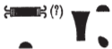

## Esna 123 {-}  
  
- Location: Laboratory, right lintel  
- Date: Domitian  
- [Hieroglyphic Text](https://www.ifao.egnet.net/uploads/publications/enligne/Temples-Esna002.pdf#page=303){target="_blank"}  
- Bibliography: @vadas-2020, p. 96 (full translation).    
    
  
  
#### Title {-}  
  

  
  
^1^ *šms ʿntyw [n mw.t=f]  *  
  
^1^ Serving myrrh [to his mother].  
  

  
  
#### The King {-}  
  

  
  
^2^ *zȝ-Rʿ nb-ḫʿ.w  *  
^3^ *(ỉwtk(rtr)) *  
^4^ *(twm(tyns)) *  
  
^2^ Son of Re, Lord of Appearances,  
^3^ (Autok(rator))  
^4^ (Dom(itian))  
  
  

  
  
#### Neith  {-}  
  
  

  
  
^5^ *N.t wr.t   *  
^6^ *mw.t-nṯr nb.t ^7^ tȝ-sn.t  *  
  
^5^ Neith the great,  
^6^ Mother of God, Lady of ^7^ Esna.  
  

  
  
#### Bastet {-}  
  

  
  
^8^ *tȝ-(nt)-Bȝst.t *  
^9^ *ʿḏ.t ṯḥn.t(??) * [^fn123-1]  
  
^8^ She of Bastet,  
^9^ the scintillating ichneumon(??).  
  

  
  
[^fn123-1]: {width=15%} - Tentatively following the reading of @vadas-2020, p. 96, with n. 22.  
  
#### Heka {-}  
  

  
  
^10^ *ḥkȝ pȝ-ẖrd ^11^ wr [...]  *  
  
^10^ Heka the child, ^11^ great [...]  
  

  
