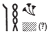
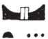

## Esna 124 {-}

- Location: Laboratory, left
- Date: Unknown, probably Domitian
- [Hieroglyphic Text](https://www.ifao.egnet.net/uploads/publications/enligne/Temples-Esna002.pdf#page=304){target="_blank"}
- Bibliography: @vadas-2020, pp. 96-98 (complete)

NB: For the individual ingredients and objects mentioned, most of which are depicted in [Esna 120], see the detailed commentary by @vadas-2020.

| ^1^ *[pr]-ḥḏ n kȝpw pw  *
|   *ʿpr(.w) m ỉḫt nb nfr  *
|     *m dbḥ.w nw ỉr.t-ḥr  *
|   
| *ỉhm.w wr.w m ʿšȝ=sn  *
| *[...] m sštȝ=f  *
|   *m pr(.t) ḥr wḏḥ=f  *
| *nn-[ỉ]b m qmḥ.w  *
| *ḫȝw nb nw Pwn.t  *
| *gȝ.wt nw tȝ-nṯr  *
|   *ỉw=sn ỉry r s.t tn  *
|     
| *nḏm.wy ḫnm=s  *
| *wr.wy sṯỉ=s  *
| *ḥḏ ỉȝd.t=s ḥr.w nb  *
|  
| ^1^ This is the treasury of Kyphi,
|   equipped with all good things,
|   with ingredients of the Eye of Horus.
| 
| Great *ỉhm.w* in numerous amounts,
|   [...] in its secret form,
|   as that which goes upon his altar.
| styr[a]x on branches,[^fn-124-1]
| all resins from Punt,
| the products[^fn-124-2] of God's Land,
|   they are all in this place.
|   
| How sweet is its scent!
| How great its aroma!
| Its musk brightens every face!

[^fn-124-1]: {width=8%} - Vadas did not read this word, but it is apparently *qmḥ.w*, "branches; leaves" (*Wb* V, 40, 2).
[^fn-124-2]: {width=8%} - @vadas-2020, p.97, copied this word as *šnwt*, "offerings", but the sign is more likely *gȝ.wt  *, "bundles (of tribute)" (*Wb* V, 153, 3-7). 

| ^2^ *bw n ỉrp pw  *
| *s.t n ỉnm.t  *
| *tḫ ỉm=s  *
| *ḥʿʿ m-ḫnt=s  *
| *wnf-ỉb (ḥr) pr m-ẖnw=s  *
|   
| *[...s]wn  *
| *ḫpr m Im.t  *
|   *ḥw.t-ỉḥ.t m-ʿb Knm.t  *
| *ỉn.w nb nw dsds  *
|   *ḥtr(.w) r ʿrry.t tn  *
|  
| *nḏm-ỉb tḫ ỉm=s  *
| *nwḥ r-ȝw m r'-wȝ.t=s  *
| 
| ^2^ This is the place of wine,
| the seat of *ỉnm.t*-vintage,
| drunkennes is inside,
| rejoicing is within,
| and exaltation emerges from it.
| 
| [...from S]uni,
| which comes from Imet,
|   Hut-Ihet and Kharga Oasis,
| all products of Bahariya Oasis
|   are gathered to this portal:[^fn-124-3]
| 
| Joy and drunkenness are therein,
| total inebriation surrounds it!
  

[^fn-124-3]: @vadas-2020, p. 97, imprecisely translated this term as "sanctuary." This term has the more precise meaning of "portal" or "gateway" of a palace or temple, a place for bringing tribute, and an interface between the temple and the profane outside world; cf. @klotz-domitian, p. 69, n. g. It is thus an appropriate venue for drunken celebrations by the masses, gathered right outside before the forecourt.