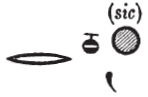

## Esna 125 {-}  
  
  
  
- Location: Laboratory, right  
- Date: Unknown, probably Domitian  
- [Hieroglyphic Text](https://www.ifao.egnet.net/uploads/publications/enligne/Temples-Esna002.pdf#page=305){target="_blank"}  
- Bibliography: @vadas-2020, p. 98 (complete)  
  
  
NB: For the individual ingredients and objects mentioned, most of which are depicted in [Esna 120], see the detailed commentary by @vadas-2020.  
  

  
  
^1^ *s.t tn nfr.t   *  
*ndm *  
  *n nwd šps  *  
*ỉwnn pw n N.t nb kȝpw  *  
*ḥnw.t Pwn.t  *  
*ỉ[zwy] n sḫp  *  
  *n mḏ ỉbr tỉ-šps ḥknw  *  
    *nw ḫȝw nb.w nw fk-ḥr.t  *  
    
^2^ *sḥ pn nfr  *  
*s.t sḫn n ḥḏ.t-wr.t  *  
*mnqb n ḥw.t-ḥr nb.t šsm.t  *  
*ʿ[.t] n ḫȝʿ snṯr mnwr  *  
  *ṯz.wt nw pẖr.w  *  
    
*ʿq.n šsmw r nw=f  *  
  *r ỉr(.t) ỉrw nb ỉm=f  *  
    *r sḥb Iwny.t  *  
      *m ḫnm nḏm nn ȝb  *  
       
^1^ This good place,  
(it is) the throne   
  of the August Distiller (Shesemu),  
it is the sanctuary of Neith, lady of kyphi,  
  mistress of Punt,  
the la[boratory][^fn-125-1] of production  
  of ointment, *ỉbr*, *tỉ-šps*, oil,  
    of all resins from Fek-heret.  
      
^2^ This good chamber,  
the place of alighting for the Great White,[^fn-125-2]  
the palace of Hathor, Lady of Shesemet,  
the room of applying incense and *mn-wr*,  
  and ingredients of recipes.  
  
Shesemu enters at his proper time[^fn-125-3],  
  to perform every rite in it,  
    in order to make Iunyt festive,  
      with sweet aromas, without fail.  
  

  
  
[^fn-125-1]: {width=18%} - The first word is damaged, but few names for rooms or structures begin with an initial *yod*. From the context, this is almost certainly *jz*, "laboratory", supporting the conclusions by @vadas-2020, pp. 124-125, about the function of this room. Note that in [Esna 118], 4 (scene with Tutu, immediately above the laboratory) the king is identified with Shesemu and Horus "Chief of the Ennead of the Laboratory."
[^fn-125-2]: @vadas-2020, p. 98, n. 38, argued this might be an epithet of Hathor. Nonetheless this almost certainly refers to Nekhbet, goddess of the "great White crown," who is frequently called just "the White one of Nekhen" (e.g. [Esna 70], 3), and is closely linked to incense. Cf. *LGG* V, 608b-c.  
[^fn-125-3]:  {width=10%} @vadas-2020, p. 97, with n. 41, translated *r ntf*, "so that he", which is improper syntax. Instead, this is just a standard expression for when rituals happen at Esna.