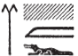
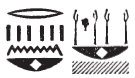
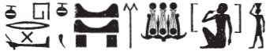
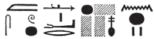

# Intercolumnar Wall A and North-East Door (127-133) {-}  
  
## Esna 127 {-}  
  
- Location: South-east door, above lintel  
- Date: Unknown, probably Domitian  
- [Hieroglyphic Text](https://www.ifao.egnet.net/uploads/publications/enligne/Temples-Esna002.pdf#page=308){target="_blank"}  
- Bibliography: @sauneron-5, pp. 374-375; @sternberg, pp. 100-102 (only cols. 1-8)
  
  
NB: This long text is quite damaged. Many of the surviving snippets can be understood by comparing related inscriptions at Esna, especially those concerning the destruction of enemies such as Apophis on Epiphi 19-20 (*Esna* III, 259-266), the festival of justification on Khoiak 1-6, and descriptions of the sacred necropolis of North Esna.
  

  

^1^ *[...]*  
*[ʿḫn].n=f [ỉr.ty]=f *  
*r [ḫfty pn]*  
*ẖr ẖkr.w nw ʿḥȝ  *  
*[...].n=f [...]=sn  *  
*[...]  *  
   
^2^ *[...]  *  
*[...]=f ʿšȝ  *  
*ỉr=f ḫrwy.t ʿȝ.t ỉm=sn  *  
*hȝ=sn r mw ẖr=f  *  
     
*wḥm=f qd=f m [ʿḫ]m  *  
*[...] ỉry  *  
*[...] wn [...]  *  
*[...].ỉn ḫr m-ʿ=f  *  
     
*sȝḥ=f* ^3^ *[...]  *  
*[...] wḏȝ.ty [...]  *  
*[...]  *  
*Rʿ m [nb]-pḥty  *  
*ẖnm=f ḥnʿ=f m sḫ.t  *  
*ỉw ỉb=f ȝw.w  *  
   
*rdỉ.n=f s(w)  *  
*m nb n sḫ.t  *  
*ḏ(d).tw n=f   *  
*ẖnmw nb-sḫ.t  *  
    
*mḥn tfn.t ḥr-tp=f  *  
*wpš.n=s m wp.t=f  *  
*m-ẖnw* ^4^ *ww.t tn nfr  *  
*ḫpr rn=s n Nb.t-ww  *  
  
^1^ [...]  
[he closed] his [eyes]  
against [th]is [enemy],  
bearing his battle armor.[^fn-127-1]  
[...] he [...] their  
[...]  
  
^2^ [...]  
[...] numerous.  
He made a great massacre among them,  
they went down to the water under it.  
  
He repeated his form as a [cr]ocodile,[^fn-127-2]  
[...] likewise,  
[...] was [...]  
[...] fell with him.  
  
He reached ^3^ [....]  
[...] the *wedjat*-eyes [...]  
[...]  
Re as [Lord] of Strength,  
he joined with him in the Field,  
his heart being happy.  

He made him  
as lord of the Field,  
thus he is called  
'Khnum Lord of the Field.'  
  
Tefnut coiled up upon his head,  
she shone (*wpš*) on his brow (*wp.t*),  
within ^4^ this good field (*ww*),  
thus her name became 'Nebtu' (*Nb.t-ww*).  

[^fn-127-1]: Restored after *Esna* III, 261, 17, §9.
[^fn-127-2]: {width=8%} - Other restorations are possible. In a related hymn, Khnum is called "the great crocodile (*ḫnt wr*), who hides himself in Nun" (*Esna* III, 265, 26; @sauneron-5, p. 375).

 

*ḏd.ỉn Rʿ n mw.t=f  *  
*nfr-ỉb(=ỉ) ỉqr zp-snw  *  
*ḏr mȝȝ=ỉ zȝ[=ỉ] šw  *  
*m nb-pḥty  *  
*ỉw sn.t=f m tfn.t  *  
*mḥn(.t) m ḥȝ.t=f  *  
*ẖnm.t ḥnʿ ȝḫ.t *  
*m spȝ.t tn  *  
  
*ḏ(d).tw pr-ẖnmw-n-sḫ.t  *  
*m rn n ỉȝ.t tn  *  
  
Then Re said to his mother:  
'My heart is glad, and very excellent,  
because I see [my] son Shu  
as the Lord of Strength,  
his sister is as Tefnut,  
coiled upon his forehead.  
The cistern (*ẖnm.t*) is with the field  
in this district.'  
  
So one says Temple of Khnum of the Field  
as the name of this mound.  

 

^5^* *mȝʿ-ḫrw ỉn ḥm=f *  
*m snw n zp  *  
*(hrw) 1/6 n ḥb kȝ-ḥr-kȝ*  
   
*[...] š nṯry  *  
*ḥr šms-ỉb=f m ẖnmw  *  
*ḥr ỉr(.t) zȝ=f  *  
*ḥr mk(.t) ḥʿw=f  *  
*ḥr ḫwỉ ḏ.t=f  *  
*r ḫrwy.t  *  
   
*wbn ḥm=f m mȝỉ ʿȝ-pḥty  *  
*dỉ=f r tȝ   *  
^6^ *m mȝỉ ḥzȝ-ḥr  *  
*qn ṯnr nʿš [...]  *  
*[...]  *  
*nwr.n=f ḏw.w m hmhm=f  *  
   
*pr=f r=sn  *  
*wȝḥ=f ỉmỉ.tw=sn  *  
  
*ỉỉ pw ỉn sn.t=f tfn.t  *  
*mnḥ.n=s tp.w nw ḫfty.w=f  *  
^7^ *m ḫrpw=s n mȝỉ.t  *  
*mr rn=[s n] Mnḥy.t   *  
   
^5^ Then his majesty was justified  
for a second time,  
on day 5 (= 1/6) of the Khoiak Festival.[^fn-127-3]   
  
[...] the sacred lake,  
following his heart as Khnum,  
making his protection,  
guarding his flesh,  
protecting his body  
against massacre.  
  
His majesty shone as a lion great of strength,  
and he appeared on earth  
as a wild-faced lion,  
might, brave, raging [...]  
[...]  
the mountains tremble at his war cry.[^fn-127-4]  
  
He came forth against them,  
and installed himself in their midst.  
  
Then his sister, Tefnut, arrived,  
cutting off the heads of his enemies,  
in her manifestation of a lioness,  
in [her] name [of] Menhyt.  

[^fn-127-3]: {width=15%} - @sauneron-5, p. 375, n. 1, translated this date as "le premier jour", but noted its reading was doubtful. If this is fractional notation, then it should be the 5th of Khoiak. It is not impossible that this alternatively reads *r sỉn.t*, "over Egypt", a term frequently spelled like this (*Wb* IV, 153, 7) but one would then expect the *nỉw.t*-determinative.
[^fn-127-4]: {width=25%} - The reading *nwr* seems certain from context. The *hmhm*-crown often writes the homophonous *hmhm*, "war cry": e.g. *Esna* III, 265, 27; 266, 6

 

*[...].n=f gs n [...]  *  
*m bȝ=tkk  *  
*tqr-pḥty  *  
*nḫt-ʿ smȝ bdš.w  *  
*ỉr ʿḏ.t m ʿȝpp  *  
*pḥty pḥty=f m pr-nṯr [....]  *  
  
[...] he [...] the half of [...]  
as the raging Ba,  
fierce of strength,  
mighty of arm, who slays the disaffected,  
who makes a slaughter of Apophis:  
his strength is strong in Per-netjer [...]  

 

^8^ *pr=f m mȝʿ-ḫrw  *  
*m wp.wt[=f] nb.w  *  
*wdỉ=sn qn n wḏ[=s]  *  
*[...]  *  
  
*pȝ wpy ʿȝ  *  
*ḫr.tw r=f  *  
   
*ỉt=f Rʿ m ḥqȝ ȝw.t-ỉb  *  
*m ḥb=f nfr  *  
*n wḏʿ-mdw  *  
*nṯr.w spȝw.t nỉw.wt [...]  *  
*[...]  *  
*^9^ ʿn.wy ỉry m sw wʿ *  
*r mȝȝ nfr[w] n ỉtn.wy  *

^8^ He emerged in justification[^fn-127-5]  
from all [his] trials (*wp.t*).  
They deliver harm to whomever [she] commands[^fn-127-5a]    
[...]  
the Great *wpy*-Festival  
so they call it.  
  
His father Re is ruler of happiness,  
in his good festival  
of issuing judgements.  
The gods of nomes and cities [...]  
[come to see him...] [^fn-127-6]  
^9^ beautiful, likewise, on Day 1  
to see the beauty of the two disks.[^fn-127-7]

[^fn-127-5]: This section has close parallels with the better-preserved [Esna 81], 5-6.
[^fn-127-5a]: Restored after [Esna 81], 5.
[^fn-127-6]: A reference to the diivinities from neighboring cities arriving during [Khoiak 1-6].
[^fn-127-7]: {width=25%}  - Restored after the parallel in [Esna 81], 6: {width=25%}. From related texts, the two disks are Khnum-Shu and Nebtu-Tefnut: *Esna* III, 346, 22; [Esna 80], 3.

*psḏ.t=f m ỉhȝy  *  
*ỉȝ.t=f nṯry twr.tw n kȝ=f  *  
*tȝ-r-ḏr=f ẖr ḥry.t=f  *  
    
*pr pn nfr*  
*n pḏ-nmt.t ḫnt sḫ.t=f  *  
*s.t ḏsr.t pw nt Itm  *  
^10^ *ḥw.t-ỉmn wr zp-snw  *  
*nỉ rḫ ỉmỉ=s  *  
*nỉ ḫnd=s zȝṯ  *  
*nn ʿr=s z.t  *  
*nỉ sš bwt-nṯr m ḫnt=s  *  
    
*ḥr.tw zp-snw r bwt=s  *  
*swḏȝ tȝ (r)-ḏr=f  *  
*r ḫrwy.t  *  
  
*ẖʿq(?) wnḫ   *  
*pȝ nty ʿq r=s  *  
*mw n ḥsmn  *  
*pȝ nty sḫn ỉm=s  *  
^11^ *[pẖ]r nb r=s  *  
*twr.tw r zȝṯ  *  
*wʿb.tw r s.t  *  
*m wʿb nt hrw 8  *  
    
*ỉb n z ḥr wȝ.t=s  *  
*r swtwt ỉḫt r pr=s  *  
*n rʿ-[nb]  *  
*fqȝ.w=s [...]  *  
*[...] tȝ-šmʿ mḥw  *  
*nr=s pẖr(.w) m tȝ.wy ḫȝs.wt  *  
*nỉ ḥȝt-ỉb m-ḫnt=s [rʿ-nb]  *  
  
His Ennead is in jubilation,  
his divine mound is purified for his Ka,  
they whole land is in terror of him.  
  
This good domain,  
of Wide of Steps within his Field:  
it is the sacred place of Atum,  
the extra secret temple.[^fn-127-8]  
One does not know what is inside,  
impurity cannot trespass it,  
a woman may not approach it,  
the divine abomination may not pass inside.  
  
Avoid its abomination,   
and keep the entire land safe  
from calamity!  
  
Shaved(?)[^fn-127-9] and clothed must be,  
all (men) who enter it;  
water and natron (bath is required)[^fn-127-10]   
for all who visit inside;  
^11^ [who ] came around to it,  
cleansed from filth,  
purified from (contact with) a woman,  
for a purification of 8 days.  
  
If a man desires to enter her road,  
in order to bring gifts to her temple,  
[any] day,  
she rewards [him...]  
[...] Upper and Lower Egypt.  
Fear of her encircles all lands,  
there is no sadness inside it, [daily].

[^fn-127-8]: This is the location near North Esna where Re hid from his enemies: *Esna* III, 196, 4.
[^fn-127-9]: {width=10%} - Reading uncertain. Many of the same requirements for entering the divine necropolis of North Esna occur in *Esna* 197, 18-20. The only difference is this first term, which I tentatively suggest is a slightly confused spelling of Xaq, "to shave", which is mentioned in *Esna* 197, 18: {width=15%} (cf. @sauneron-5, p. 345, n. c). Alternatively, the parallel in the same text mentions *wnḫ* in the phrase *ḥbs n wnḫ*, "fine linen clothing", and this difficult term might instead be a corrupted form of *ḥbs*. 
[^fn-127-10]: Literally "water of natron" or "water and natron"; cf. @sauneron-5, pp. 340, 346, n. g. 