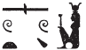
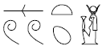
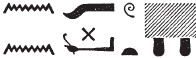
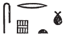
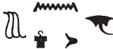
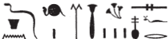

## Esna 130 {-}  
  
  
  
  
- Location: North-East Door, interior, right
- Date: Probably Domitian 
- [Hieroglyphic Text](https://www.ifao.egnet.net/uploads/publications/enligne/Temples-Esna002.pdf#page=312){target="_blank"}  
- Bibliography: None. LGG references in [Tempeltexte 2.0](http://www.tempeltexte.uni-tuebingen.de/portal/#/text-detail/488){target="_blank"}  

  

^1^ *ỉr ỉȝ.t tn   *  
*nty ḥr gs-rsy   *  
*n pr-ẖnmw n sḫ.t  *  
      
*s.t-ʿȝ.t rn=s [...]  *  
*[...].w nty ỉm [...]  *  
*[nṯr.w] 3 [nṯr.yt] 4  *  
*[m] rn=sn  *  
      
*[Ws]ỉr[-nxt Inpw ỉmy-P]  *  
*ḥr.t zȝ.t-Rʿ ỉwt.t-ww nb.t-ww  *  
      
*ms.w-Rʿ pw  *  
*ḫw(.w) mk(.w) m-ḫnt=s  *  
*mỉ ỉmḥ.t ẖr ^2^ ḥtpty.w  *  
    
*wbn ỉt=sn Rʿ  *  
*m-ʿqȝ=s  *  
*(ḥr) ỉr(.t)-ʿ n ḥts   *  
*[...]  *  
*[...]=s nty ỉm  *  
  
^1^ As for this mound,  
which is to the south  
of Per-Khnum of the Field.  
  
The Great Place[^fn-130-1] is its name [...]  
[...]s that are there [...]  
3 [gods] and 4 [goddesses][^fn-130-2]  
[in] their names:  
  
[Os]iris [the Mighty, Anubis, He who is in Pe],  
Horit, Daughter of Re, Iutu(?),[^fn-130-3] Nebtu.  
  
They are the children of Re,  
guarded and protected within it,  
like the cavern[^fn-130-4] bearing ^2^ the blessed dead.  
  
Their father Re rises  
across from it  
performing the action of mummifying   
[...]  
[...] which is there.  

[^fn-130-1]: The "Great Place" is mentioned frequently in the calendars and related festival texts. It is the abaton for the deceased gods, the children of Re, near the temple of Khnum-Re Lord of the Field in North Esna.
[^fn-130-2]: This restoration is suggested by @sauneron-2, p. 251, notes a-b. As he mentions, the same list of divinities are listed among the blessed dead who praise Neith north of Esna in the great hymn [Esna 163], 27; and they even receive offerings in *Esna* VII, 613, along with their father Re-Harakhty. Since this is a group of 7 ancestor deities, it is unclear whether they are identical with the 7 Djaisu of Methyer, also said to be buried north of Esna. 
[^fn-130-3]: {width=11%} - The precise reading of this name is tricky; it appears identically in [Esna 163], 27, and similarly in *Esna* VII, 613, 27: {width=12%}. The first sign elsewhere writes *ỉwty* (e.g. *Esna* III, 263, 24) and *ʿȝ* (e.g. [Esna 162], 4; *Esna* 277, 23 [7]). I prefer to interpret her name as the opposite of her companion, Nebtu: "she without a field", "lady of the field." But since this is admittedly a poor divine epithet, "Great One of the Field (*ʿȝ.t-ww*)" should also be considered.
[^fn-130-4]: This would seem to be the prototypical Egyptian abaton, the cavern in Helopolis, burial place of the children of Re.

*ḏḥwty pw ḥr shr ỉb=s[n]  *  
*[...]  *  
*[ẖ]nm nṯr 8  *  
*ḏd.tw [n]=f  *  
*ỉmȝ-ỉb   *  
*pȝ-wrš-n-hrw-8  *  
*ḫr.tw r=f  *  
  
^3^ *s[..]=f st m [ỉ]hȝy  *  
*qbb ỉb=sn ỉm  *  
    
*nỉ ỉr.tw sgb m-ẖnw ỉȝ.t tn  *  
*nn ṯȝỉ.tw ṯb.ty m-ḫnt=s  *  
*ʿq.tw r=s [...]   *   
*[...] wʿ.t  *  
*nỉ ṯȝ.tw srp.t m-ḫnt=s  *  
*m gs-ḥry [...]  *  
    
*[...]  *  
*ḥr s[w]r nṯr.w ʿȝ.w  *  
*ḥtp(.w) m-ḫnt=s  *  
*mw nṯry ỉm[...]  *  
  
He is Thoth, delighting their hearts  
[...]  
[j]oining the 8 gods.  
One says [to] him:  
'Be gracious!'  
Thus he is called  
the Guard of the 8th Day.[^fn-130-5]  
  
^3^ He [...] them in jubilation,  
their hearts are cooled therein.  
  
One may not shout within this mound,  
one may not wear sandals[^fn-130-5a] within it,  
whoever enters it [...]  
[...of] 1 [day];[^fn-130-6]  
one may not wear ram-skin(?)[^fn-130-7] in it,  
in the upper part [...]  
  
[...]  
magnifying the great gods  
who rest within it.  
The divine water is there [...]  

[^fn-130-5]: Distinct from "the Guard of Day 9" mentioned in [Esna 129], 2.
[^fn-130-5a]: {width=15%} - Such a prohibition is not mentioned elsewhere, but an injunction against wearing leather sandals makes sense, especially with the possible mention of animal skin clothing later. Cf. @sauneron-5, p. 342, n. f, for an interesting later parallel.
[^fn-130-6]: Restore after *Esna* III, 197, 16: "all men should be purified from women for a purification of 1 day (*m wʿb nt hrw wʿ*)"; cf. @sauneron-5, pp. 340-341, with n. a.
[^fn-130-7]: {width=15%} - This word is spelled like srp.t, "lotus blossom", but the determinative would not fit here. Rather, this seems to be a variant of a similar text concerning North Esna, which forbids men to wear "skin of a ram" (*šny n* ***sr***: {width=16%} ) when entering the temple: *Esna* III, 197, 17; cf. @sauneron-5, p. 342, n. f. Perhaps the final *p* and *t* in the present inscription are errors for the animal skin determinative present in the latter text.

^4^ *wnn ỉȝ.t tn   *  
*ḥr mḥ.t n pr-ẖnmw n sḫ.t  *  
   
*ỉmỉ-wȝḏ=s pw  *  
*ỉȝ.t nbw.t-ʿȝy.t rn=s  *  
*m rȝ n rȝ  *  
     
*ʿḥʿ tfn.t ḥr=s   *  
*m ỉʿrr.t m-ẖnw   *  
*wȝḏ n gnš.w  *  
*r ḥȝp=s r nṯr.w  *  
     
*ỉỉ.ỉn Rʿ [...]  *  
*[...]  *  
^5^ *[...] wȝḏ.w pn  *  
    
*ḏ(d).ỉn Rʿ  *  
*m wȝḏ.w s(t) nfr  *  
*ḏd.tw ỉmy-wȝḏ=s  *  
*m rn n ỉȝ.t tn  *  
     
*ḏ(d).ỉn [Rʿ] n [t]f[n.t]   *  
*[...] nbw[...]  *  
*[...] mỉ [Rʿ] ḏ.t   *  
  
^4^ Now this other mound,  
to the north of Per-Khnum of the Field:  
  
It is *ỉmy-wȝḏ=s*,  
its name is also 'Mound of the Great Gold',[^fn-130-9]  
in oral tradition.  
  
Tefnut stopped upon it,  
as a uraeus within   
a papyrus thicket of *gnš*-plants,  
to hide herself from the gods.  
  
Then Re came [...]  
[...]  
^5^ [...] this papyrus thicket.  
  
Then Re said:  
'It is nice in the papyrus thicket!'[^fn-130-10]  
Thus one says *ỉmy-wȝḏ=s*  
as the name of this mound.  
  
Then [Re] said to [Te]f[nut]:[^fn-130-11]  
[...] gold [...]  
[...] like [Re] eternally.

[^fn-130-9]: As @sauneron-2, p. 241, n. e, pointed out, this same mound is mentioned in *Esna* 197, 20 (on column 1, immediately inside the door from the present text), and 241, 11.
[^fn-130-10]: {width=25%} - The syntax is unusual, but this appears to be a way of linking Re's speech (*(ỉ)m wȝḏ s(t)*) with the name of the mound (*ỉmy-wȝḏ=s*).
[^fn-130-11]: Since the following section mentions "gold", presumably Re's second speech gave an etymology for the alternate name, "Mound of the Great Gold."