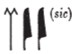

## Esna 135 {-} 

- Location: Intercolumnar wall B
- Date: Probably Domitian
- [Hieroglyphic Text](https://www.ifao.egnet.net/uploads/publications/enligne/Temples-Esna002.pdf#page=317){target="_blank"}
- Bibliography: @elgawady, pp. 199-200; @shemanefer, p. 50 (partial); @gamelin-2019 pp. 38-40 (partial translation and discussion)
- [Photograph](http://www.temples-egypte.net/sud/esna/envers/nord/mursBahutDetails.html){target="_blank"}

  

#### Title {-}

^1^ *ḥnk ʿnḫ-ḏd-wȝs n ỉt=f*   
*ʿšȝ ḥtp.w*  
  
^1^ Offering *ʿnḫ-ḏd-wȝs* to his father,[^fn-135-1]  
numerous of offerings.

[^fn-135-1]: In the scene, the king offers a small scepter with these symbols on it.

#### The King {-}

^2^ *nsw.t-bỉty   *  
*(ywtgr(tr) ksrs)|   *  
^3^ *zȝ-Rʿ   *  
*(twmtyns ḫwỉ)|   *  
^4^ *mry Nḫb.t ḥd(.t) Nḫn  *  
    
^2^ The King of Upper and Lower Egypt,  
(Autokra(tor) Caesar)|  
^3^ Son of Re,  
(Domitian Augustus)|  
^4^ beloved of Nekhbet, the White of Nekhen.

#### The Solar Disk {-}

^5^ *Bḥdty*  
  
^5^ He of Behedet.  

#### Nekhbet {-}

^6^ *ḥb-sd nb   *  
*ʿnḫ-ḏd-wȝs nb   *  
*snb nb   *  
*ȝw.t-ỉb nb   *  
*ḥr s.t-ḥr   *  
*ḫnty ʿnḫ.w ḏ.t  *  
   
^6^ All Sed Festivals,  
all *ʿnḫ-ḏd-wȝs*,
all health,  
all happiness  
upon the throne of Horus,  
foremost of the living, forever.  

#### Behind the King {-}

^8^ *mn n=k ḥḥ n ʿnḫ-ḏd-wȝs   *  
*nsw=k tȝ.wy m nḏm-ỉb(?)   *  
*ʿnḫ=k ḏd=k wȝs=k   *  
*ʿȝ šfy.t=k   *  
*ḫr ḥr nb  *  
   
^8^ Take millions of *ʿnḫ-ḏd-wȝs*,  
may you rule the Two Lands in happiness(?),[^fn-135-2] 
you live, you endure, you are mighty,  
your prestige is great  
before everybody.  

[^fn-135-2]: {width=15%} - Reading uncertain. @elgawady, p. 200, n. 1392, read *m mȝʿ-ḫrw*, "in justification," which would also make perfect sense.

#### Shemanefer {-}

^9^ *ḏd-mdw n šmʿ-nfr   *  
*Sbk* ^10^ *zȝ N.t   *  
*nṯr šps pr m Rʿ   *  
^11^ *qmȝ n(ty)   *  
*ỉr wnn.t  *  
    
^12^ *nsw.t-bỉty   *  
*ỉwʿʿ n N.t   *  
*smsw n Rs.t-ḥw.wt=s  *  
    
*ḫfḫf nṯry   *  
*ḫʿỉ m hrw   *  
*ḫprw ʿȝ n nṯr nb   *  
*rȝ-ḥzȝ   *  
*nḫt ḫpš.w   *  
^13^ *ỉty sẖr ḫfty.w=f   *  
*ḫnt wr n tȝ  *  
     
*štȝ-ḫʿ.w   *  
*wḥm msḫʿ.w   *  
*rnp n nḥḥ ḏ.t   *  
*šmʿ-nfr nṯr ʿȝ ḥr-ỉb tȝ-sn.t  *  
    
^9^ Words spoken by Shemanefer,  
Sobek, ^10^ son of Neith,  
august god who came forth from Re,  
^11^ who created what is,  
and made what exists.  
  
^12^ King of Upper and Lower Egypt,  
heir of Neith,  
eldest of *Rs.t-ḥw.wt=s*.  
  
Divine *ḫfḫf*-crocodile,  
who appears in the day,  
the great manifestation of every god,  
the wild-mouthed crocodile,  
strong of limbs,  
^13^ Sovereign, who fells his enemies,  
great *ḫnt*-crocodile of the earth.  
  
Mysterious of appearances,  
who repeats births,  
who rejuvenates forever and ever:  
Shemanefer, the great god within Esna.

#### Wadjet {-}

^14^ *Wȝḏy.t ỉr.t-Rʿ nb.t p.t   *  
^15^ *dỉ=s ʿnḫ-wȝs nb   *  
*snb nb ȝw.t-ỉb nb ḏ.t  *  
   
^14^ Wadjet, Eye of Re, Lady of Heaven,  
^15^ she gives all ʿnḫ-wȝs,  
all health, all happiness, eternally.  

#### Behind Shemanefer {-}

^16^ *šzp.n=ỉ ʿnḫ   *  
*ȝm.n=ỉ ḏd   *  
*ḫfʿ=ỉ wȝs m ʿ.wy=ỉ   *  
*ʿnḫ=ỉ*  
*ḏd=ỉ*  
*wsr=ỉ  *  
     
*ḏỉ=ỉ n=k ỉḫt nb   *  
*pr m tȝ  *  
  
^16^ As I have received *ʿnḫ*,  
so I have grabbed *ḏd*,  
and I have grasped *wȝs* in my hands.  
I live (*ʿnḫ*),  
I endure (*ḏd*),  
I am mighty (*wsr*).  
  
I give to you all good things  
which come forth from the earth.

