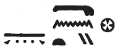

## Esna 138 {-}  
  
  
  
- Location: Intercolumnar Wall B, soubassement  
- Date: Domitian  
- [Hieroglyphic Text](https://www.ifao.egnet.net/uploads/publications/enligne/Temples-Esna002.pdf#page=321){target="_blank"}  
- Bibliography: @tattko-2014, pp. 414-415 (description only)  
  
### 1 - Nile {-}  
  

  
  
*[...]  *  
*rnp r nw=f  *  
*sṯỉ [...]  *  
*ḥʿʿ-ỉb nb n [...]  *  
*m [.] Nwn  *  
*ḥʿʿ ḏȝ(m).w n ỉỉ=f  *  
  
[...]  
who rejuvenates at his time,  
who pours out [...]  
every heart rejoices when [...]  
as [...] Nun.  
Generations rejoice when he arrives.  
  

  
  
### 2 - Field {-}  
  

  
  
[*sḫ.t qbb.t...*]  
*ḏd-mdw   *  
  
*[ỉỉ].n  *  
*([...][ḫr=k]  *  
*[ẖnmw-Rʿ] nb tȝ-sn.t  *  
  
*ỉn=f n=k qbb.t  *  
*[...]  *  
*mnw ẖr šmȝ.w  *  
*wbg [...]  *  
*[wȝḏ?]wȝḏ [...]  *  
*[...]   *  
*qbb.t qmȝ sm.w=s  *  
   
The [field *qbb.t*...] [^fn-138-1]  
Words spoken:  
   
[The king (...)]  
has [come before you],  
  [...Khnum-Re] Lord of Esna[^fn-138-2].  
    
He brings to you the *qbb.t*-field  
[...]  
pools bearing blossoms,  
blooming [...]  
verdure(?) [...]  
[...]  
*Qbb.t* which creates her plants.  
  

  
[^fn-138-1]: A field with the same name appears in *Esna* VII, 634, 40-43 (15). That text is also quite damaged, so it does not help restore the present inscription.  
[^fn-138-2]: {width=40%} - Most likely an acrophonic spelling (*s* < *sṯỉ*), but the phallus might also represent the biliteral *sn* < *wsn*, "engendering ram" (consonantal principle) - a frequent epithet of Khnum at Esna.   
