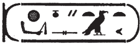
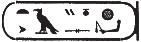

## Esna 141 {-}  
  
  
  
- Location: Intercolumnar Wall C  
- Date: Hadrian  
- [Hieroglyphic Text](https://www.ifao.egnet.net/uploads/publications/enligne/Temples-Esna002.pdf#page=324){target="_blank"}  
- Bibliography: @elgawady, pp. 203-205.
- [Photograph](http://www.temples-egypte.net/sud/esna/envers/nord/mursBahutDetails.html#B3){target="_blank"}
  
This is a potentially significant scene. The Bas of Pe and Nekhen carry the Roman emperor Hadrian in a sedan chair, just as if he were celebrating a classical Pharaonic jubilee (Sed Festival). Similar reliefs can be found at Karnak under [Ramesses II](http://sith.huma-num.fr/karnak/1833) and [Ramesses III](http://sith.huma-num.fr/karnak/4523). Hadrian actually visited Upper Egypt in 130-131 CE, including trips to famous monuments such as the Colossus of Memnon in Western Thebes, and he reportedly interacted closely with local Egyptian clergy.[^fn-141-1]    
    
This unique relief does not fit in with the other intercolumnar scenes at Esna, which otherwise show the well-attested ritual sequence of building the temple and seeing the chief divinities. Nonetheless, similar scenes of the king carried on a sedan chair can accompany scenes of "appearing from the palace", as depicted in [Esna 52] and [Esna 74].[^fn-141-1b] Since most of the surrounding reliefs were decorated under Domitian, including the inscriptions immediately above this scene ([Esna 139), [Esna 140]), it is tempting to speculate this scene commemorates a visit by Hadrian himself to the temple of Esna. At the very least, it seems as if the cartouches were finished during his reign. The royal names carved beneath his feet (below, 12) more closely resemble the name of his predecessor, Trajan.  
  
[^fn-141-1]: @klotz-caesar, pp. 322-324, 336-337.  
[^fn-141-1b]: E.g. *Edfou* III, 161-163 (cf. *Edfou* IX, pl. LXIII); *KO* 71.  

### Above Hadrian {-}  
  

  
  
^1^ *nsw.t-bỉty  *  
*nb-tȝ.wy  *  
*(ȝwtwktr kysrs) *  
^2^ *zȝ-Rʿ nb-ḫʿ.w  *  
*(ỉtrỉnỉs nty-ḫwỉ)  *  
    
^3^ *nṯr nfr  *  
*psḏ m nbw  *  
*wṯz-ḫʿ ḥr tnṯȝ.t  *  
*ȝm ḥḥ*   
   *m sḏd nsy.wt  *  
*ḫfʿ [nḫȝḫȝ?]*       
  *[ḥr] ḥȝq [...]  *  
      
^1^ The King of Upper and Lower Egypt,  
Lord of the Two Lands,  
(Autokrator Caesar)  
^2^ Son of Re, Lord of Appearances,  
(Hadrian Augustus)  
  
^3^ The good god,  
who shines in gold,  
who wears crowns on the palanquin,  
who grabs Heh  
  while making kingship endure,[^fn-141-2]  
who grasps [the fly whisk?]  
  taking [...]  
    

  
   
[^fn-141-2]: In this scene, Hadrian is holding a composite scepter, featuring the god Heh (*ḥḥ*) and a djed pillar (*sḏd*).  
  

  
  
^4^ *ṯnỉ.tw ʿn.tw   *  
  *ẖr šw.ty n tȝ-ṯnn  *  
*m sḏḏ=f n ẖnmw nb Iwny.t  *  
  
*Mnḥy.t m hnn=f  *  
  *mỉ mḥn.t* ^5^ *ḥr-tp n nṯr.w nb.w  *  
    
*wbn m ȝḫ.t rʿ-nb zp-snw  *  
*mỉ ỉtn tp dwȝw  *  
    
^4^ He is distinguished, he is pleasing,  
  wearing the double plumes of Tatenen,  
in his image of Khnum Lord of Iunyt.  
  
Menhyt is on his brow,  
  like the uraeus ^5^ atop all gods.[^fn-141-3]  
  
Shine in the Akhet every day!  
Like the sundisk in the morning.  
  

  
  
[^fn-141-3]: Another reference to Hadrian's regalia: he wears the double-plumed crown of Khnum and Tatenen, with a small uraeus on his forehead.  
  

  
  
*ḥry-tȝ n ẖnmw  *  
*msw.t n R  *  
*snn ʿnḫ n* ^6^ *Ptḥ  *  
*pr.t ȝḫ.t n nb-(r)-ḏr  *  
*wtṯ.n=f sw  *  
  *r ỉdn s.t=f  *  
  
*qmȝ.n šw  *  
*pʿpʿ.n tfn.t  *  
^7^ *dỉ(.w) r tȝ m ḥqȝ ns.t  *  
*mw n tȝ  *  
*bẖ.n Nw.t  *  
*ḫnmm.n N.t  *  
*šd.n ỉh.t  *  
*rr.n Wr.t-ḥkȝw  *  
   ^8^ *sṯny n nb.w Iwny.t  *  
   
  
The successor of Khnum,  
image of Re,  
living statue of ^6^ Ptah,  
glorious seed of the All Lord,  
whom he begot  
  in order to fill his throne.  
    
Created by Shu,  
conceived by Tefnut,  
^7^ given birth as Ruler of the throne;  
seed of the earth,  
born of the sky (Nut),  
nursed by Neith,  
raised by the Ihet cow,  
nourished by Weret-hekau:  
  ^8^ distinguished by the Lord of Iunyt.  
  

  

  
  
*nsw.t m pr=f  *  
*ḥqȝ tp nwd.t=f  *  
*nb wʿ ḥr ndb.t=f  *   
  
^9^ *zȝ Wsỉr  *  
*ms.n Is.t  *  
*bỉk n nbw  *  
*ḫʿ.tw ḥr srḫ  *  
  
*nsyw.t=f ḥn.ty nḥḥ  *  
^10^ *smn ḥp.ty=f*   
    *ỉn nb sḫm.ty  *  
*šnw n tȝ ẖr s.t-ḥr=f  *  
*nb tȝ.wy*   
    *mỉ nb tȝ.wy  *  
*šzp nsyw.t*   
    *m hrw n ms.tw=f  *  
  
King when he emerged,  
ruler atop his swaddling clothes,  
sole lord upon his territory.  
  
^9^ Son of Osiris,  
born of Isis,  
falcon of gold,  
appearing upon the *serekh*.  
  
His kingship is the limits of eternity,  
^10^ his boundaries where established  
  by the Lord of the double crown,  
the globe is under his supervision,  
lord of the two lands,   
  like the Lord of the Two Lands(?),  
who received kingship  
  on the day he was born.  
  

  

  
  
^11^ *rmn sw wṯz sw  *  
  *ỉn bȝ.w P Nḫn  *  
    *r ʿh*   
      *n qdỉ rmṯ  *  
        *ỉr nṯr.w ỉm=f  *  
  
^12^ *ḏỉ=f n=f nsyw.t n Rʿ  *  
  *ḥqȝ n šw  *  
  *ỉmỉ.t=pr n (Wn-nfr mȝʿ-ḫrw) *  
    *ḥr s.t-ḥr*   
        *ḫnty ʿnḫ.w ḏ.t  *  
  
^11^ He is carried, he is elevated,  
  by the Bas of Pe and Nekhen,  
    toward the palace   
      of he who built people  
        and makes gods therein.  
          
^12^ May he give to him the kingship of Re,  
  the rule of Shu,  
  the inheritance of (Wennefer, justified),  
    upon the throne of Horus,  
      foremost of the living, forever.  
  

  
### Bas of Pe {-}  
  
  

  
  
^13^ *bȝ.w P  *  
*šms(.w) ḥr m tȝ-mḥw  *  
*wṯz bỉty *  
   *mỉ ỉt=sn  *  
  
^13^ The Bas of Pe,  
Followers of Horus in Lower Egypt,  
who carry the *bỉty*-king,  
   like their father.  
  

  
  
### Bas of Nekhen {-}  
  

  
  
^14^ *bȝ.w Nḫn  *  
*šms(.w) ḥr m tȝ-šmʿ  *  
*fȝỉ nsw.t   *  
  *mỉ skr m ḥnw  *  
  
^14^ The Bas of Nekhen,  
Followers of Horus in Upper Egypt,  
who carry the *nsw*-king,  
   like Sokar in the *henu*-bark.  
  
  

  
  
### Beneath the King's Feet {-}  
  
NB: Text moves in two directions from the center.  
  

  
  
*ḫȝs.wt nb.w ḫbỉ(.w)  *  
  *n bȝw n nṯr nfr  *  
    *(trȝyns ḫwỉ) *  
    
*ḫȝs.wt nb.w snḥ(.w)  *  
  *ẖr ṯb.ty n nsw.t-bỉty  *  
    *(trȝtyns ḫwỉ) *  
  
All foreign lands are bent down  
  to the power of the good god,  
    (Trajan(?)[^fn-141-4] Augustus)  
      
All foreign lands are bound  
  beneath the sandals of the king  
    (Trajan(?) Augustus)  
  
  

  
  
  
[^fn-141-4]: {width=10%}{width=10%} - As written, this cartouche appears to read "Trajan". Sauneron assumed it was a corrupt form of Hadrian.