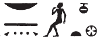

## Esna 143 {-}  
  
  
  
- Location: Intercolumnar Wall B, soubassement  
- Date: Domitian  
- [Hieroglyphic Text](https://www.ifao.egnet.net/uploads/publications/enligne/Temples-Esna002.pdf#page=327){target="_blank"}  
- Bibliography: @tattko-2014, pp. 375-376, 415-416 (translation of Nile figure, with parallels)  
- Parallels: *Esna* VI, 634, 20-23, No. 10; *Urk* VIII, 122, 3 (for the Nile figure)  
  
### 1 - Nile {-}  
  

  
  
^1^ *mw mtr*   
   ^2^ *mȝwỉ=f r tr=f  *  
^3^ *ḏd-mdw  *  
    
*ỉỉ.n nsw.t-bỉty  *  
*(ȝwtwkrtr kysrs) *  
*ḫr=t  *  
*N.t wr.t mw.t-nṯr  *  
*nb.t tȝ-sn.t  *  
    
*ỉn=f n=t mw [mtr]  *  
  *smtr šdy.wt  *  
*nʿy=f [n=t]  *  
^4^ *[ḥms.n]=f [ḥr ỉdb].w  *  
*bʿḥ.n=f tȝ.wy m nfrw=t  *  
  *r srwḏ pȝw.t  *  
    *n nṯr.w  *  
    
*ntṯ ỉt nfr  *  
*rs ḥr [pr ỉm=s]  *  
*mw.t mnḫ.t  *  
*nfr šd.t  *  
  
^1^ The *Mtr* water,[^fn-143-0]  
   ^2^ he renews at his time.  
^3^ Words spoken:  
  
The King of Upper and Lower Egypt,  
(Autokrator Caesar)  
has come before you,  
Neith [^fn-143-1] the great, Mother of God,  
Lady of Esna.  
  
He brings to you the [precise] water  
  who corrects the fields,  
he travels [for you]  
^4^ [As he settl]ed [upon the ban]ks,  
he flooded the two lands with your beauty,  
  to make flourish bread offerings  
    for the gods.  
    
You are the good father,  
who watches over [what comes from] her[^fn-143-2],  
an effective mother,  
good at nurturing.  
  

  
  
[^fn-143-0]: The Hapi called *Mtr* occurs in numerous temples; cf. @tattko-2014, pp. 374-377. It's listed as one category of inundation already in New Kingdom onomastica: Gardiner, *AEO*, p. __. 
[^fn-143-1]: {width=10%} - This same spelling of Neith occurs fairly often at Esna, particularly in other Hapi scenes: . It is an allusion to her form as the primeval *ḏ*-serpent, sometimes called *ḏ.t*, "Eternity." Cf. @klotz-caesar, p. 174.  
[^fn-143-2]: {width=35%} - Other restorations are possible.  
  
### 2 - Field {-}  
  

  
  
^5^ *sḫ.t [...]*   
   ^6^ *sḫn [ḥr]r.w=s  *  
^7^ *ḏd-mdw  *  
    
*ỉỉ.n zȝ-Rʿ  *  
*(ỉtrynỉs nty-ḫwỉ) *  
*ḫr=t  *  
*N.t wr.t mw.t-nṯr  *  
*nb.t tȝ-sn.t  *  
    
*ỉn=f n=t sḫ.t [...]  *  
^8^ *[...r] sȝw s.t=ṯ  *  
  *smn=s wʿb.w=t  *  
  *sʿšȝ.n=s wdpw(?)=[t]  *  
  
*ntṯ šȝʿ ḥtp.w-nṯr*   
[...]    
  
^5^ The field [...]   
  ^6^ who unites with her [flowe]rs.  
^7^ Words spoken:  
  
The Son of Re,  
(Hadrian Augustus)  
has come before you,  
Neith the great, Mother of God,  
Lady of Esna[^fn-143-3].  
  
He brings to you the field [...]  
^8^ [...] to broaden your place,  
  she establishes your priests,  
  and multiplies your servants(?).  
  
You are she who began divine offerings  
[...]  
  
  

  
  
[^fn-143-3]: {width=10%} - Not an uncommon spelling of Esna.  
