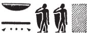
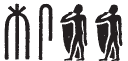
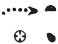

## Esna 146 {-}  
  
  
  
- Location: Central Door, left side  
- Date: Unknown, probably Domitian  
- [Hieroglyphic Text](https://www.ifao.egnet.net/uploads/publications/enligne/Temples-Esna002.pdf#page=330){target="_blank"}  
- Bibliography: None  
  
NB: This text contains many lacunae, making it difficult to restore partially-preserved words with any confidence.  
  

  
  
  
^1^ *[...] n ḫnti sḫ.t=f [...]  *  
*s[...]  *  
*[...] ([...]) *  
*mry ẖnmw-[Rʿ] nb sḫ.t   *  
*[...]  *  
*swḏȝ tȝ r-ḏr=f   *  
  *ḥr snṯ=f  *  
  
[...] of Foremost of his Field,  
[...]  
[...] ([...])  
*beloved of* Khnum-[Re] Lord of the Field,  
[he who...],  
and who keeps the whole world safe   
  upon its foundation.  
    

  

  
  
^2^ *ʿnḫ nṯr nfr  *  
*[ỉ]ḥy-Nwn  *  
  *pr m wsr.t  *  
*pr.t ȝḫ.t   *  
  *pr m nṯr  *  
*ms.tw=f r nb-wʿ  *  
   
*mḥ=f tȝ ẖ(r) kȝ.w  *  
  *m hȝw=f  *  
*ssȝỉ=f ḥr.w  *  
  *nỉ [...] mnḫ n [...]  *  
    
*nsw.t-bỉty   *  
*nb-tȝ.wy*   
*(ȝwt[wkrtr ksr]s) *  
*mry nb.t-ww nb.t tȝ-sn.t  *  
*tfn.t [...r]šw  *  
*ỉmȝ-ỉb n sn=s *  
   *ḥnʿ zȝ=s  *  
   
^2^ Live the good god,   
the Ihy-Nun,[^fn-146-1]  
  who came forth from the Mighty,  
the luminous seed,  
  who came forth from the god,  
he was born to be the sole lord.  
  
He fills[^fn-146-2] the land with food  
  in his time,  
and satiates everybody  
  without [...] effective for [...]  
    
King of Upper and Lower Egypt,  
Lord of the Two Lands,  
(Aut[okrator Caesar])  
*beloved of* Nebtu, Lady of Esna,[^fn-146-3]  
Tefnut [^fn-146-4] [...j]oy,  
who pleases the heart of her brother  
  as well as her son.[^fn-146-5]  
  

  
  
[^fn-146-1]: Special form of Hathor's child, Ihy. Cf. @cauville-ihy.  
[^fn-146-2]: {width=8%} - Reading suggested by @sauneron-2, p. xxxi; see also @kurth-1, p. 210, n. 121.  
[^fn-146-3]: {width=15%} - This spelling of Esna alludes to the two children of Re, Khnum-Shu and Nebtu-Tefnut. Compare a similar spelling of these "two children" in [Esna 58], 3: {width=12%}; similarly [Esna 80], 1.  
[^fn-146-4]: {width=10%} -  Tentatively restoring the name of Tefnut, as in [Esna 60], 5: {width=10%} (*Tfn.t* < *tf*, "to spit" + *niw.t*, "city)  
[^fn-146-5]: That is, Khnum-Shu Lord of the Field, and Heka-Geb. Exact parallel to this phrase in *Esna* III, 236, 10, right after Menhyt returns to Egypt from Kenset.
  
