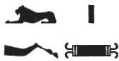

## Esna 150 {-}

- Location: Central Door, right side
- Date: Most likely Domitian
- [Hieroglyphic Text](https://www.ifao.egnet.net/uploads/publications/enligne/Temples-Esna002.pdf#page=334){target="_blank"}
- Bibliography: None

| ^1^ *[...] psḏ m mḥn  *
| *rr.n Mnḥy.t [...]  *
| *[...]  *
| 
| ^2^ *[...ḫỉ] n wr-ḥkȝw  *
| *nb mȝʿ-ḫrw  *
| *sỉȝ(.w) ḫnt ẖ.t  *
|   *nỉ pr=f [r tȝ...]  *
| *[ṯnỉ] šȝy ḥr-tp msḫn.t  *
| *rḏỉ.n nb.ty mnḏ.ty=sn  *
|   *sṯỉ-rȝ=f  *
| *ṯnỉ sw rr.ty  *
|   *tp nwd.t=f  *
|   
| *Km.t bʿḥ(.tw) m rk=f  *
| *nsw.t-bỉty  *
| *nb-tȝ.wy  *
| *(ȝwtkrtr k[sr]s)|  *
| *mry  *
| *ḥkȝ pȝ ẖrd   *
| *ʿȝ wr tpy n ẖnmw  *
| *ḫy nfr  *
| *wḥm msḫʿ.w m šmʿ-mḥw  *
| 
| ^1^ [...] who shines[^fn-150-1] in the uraeus,
| nurtured by Menhyt [...]
| [...]j
| 
| ^2^ [...child] of the Greatest of Magic[^fn-150-2],
| Lord of justification,
| who was recognized already in the womb,
|   before he had come forth [on earth...],
| whom Shai [distinguished] upon the birth-brick,
| to whom the Two Ladies gave [^fn-150-3] their breasts
|   during his breakfast,[^fn-150-4]
| whom the birth-goddesses distinguished
|   while still atop his swaddling clothes.
| 
| Egypt is flooded during his era,
| the King of Upper and Lower Egypt,
| Lord of the Two Lands,[^fn-150-5] 
| (Autokrator Ca[esar])|
| *beloved of*
| Heka the Child,
| the very great, first-born of Khnum,
| good child,
| who repeats births in Upper and Lower Egypt.

[^fn-150-1]: {width=20%} - Common sportive writing of this verb, with the sun as Khnum shining between heaven and earth.
[^fn-150-2]: {width=15%}{width=5%} - The determinative appears to be Osiris, which makes it tempting to read the preceding signs as an elaborate, acrophonic trigram for his name. Nonetheless, this seems more likely to be a representation of Geb, who like Heka could be called "greatest of magic", and whose connection to magic is well-known.
[^fn-150-3]: {width=15%} - Rare spelling of this common verb.
[^fn-150-4]: {width=15%} - Notable spelling of this word for "breakfast" (*Wb* IV, 350, 5-6). Due to the lacuna, it's unclear if a preposition is missing ("as/for his breakfast"), so the present translation assumes the mealtime is being used adverbially.
[^fn-150-5]: {width=12%}{width=10%} - The same spelling occurs in a damaged context in [Esna 146], 2. The ram (*bȝ*) with the red crown (*n*) writes *nb*.
