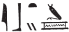
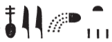

## Esna 155 {-}  
  
  
  
  
- Location: Column A
- Date: Domitian 
- [Hieroglyphic Text](https://www.ifao.egnet.net/uploads/publications/enligne/Temples-Esna002.pdf#page=340){target="_blank"}  
- Bibliography: @sauneron-1, p. 62 (excerpts); see also [Tempeltexte 2.0](http://www.tempeltexte.uni-tuebingen.de/portal/#/text-detail/795){target="_blank"}    

^1^ *wḫȝ pn   *  
*nty (ḥr) dwn m bȝḥ=k  *  
*ẖnmw-Rʿ nb sḫ.t  *  
*ḥqȝ n mnỉ.w  *  
    
*ṯwf pw  *  
*swtwt=k r mȝȝ=f  *  
*ṯz=k [...]  *  
*[...] m-ẖnw ssw(?) [wʿ?]  *  
    
*[...] mȝnw  *  
*m nb(.t)-ḥry.w  *  
   
*spr=f Km.t  *  
*ỉṯ=k nmt.t=f  *  
*rwỉ=k r-dbn=f  *  
*m sʿr(.t)-nb=s  *  
    
^2^ *ȝḫ-bỉ.t ẖr mrr.t=k  *  
*ṯwf rwḏ.tw n ḥr=k  *  
*sḏm sḏm.w  *  
*wšb n=k wšb.w  *  
*ʿm nr.w-ỉḥ.w ỉb.w[=sn]  *  
*[...] ḥw.t-[...]  *  
   
^1^ This papyriform columned hall  
which rises upon before you,  
Khnum-Re Lord of the Field,  
Ruler of the Herdsmen;  
  
It is a reed marsh,  
which you travel to see.  
You lift up [...]  
[...] within a [single?] day.[^fn-155-1]  
  
[...] Manu  
in (the hour) Lady of those Above.[^fn-155-2]  
  
You reach Egypt,  
and you seize its course,  
and move all around it,  
in (the hour) She who Raises her Lord.[^fn-155-3]  
  
^2^ Chemmis bears what you love,  
a reed marsh flourishing before you.  
The *sḏm*-bulls listen (*sḏm*),   
and the *wšb*-bulls respond (*wšb*) to you;  
the cattle ranchers stay quiet  
[...] the Temple of [...][^fn-155-4]

[^fn-155-1]: What follows is another description of Khnum Lord of the Field journeying between Esna and Chemmis within a single night. Cf. [Esna 190], 1; @sauneron-1, pp. 71-72.
[^fn-155-2]: The first hour of the night: *Wb* III, 142, 10.
[^fn-155-3]: The second hour of the night: *Wb* IV, 33, 18-19.
[^fn-155-4]: @sauneron-2, p. 268, n. a, suggested a bird might be in the *ḥw.t*-sign. This could be "Temple of the Chicks", "Temple of the Mother", or something else entirely. "Temple of the Bas" is mentioned later on in column 3.

*[...]  *  
*bʿḥ.w [...] nb   *  
*m [ỉrṯ.t] sšp  *  
*wnm=k [swr]=k  *  
*wʿb.tw ỉḥ.w ngȝ.w(?)  *  
^3^ *mỉ ʿšȝ=sn  *  
     
*sȝḥ.n=k tȝ  *  
*šȝʿ.n=k  *  
*ỉn.n=k pr-ẖnmw m nḏm-ỉb  *  
*ʿq=k ḥw.t-bȝ.w   *  
*m mk.t-nb=s  *  
*ršw ỉmy.w pr-nṯr  *  
*n ptr=k  *

[...]  
all [...] are flooded  
with radiant milk:  
may you eat and [drink].  
The cows and bulls(?)[^fn-155-5] are pure  
^3^ as they are numerous!  
  
You finally arrived at the land  
where you had started;  
you reach Per-Khnum in happiness,  
and you enter Temple of the Bas  
in (the hour) She who Protects her Lord:[^fn-155-6]  
those within Per-netjer rejoice  
from seeing you.

[^fn-155-5]: {width=15%} - This would appear to write "the cows of others", or "cows and other things (*nkt*)" (*Wb* II, 347, 15-16). While these options are possible, the context suggests reading the pair of "cows and bulls", with an unetymological spelling of the latter term.

[^fn-155-6]: This is often the tenth hour of the night, but it can also be the third hour of the day (*Wb* II, 160, 8-10). Since Khnum of the Field is supposed to complete his journay in a single night, the former option seems more likely here. 

 

*nṯr ʿȝ nb sḫ.t  *  
*hr=f m [...]  *  
*ʿq[=f ... m] ȝw.t-ỉb  *  
*ršw ỉb=f*  
*m mȝȝ ỉfd.w=f  *  
*nt-ʿ=f mỉ mỉt.t=f  *  
   
*ʿȝ ỉbṯ.wt  *  
*ḫnty zbt.wt  *  
^4^ *wr sm.w  *  
*ʿšȝ npry  *  
*msḫ.wt=f ṯḥn.tw   *  
*ẖr ḥrr.w nb.w  *  
*pẖr(.w) m mn.w  *  
*ẖr pȝy.w ḫnn.w  *  
  
*mẖr.t ẖr šbn.w   *  
*m šzp(.w) nb.w n nṯr  *
  
The great god, Lord of the Field,  
he delights from [...]  
[he] enters [...in] happiness,  
his heart delights   
from seeing its four corners,  
its rites are just like at its peer.[^fn-155-7]  
  
Great of fowling traps,[^fn-155-8]  
prominent of blossoms,  
^4^ great of plants,  
numerous of grain.[^fn-155-9]  
Its fields[^fn-155-10] sparkle  
bearing all types of flowers.  
It is surrounded by pools  
hosting birds and fish.   
  
The stable[^fn-155-11] bears various cows,  
in all images of god.[^fn-155-12]

[^fn-155-7]: That is, North Esna is just like Chemmis, which he recently visited at night.
[^fn-155-8]: {width=12%} - The phonetic spelling is normal for this word, but the determinative is remarkable. It appears to show a bird above a broad net, rather than the usual clapnet used to write this term. 
[^fn-155-9]: {width=12%} - Same spelling of *npry*, "grain", in [Esna 176], 6.
[^fn-155-10]: The same rare term appears in [Esna 176], 5.
[^fn-155-11]: According to *Wb* II, 134, 6-8, this term usually means a granary, but here it is clearly the location for storing cows.
[^fn-155-12]: As on other texts from the front columns, here begins a list of multiple divine cows, purportedly found at Esna.

*ḥsȝ.t štȝ.t   *  
*šd(.t) Rʿ m [...]  *  
*ḥsȝ.t mỉt.t   *  
*ḥr wḥm-ḫʿ  *  
      
*wrry.t*  
^5^ *mnʿ.t ḫy=s  *  
*sḫȝ.t-ḥr   *  
*ḥqȝ ns.t=s  *  
    
*ȝḫy.t wr.t  *  
*šdnw.t mw.t-nṯr  *  
*ȝḫy.t mỉt.t  *  
*m wḥm-ḫpr  *  
      
*kȝ.w m P  *  
*ỉd.wt m Dp  *  
*ḫwy.wt n psḏ.t  *  
*ỉmn.w *  
*n nṯr.w nb.w tȝ  *  
*mnty.w n nṯr.w p.t  *  
      
*kȝ.w* ^6^ *ḥr sṯ.t (r) ỉd.wt  *  
*m ỉb=sn  *  
*sʿr* ^7^ *r dmḏy.t=s  *  
*ḫṯy.wt ḥr dr  *  
*nỉ spr rḫt  *  
^8^ *bẖ zȝ*   
*m-snỉ r ỉt=f  *  
   
*ḏȝm.w* ^9^ *m mȝ.wt  *  
*nỉ rḫ ṯnw=sn  *  
^10^ *(ḥr) wḥm šn r mnḫ  *  
    
Hesat the mysterious,  
who nurses Re in [...]  
Hesat, likewise,  
repeating life.    
  
The Great cow,[^fn-155-12]   
^5^ who feeds her child;  
Sekhat-Hor,  
the ruler of her throne.  
  
The great Akhet cow,  
she of Shedenu, mother of god;  
the Akhet cow, likewise,  
repeating forms.  
  
The bulls in Pe,  
the cows in Dep,   
the *ḫwy.t*-cows of the Ennead,  
the *ỉmn*-bulls   
of all the gods of earth;  
the *mnty*-bulls of the gods of heaven.  
  
The bulls ^6^ ejaculate (for) the cows[^fn-155-12b]  
in their 'hearts',  
going up ^7^ at her appointed time;  
the *ḫṯy.t*-cows deliver,  
one could not even make a list,[^fn-155-13]  
^8^ so a son is born   
resembling his father.    
  
The generations ^9^ are renewed,  
their number cannot be known,  
^10^ repeating the cycle excellently.

[^fn-155-12b]: Similar phrase in [Esna 95], 3.
[^fn-155-13]: Apparently there are so many calves that one could not make a full list, just as they are later said to be innumerable.
